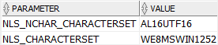
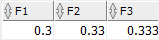

Each data type has a code managed internally by Oracle. To find the data type code of a value in a column, you use the `DUMP()` function.

## Character data types

- Character data types consist of `CHAR`, `NCHAR`, `VARCHAR2`, `NVARCHAR2`, and `VARCHAR`.
- The `NCHAR` and `NVARCHAR2` data types are for storing Unicode character strings.
- The fixed-length character data types are `CHAR`, `NCHAR` and the variable-length character data types are `VARCHAR2`, `NVARCHAR2`.
- `VARCHAR` is the synonym of `VARCHAR2`. However, you should not use `VARCHAR` because Oracle may change its semantics in the future.
- For character data types, you can specify their sizes either in bytes or characters.

```sql
SELECT *
FROM nls_database_parameters
WHERE PARAMETER IN(
        'NLS_CHARACTERSET',
        'NLS_NCHAR_CHARACTERSET'
    );
```

## NCHAR vs. CHAR

- First, the maximum size of `NCHAR` is only in the character length semantics while the maximum size of `CHAR` can be in either character or byte length semantics.
- Second, `NCHAR` stores characters in national default character set whereas the `CHAR` stores characters in the default character set.



- The AL16UTF16 character set uses 2 bytes for storing a character so the description column has the maximum byte length of 20 bytes.

## `NUMBER` data type

- The `NUMBER` data type has precision p and scale s. The precision ranges from 1 to 38 while the scale range from -84 to 127.
- If you don’t specify the precision, the column can store values including fixed-point and floating-point numbers. The default value for the scale is zero.
- Both precision and scale are in decimal digits and optional. If you skip the precision and scale, Oracle uses the maximum range and precision for the number.
- `NUMBER(p)` is equvalent to `NUMBER(p,0)`

```sql
NUMBER[(precision [, scale])]
```

Ex: NUMBER(6,2).

- Oracle allows the scale to be negative, for example the following number will round the numeric value to hundreds.

```sql
NUMBER(5,-2)
```

- Note that if you insert a number into a `NUMBER(p,s)` column and the number exceeds precision p, Oracle will issue an error. However, if the number exceeds the scale s, Oracle will round the value.
- `INT`, `SMALLINT`, `NUMERIC`, and `DECIMAL` are just aliases that you can use for define numeric columns . They are not the real data types. Internally, Oracle maps these aliases to the corresponding `NUMBER` data type.

## `FLOAT` datatype

- The Oracle `FLOAT` data type is the subtype of the `NUMBER` data type. Its main purpose is to facilitate compatibility with ANSI SQL `FLOAT` data types.
- You can only specify the precision for the `FLOAT` data type. You cannot specify the scale because Oracle Database interprets scale from the data. The maximum precision of `FLOAT` is 126.
- In FLOAT, the precision is in binary bits, while in NUMBER the precision is in decimal digits.
- According to this formula, the maximum of 126 digits of binary precision roughly equals 38 digits of decimal precision.

```sql
CREATE TABLE float_demo (
    f1 FLOAT(1),
    f2 FLOAT(4),
    f3 FLOAT(7)
);
```

| ANSI SQL FLOAT   | Oracle FLOAT |
| ---------------- | ------------ |
| FLOAT            | FLOAT(126)   |
| REAL             | FLOAT(63)    |
| DOUBLE PRECISION | FLOAT(126)   |



- f1, f2 and f3 is `FLOAT(1)`, `FLOAT(4)`, and `FLOAT(7)`. So the corresponding precision in decimal digits of the column f1, f2, and f3 is 1 (1 _ 0.30103), 2 (4 _ 0.30103), and 3 (7 \* 0.30103).

## BINARY_FLOAT & BINARY_DOUBLE

- Oracle 10g introduces two new floating point data types `BINARY_FLOAT` and `BINARY_DOUBLE` that allow you to store floating-point numbers in your table columns.
- The floating-point numbers do not have the same precision as the `NUMBER` values, but they have a better performance for numerical computations. Because of this, the floating-point numbers are suitable for the scientific calculations but not suitable for financial calculations.
- Oracle binary floating-point numbers support the special values Infinity and NaN (which stands for Not a Number)
- To specify floating-point number literals, you add the suffix f for single precision and d double precision

```sql
SELECT
    10.2d,
    32.7f
FROM
    dual;
```

## Oracle FLOAT vs. BINARY_FLOAT & BINARY_DOUBLE

The following are the major differences between FLOAT data type and floating-point data type:

- The floating-point data types take advantage of hardware acceleration, therefore, they have better performance for numerical computations.
- The floating-point data types can store smaller / larger numbers than `FLOAT` type.
- The floating-point data types store only approximate values, while the `FLOAT` data type stores exact values.


## Datetime and Interval data types

- Datetime data types are `DATE`, `TIMESTAMP`, `TIMESTAMP WITH TIME ZONE`, and `TIMESTAMP WITH LOCAL TIME ZONE`. The values of a datetime data type are datetimes.
- The interval data types are `INTERVAL YEAR TO MONTH` and `INTERVAL DAY TO SECOND`. The values of interval data type are intervals.
- The standard date format for input and output is DD-MON-YY e.g., 01-JAN-17 which is controlled by the value of the `NLS_DATE_FORMAT` parameter.
- Punctuation such as hyphen (-), slash (/), comma (,), period (.) and colons (:) can be used
- Date Format Elements
  Ex: TZH - Time zone hour - ‘HH:MI:SS.FFTZH:TZM’
  TZM - Time zone minute
  TZR - Time zone region information.
  MI -Minute that ranges from 0 to 59

```sql
ALTER SESSION SET NLS_DATE_FORMAT = 'YYYY-MM-DD';
```

```sql
SELECT TO_CHAR( SYSDATE, 'FMMonth DD, YYYY' )
FROM dual;
```

```sql
SELECT TO_DATE( 'August 01, 2017', 'MONTH DD, YYYY' )
FROM dual;
```

- Besides using the `TO_DATE()` function , you can specify a `DATE` value as a string literal using the following syntax:

```sql
DATE '2017-08-01'
```

### TIMESTAMP data type

- The `TIMESTAMP` data type allows you to store date and time data including year, month, day, hour, minute and second.
- In addition, it stores the fractional seconds, which is not stored by the DATE data type.
- The fractional_seconds_precision specifies the number of digits in the fractional part of the SECOND field. It ranges from 0 to 9, meaning that you can use the `TIMESTAMP` data type to store up to nanosecond.

```sql
CREATE TABLE logs (
    log_id NUMBER GENERATED BY DEFAULT AS IDENTITY,
    message VARCHAR(2) NOT NULL,
    logged_at TIMESTAMP (2) NOT NULL,
    PRIMARY KEY (log_id)
);
```

```sql
INSERT INTO logs (message,logged_at)
VALUES ('Invalid username/password for root user',LOCALTIMESTAMP(2));

INSERT INTO logs (message,logged_at)
VALUES ('User root logged in successfully',LOCALTIMESTAMP(2));
```

```sql
INSERT INTO logs (message, logged_at)
VALUES ('Test default Oracle timestamp format', TO_TIMESTAMP('03-AUG-17 11:20:30.45 AM'));
```

#### TIMESTAMP literals

```sql
TIMESTAMP 'YYYY-MM-DD HH24:MI:SS.FF'
```

```sql
SELECT message, TO_CHAR(logged_at, 'MONTH DD, YYYY "at" HH24:MI')
FROM logs;
```

#### Extract TIMESTAMP components

```sql
SELECT
    message,
    EXTRACT(year FROM logged_at) year,
    EXTRACT(month FROM logged_at) month,
    EXTRACT(day FROM logged_at) day,
    EXTRACT(hour FROM logged_at) hour,
    EXTRACT(minute FROM logged_at) minute,
    EXTRACT(second FROM logged_at) second
FROM
    logs;
```

### TIMESTAMP WITH TIME ZONE

- `TIMESTAMP WITH TIME ZONE` data type stores both time stamp and time zone data.

#### TIMESTAMP WITH TIME ZONE literals

```sql
TIMESTAMP 'YYYY-MM-DD HH24:MI:SS.FF TZH:TZM'
```

```sql
TIMESTAMP '2017-08-10 10:30:20.15 -07:00'
```

### INTERVAL

There are two types of `INTERVAL`:

- **INTERVAL YEAR TO MONTH** – stores intervals using of year and month.
- **INTERVAL DAY TO SECOND** – stores intervals using days, hours, minutes, and seconds including fractional seconds.

| INTERVAL YEAR TO MONTH Literals   | Meaning                                                                                                                                                                       |
| --------------------------------- | ----------------------------------------------------------------------------------------------------------------------------------------------------------------------------- |
| INTERVAL '120-3' YEAR(3) TO MONTH | An interval of 120 years, 3 months; Must specify the leading field precision YEAR(3) because the value of the leading field is greater than the default precision (2 digits). |
| INTERVAL '105' YEAR(3)            | An interval of 105 years 0 months.                                                                                                                                            |
| INTERVAL '500' MONTH(3)           | An interval of 500 months.                                                                                                                                                    |
| INTERVAL '9' YEAR                 | 9 years, which is equivalent to INTERVAL '9-0' YEAR TO MONTH                                                                                                                  |
| INTERVAL '40' MONTH               | 40 months or 3 years 4 months, which is equivalent to INTERVAL '3-4' YEAR TO MONTH                                                                                            |
| INTERVAL '180' YEAR               | Invalid interval because ‘180’ has 3 digits which are greater than the default precision (2)                                                                                  |

| INTERVAL DAY TO SECOND Literals               | Meaning                                                                                                 |
| --------------------------------------------- | ------------------------------------------------------------------------------------------------------- |
| INTERVAL '11 10:09:08.555' DAY TO SECOND(3)   | 11 days, 10 hours, 09 minutes, 08 seconds, and 555 thousandths of a second.                             |
| INTERVAL '11 10:09' DAY TO MINUTE             | 11 days, 10 hours, and 09 minutes.                                                                      |
| INTERVAL '100 10' DAY(3) TO HOUR              | 100 days 10 hours.                                                                                      |
| INTERVAL '999' DAY(3)                         | 999 days.                                                                                               |
| INTERVAL '09:08:07.6666666' HOUR TO SECOND(7) | 9 hours, 08 minutes, and 7.6666666 seconds.                                                             |
| INTERVAL '09:30' HOUR TO MINUTE               | 9 hours and 30 minutes.                                                                                 |
| INTERVAL '8' HOUR                             | 8 hours.                                                                                                |
| INTERVAL '15:30' MINUTE TO SECOND             | 15 minutes 30 seconds.                                                                                  |
| INTERVAL '30' MINUTE                          | 30 minutes.                                                                                             |
| INTERVAL '5' DAY                              | 5 days.                                                                                                 |
| INTERVAL '40' HOUR                            | 40 hours.                                                                                               |
| INTERVAL '15' MINUTE                          | 15 minutes.                                                                                             |
| INTERVAL '250' HOUR(3)                        | 250 hours.                                                                                              |
| INTERVAL '15.6789' SECOND(2,3)                | Rounded to 15.679 seconds. Because the precision is 3, the fractional second ‘6789’ is rounded to ‘679’ |

## `RAW` and `LONG RAW` data types

- The `RAW` and `LONG RAW` data types are for storing binary data or byte strings e.g., the content of documents, sound files, and video files.
- The `RAW` data type can store up to 2000 bytes while the `LONG RAW` data type can store up to 2GB.

## `BFILE` Datatype

- `BFILE` data type stores a locator to a large binary file which locates outside the database. The locator consists of the directory and file names.

## `BLOB` Datatype

- `BLOB` stands for binary large object. You use the `BLOB` data type to store binary objects with the maximum size of (4 gigabytes – 1) \* (database block size).

## `CLOB` Datatype

- `CLOB` stands for character large object. You use `CLOB` to store single-byte or multibyte characters with the maximum size is (4 gigabytes – 1) \* (database block size).
- Note that `CLOB` supports both fixed-with and variable-with character sets.

## `NCLOB` Datatype

- `NCLOB` is similar to `CLOB` except that it can store the Unicode characters.

## `UROWID` Datatype

- The `UROWID` is primarily for values returned by the `ROWID` pseudo-column. Its values are base 64 strings that represent the unique address of rows in a table.
