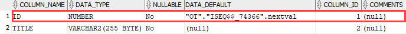

## PRIMARY KEY

A primary key is a column of a combination of columns in a table that uniquely identifies a row in the table.

The following are rules that make a column a primary key:

- A primary key column cannot contain a NULL value or an empty string.
- A primary key value must be unique within the entire table.
- A primary key value should not be changed over time.

According to these rules, the following are the recommendations for the primary keys:

- First, the primary key should be meaningless. Sometimes, you may want use meaningful data, which considers being unique, for the primary keys e.g., social security number (SSN), vehicle identification number (VIN), email, and phone number. However, you don’t know when the email or phone number changes or is reused by another person. In such cases, it will create many data problems. In the database world, the artificial keys are known as surrogate keys which are as opposed to natural primary keys.
- Second, the primary keys should be compact. The primary keys typically are numeric because Oracle typically processes numbers faster than any other data types.
- It is considered a best practice have a primary key in every table though it is not mandatory in Oracle.

### Creating a primary key that consists of one column

```sql
CREATE TABLE purchase_orders (
    po_nr NUMBER PRIMARY KEY,
    vendor_id NUMBER NOT NULL,
    po_status NUMBER(1,0) NOT NULL,
    created_at TIMESTAMP WITH TIME ZONE NOT NULL
);
```

```sql
CREATE TABLE purchase_orders (
    po_nr NUMBER,
    vendor_id NUMBER NOT NULL,
    po_status NUMBER(1,0) NOT NULL,
    created_at TIMESTAMP WITH TIME ZONE NOT NULL,
    CONSTRAINT pk_purchase_orders PRIMARY KEY(po_nr)
);
```

### Creating a primary key that consists of multiple columns

```sql
CREATE TABLE purchase_order_items (
    po_nr NUMBER NOT NULL,
    item_nr NUMBER NOT NULL,
    product_id NUMBER NOT NULL,
    quantity NUMBER NOT NULL,
    purchase_unit NUMBER NOT NULL,
    buy_price NUMBER (9,2) NOT NULL,
    delivery_date DATE,
    PRIMARY KEY (po_nr, item_nr)
);
```

In this example we did not use the `CONSTRAINT` clause to explicitly assign the `PRIMARY KEY` constraint a name. Therefore, Oracle implicitly assigned the primary key constraint a system-generated name such as `SYS_C0010617`.

### Adding a primary key to a table

```sql
CREATE TABLE vendors (
    vendor_id NUMBER,
    vendor_name VARCHAR2(255) NOT NULL,
    address VARCHAR2(255) NOT NULL
);

ALTER TABLE vendors
ADD CONSTRAINT pk_vendors PRIMARY KEY (vendor_id);
```

### Dropping an Oracle PRIMARY KEY constraint

```sql
ALTER TABLE vendors
DROP CONSTRAINT pk_vendors;
```

```sql
ALTER TABLE vendors
DROP PRIMARY KEY;
```

### Enable / Disable an Oracle PRIMARY KEY constraint

#### Disable

```sql
ALTER TABLE purchase_orders
DISABLE CONSTRAINT pk_purchase_orders;
```

```sql
ALTER TABLE purchase_orders
DISABLE PRIMARY KEY;
```

#### Enable

```sql
ALTER TABLE purchase_orders
ENABLE CONSTRAINT pk_purchase_orders;
```

```sql
ALTER TABLE purchase_orders
ENABLE PRIMARY KEY;
```

## Identity column

Oracle 12c introduced a new way that allows you to define an identity column for a table, which is similar to the `AUTO_INCREMENT` column in MySQL or `IDENTITY` column in SQL Server.

```sql
GENERATED [ ALWAYS | BY DEFAULT [ ON NULL ] ]
AS IDENTITY [ ( identity_options ) ]
```



- First, the `GENERATED` keyword is mandatory.

- Second, you can specify an option to generate identity values:
  - `GENERATED ALWAYS`: Oracle always generates a value for the identity column. Attempt to insert a value into the identity column will cause an error.
  - `GENERATED BY DEFAULT`: Oracle generates a value for the identity column if you provide no value. If you provide a value, Oracle will insert that value into the identity column. For this option, Oracle will issue an error if you insert a NULL value into the identity column.
  - `GENERATED BY DEFAULT ON NULL`: Oracle generates a value for the identity column if you provide a NULL value or no value at all.
- Third, you can have a number of options for the identity column.
  - `START WITH` initial_value controls the initial value to use for the identity column. The default initial value is 1.
  - `INCREMENT BY` internval_value defines the interval between generated values. By default, the interval value is 1.
  - `CACHE` defines a number of values that Oracle should generate beforehand to improve the performance. You use this option for the column that has a high number of inserts.

### GENERATED ALWAYS example

```sql
CREATE TABLE identity_demo (
    id NUMBER GENERATED ALWAYS AS IDENTITY,
    description VARCHAR2(100) NOT NULL
);

INSERT INTO identity_demo(description)
VALUES('Oracle identity column demo with GENERATED ALWAYS');
```

The following statement attempts to insert a value into the id identity column:

```sql
INSERT INTO identity_demo(id,description)
VALUES(2,
       'Oracle identity column example with GENERATED ALWAYS ');
```

Oracle issued an error:

```sql
SQL Error: ORA-32795: cannot insert into a generated always identity column
```

Because the id column was defined as `GENERATED ALWAYS`, it could not accept any provided value.

### GENERATED BY DEFAULT example

```sql
DROP TABLE identity_demo;

CREATE  TABLE identity_demo  (
    id NUMBER GENERATED BY DEFAULT AS IDENTITY,
    description VARCHAR2(100) not null
  );

INSERT INTO identity_demo(description)
VALUES('Oracle identity column demo with GENERATED BY DEFAULT');
```

The following statement inserts a new row into the identity_demo table with a provided value for the id column:

```sql
INSERT INTO identity_demo(id,description)
VALUES(2, 'Oracle identity column example with GENERATED BY DEFAULT');
```

The following example attempts to insert a null value into the id column:

```sql
INSERT INTO identity_demo(id,description)
VALUES(NULL,
       'Oracle identity column demo with GENERATED BY DEFAULT, NULL value');
```

Oracle issued an error:

```sql
SQL Error: ORA-01400: cannot insert NULL into ("OT"."IDENTITY_DEMO"."ID")
```

### GENERATED BY DEFAULT ON NULL example

```sql
DROP TABLE identity_demo;

CREATE  TABLE identity_demo  (
    id NUMBER GENERATED BY DEFAULT ON NULL AS IDENTITY,
    description VARCHAR2(100) not null
  );

INSERT INTO identity_demo(description)
VALUES('Oracle identity column demo with no value');
```

### START WITH option example

```sql
DROP TABLE identity_demo;

CREATE  TABLE identity_demo  (
    id NUMBER GENERATED BY DEFAULT ON NULL AS IDENTITY START WITH 100,
    description VARCHAR2(100) not null
  );

INSERT INTO identity_demo(description)
VALUES('Oracle identity column demo with START WITH option');
```

### INCREMENT BY option example

```sql
DROP TABLE identity_demo;

CREATE  TABLE identity_demo (
    id NUMBER GENERATED BY DEFAULT ON NULL AS IDENTITY START WITH 10 INCREMENT BY 10,
    description VARCHAR2(100) not null
);

INSERT INTO identity_demo(description)
VALUES('Oracle identity column demo 1 with INCREMENT BY option');

INSERT INTO identity_demo(description)
VALUES('Oracle identity column demo 2 with INCREMENT BY option');
```

### Oracle identity column restrictions

- Each table has one and only one identity column.
- The data type of the identity column must be a numeric data type. the user-defined data type is not allowed to use with the identity clause.
- The identity column is not inherited by the `CREATE TABLE` AS `SELECT` statement.
- The identity column cannot have another `DEFAULT` constraint.
- The encryption algorithm for encrypted identity columns can be inferred therefore you should use a strong encryption algorithm.
- The inline constraint of the identity column must not conflict with the `NOT NULL` and `NOT DEFERRABLE` constraint stated by the identity clause.

## FOREIGN KEY

```sql
CREATE TABLE child_table (
    ...
    CONSTRAINT fk_name
    FOREIGN KEY(col1, col2,...) REFERENCES parent_table(col1,col2)
    ON DELETE [ CASCADE | SET NULL ]
);
```

- First, to explicitly assign the foreign key constraint a name, you use the `CONSTRAINT` clause followed by the name. The `CONSTRAINT` clause is optional. If you omit it, Oracle will assign a system-generated name to the foreign key constraint.

- Second, specify the `FOREIGN KEY` clause to defines one or more column as a foreign key and parent table with columns to which the foreign key columns reference.

Third, use the `ON DELETE` clause to specify consequence when the rows in the parent table are deleted.

- **ON DELETE CASCADE:** if a row in the parent is deleted, then all the rows in the child table that reference the removed row will be deleted.
- **ON DELETE SET NULL:** if a row in the parent is deleted, then all the rows in the child table reference the removed row will be set to NULL for the foreign key columns.

Unlike the primary key constraint, a table may have more than one foreign key constraint.

### Add a foreign key constraint to a table

```sql
ALTER TABLE child_table
ADD CONSTRAINT fk_name
FOREIGN KEY (col1,col2) REFERENCES parent_table(col1,col2);
```

### Drop a foreign key constraint

```sql
ALTER TABLE child_table
DROP CONSTRAINT fk_name;
```

### Disable a foreign key constraint

```sql
ALTER TABLE child_table
DISABLE CONSTRAINT fk_name;
```

### Enable a foreign constraint

```sql
ALTER TABLE child_table
ENABLE CONSTRAINT fk_name;
```

## NOT NULL constraint

```sql
CREATE TABLE table_name (
    ...
    column_name data_type NOT NULL
    ...
);
```

```sql
ALTER TABLE table_name MODIFY ( column_name NOT NULL);
```

### Drop NOT NULL constraints

```sql
ALTER TABLE table_name MODIFY ( column_name NULL)
```

## CHECK constraint

An Oracle check constraint allows you to enforce domain integrity by limiting the values accepted by one or more columns.

### Creating Oracle Check

```sql
CREATE TABLE parts (
    part_id NUMBER GENERATED BY DEFAULT AS IDENTITY,
    part_name VARCHAR2(255) NOT NULL,
    buy_price NUMBER(9,2) CHECK(buy_price > 0),
    PRIMARY KEY(part_id)
);
```

```sql
DROP TABLE parts;

CREATE TABLE parts (
    part_id NUMBER GENERATED BY DEFAULT AS IDENTITY,
    part_name VARCHAR2(255) NOT NULL,
    buy_price NUMBER(9,2) CONSTRAINT check_positive_buy_price CHECK(buy_price > 0),
    PRIMARY KEY(part_id)
);
```

### Add Check constraint to a table

```sql
ALTER TABLE parts
ADD CONSTRAINT check_positive_cost CHECK (cost > 0);
```

### Drop checking constraint

```sql
ALTER TABLE parts
DROP CONSTRAINT check_valid_cost;
```

### Disable / Enable check constraint

```sql
ALTER TABLE table_name
DISABLE CONSTRAINT check_constraint_name;

ALTER TABLE table_name
ENABLE CONSTRAINT check_constraint_name;
```

### Restrictions of Oracle check constraint

- You can define check constraints for tables only, not views.
- The expression of the check constraint can refer to any column in the table, but it cannot refer to columns of other tables.
- The expression also cannot contain one of the following constructs:
- Non-deterministic functions such as SYSDATE, CURRENT_DATE, and CURRENT_TIMESTAMP.
- Subqueries or a scalar subquery expressions.
- Calls to any user-defined functions.
- Nested table columns or attributes.
- The pseudo-columns CURRVAL, NEXTVAL, LEVEL, or ROWNUM.
- Date constants that are not fully specified.

## UNIQUE constraint

A unique constraint is an integrity constraint that ensures the data stored in a column, or a group of columns, is unique among the rows in a table.

```sql
CREATE TABLE table_name (
    ...
    column_name data_type UNIQUE
    ...
);
```

```sql
CREATE TABLE table_name (
    ...,
    UNIQUE(column_name)
);
```

```sql
CREATE TABLE table_name (
    ...
    column_name data_type CONSTRAINT unique_constraint_name UNIQUE
    ...
);
```

```sql
CREATE TABLE table_name (
    ...
    column_name data_type,
    ...,
    CONSTRAINT unique_constraint_name UNIQUE(column_name)
);
```

```sql
CREATE TABLE table_name (
    ...
    column_name1 data_type,
    column_name2 data_type,
    ...,
    CONSTRAINT unique_constraint_name UNIQUE(column_name1, column_name2)
);
```

```sql
ALTER TABLE table_name
ADD CONSTRAINT unique_constraint_name UNIQUE(column_name1, column_nam2);
```

```sql
ALTER TABLE table_name
DISABLE CONSTRAINT unique_constraint_name;
```

```sql
ALTER TABLE table_name
ENABLE CONSTRAINT unique_constraint_name;
```

```sql
ALTER TABLE table_name
DROP CONSTRAINT unique_constraint_name;
```

## Normalization

- It is a series of steps to obtain a database design that allows for efficient access and eliminate redundancy.

### 1st Normal Form

- Each cell of a table must contain atomic value.

### 2nd Normal Form

- Qualify 1st NF
- Every non-prime attribute must be fully functional dependent on key; not part of key(composite key). (No partial dependency)
- **Prime attribute**= part of key; **Non-Prime attribute**= which are not part of key

```sql
student_id+subject_id --primary key
mark --dependent on student and subject_id
teacher --only depend on subject; not student. Hence it is a partial dependent column
```

**Solution**: Move teacher name to subject table and use subject_id only
**Solution**: Move teacher name to different table and use teacher_id

### 3rd Normal Form

- Qualify 2nd NF
- All the attributes in a table are determined only by the candidate keys of that relation and not by any non-prime attributes (No transitive dependency)
- 3NF data modeling was ideal for online transaction processing (OLTP) applications with heavy order entry type of needs.

```sql
student_id+subject_id --primary key
mark --dependent on student and subject_id
exam_name --dependent on student and subject. Ex. IT student will have Java exam
total_marks --dependent on exam name. Total marks changes based on exam. Ex: Maths Total: 80, Biology: 40
--But exam_name is not a part of Primary Key(non-prime). This is called transitive dependency.
```

**Solution**: Move exam_name and total_marks to a different table and use exam_id

### BCNF (Boyce Codd Normal Form)

- Qualify 3rd NF
- It is a slightly stronger version of the third normal form (3NF)
- For any dependency A derives B, A should be a super key( If A is non-prime attribute, it cannot derive B-a prime attribute)
- Only in rare cases does a 3NF table not meet the requirements of BCNF.
- A 3NF table that does not have multiple overlapping candidate keys is guaranteed to be in BCNF.

```sql
student_id+subject --primary key
professor --non-prime attribute. professor can derive the subject which is a prime attribute. Professor is not a super key.
```

**Solution**: Move professor and subject to a different table and use professor_id

### 4th Normal Form

- Qualify BCNF
- It should not have Multi-Valued dependency
- Conditions for Multi-Valued dependency:
  - A table should have at least 3 columns to have Multi-Valued dependency
  - For A derives B, for a single value of A, more than one value of B exist
  - For this table with A, B, C columns, B and C should be independent

sid is deriving course and hobby (more than 1 value)

| s_id | Course  | Hobby   |
| ---- | ------- | ------- |
| 1    | Science | Cricket |
| 1    | Maths   | Hockey  |

this two rows of data will give rise to two more rows of data

| s_id | Course  | Hobby   |
| ---- | ------- | ------- |
| 1    | Science | Hockey  |
| 1    | Maths   | Cricket |

no relationship between course and hobby

**Solution**:Move two columns (Course and Hobby) into two independent tables and use course_id and hobby_id

## ACID property

- **Atomicity**-“All or nothing” transactions
- **Consistency**-Changes are consistent across the systems and objects
- **Isolation**-Locking the row for concurrent write happens
- **Durability**-Ability to recover lost data

## Deferred Constraint

- During large transactions involving multiple dependencies it is often difficult to process data efficiently due to the restrictions imposed by the constraints.
- An example of this would be the update of a primary key (PK) which is referenced by foreign keys (FK).
- The primary key columns cannot be updated as this would orphan the dependant tables, and the dependant tables cannot be updated prior to the parent table as this would also make them orphans.
- Traditionally this problem was solved by disabling the foreign key constraints or deleting the original records and recreating them.
- Since neither of these solutions is particularly satisfactory Oracle 8i includes support for deferred constraints.
- A deferred constraint is only checked at the point the transaction is committed.
- By default constraints are created as `NON DEFERRABLE` but this can be overridden using the `DEFERRABLE` keyword.
- A deferred constraint is one that is enforced when a transaction is committed.
- A deferrable constraint is specified by using `DEFERRABLE` clause.
- Once you've added a constraint, you cannot change it to `DEFERRABLE`. You must drop and recreate the constraint.
- When you add a `DEFERRABLE` constraint, you can mark it as `INITIALLY IMMEDIATE` or `INITIALLY DEFERRED`.
- `INITIALLY IMMEDIATE` means that the constraint is checked whenever you add, update, or delete rows from a table.
- `INITIALLY DEFERRED` means that the constraint is only checked when a transaction is committed.

```sql
ALTER TABLE cust
    ADD CONSTRAINT cust_id_pk
    PRIMARY KEY(cust_id) DEFERRABLE INITIALLY DEFERRED;

ALTER SESSION SET CONSTRAINTS = DEFERRED;
ALTER SESSION SET CONSTRAINTS = IMMEDIATE;
```

- The `ALTER SESSION`... statements show how the state of the constraint can be changed. These `ALTER SESSION`... statements will not work for constraints that are created as `NOT DEFERRABLE`

## Constraint States

- Table constraints can be enabled and disabled using the `CREATE TABLE` or `ALTER TABLE` statement. In addition the `VALIDATE` or `NOVALIDATE` keywords can be used to alter the action of the state.
- `ENABLE VALIDATE` is the same as `ENABLE`. The constraint is checked and is guaranteed to hold for all rows.
- `ENABLE NOVALIDATE` means the constraint is checked for new or modified rows, but existing data may violate the constraint.
- `DISABLE NOVALIDATE` is the same as `DISABLE`. The constraint is not checked so data may violate the constraint.
- `DISABLE VALIDATE` means the constraint is not checked but disallows any modification of the constrained columns.

```sql
ALTER TABLE tab1 ADD CONSTRAINT fk_tab1_tab2
FOREIGN KEY (tab2_id)
REFERENCES tab2 (id)
ENABLE NOVALIDATE;
ALTER TABLE tab1 MODIFY CONSTRAINTS fk_tab1_tab2 ENABLE VALIDATE;
```

### Issues

Exception handling has to be coded carefully as statements will not trigger exceptions directly. Often exceptions will only be picked up by the outermost exception handler which encloses the commit statement.

- Converting a `NOVALIDATE` constraint to `VALIDATE` may take a long time depending on the amount of data to be validated, although conversion in the other direction is not an issue.
- Enabling a unique or primary key constraint when no index is present causes the creation of a unique index. Likewise, disabling a unique or primary key will drop a unique index that it used to enforce it.
