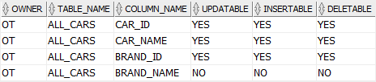

## View

- View is a “virtual” table whose data is the result of a stored query, which is derived each time when you query against the view
- most common uses of views are as follows:
  - Simplifying data retrieval.
  - Maintaining logical data independence.
  - Implementing data security.

```sql
CREATE [OR REPLACE] VIEW view_name [(column_aliases)] AS
    defining-query
[WITH READ ONLY]
[WITH CHECK OPTION]
```

#### `FORCE`

Usually, you create a new view based on existing tables. However, sometimes, you may want to create a view based on the tables that you will create later or the tables that you don’t have sufficient privileges to access at the time of creating the view. In these cases, you can use the FORCE option.

#### `WITH READ ONLY`

The `WITH READ ONLY` clause prevents the underlying tables from changes through the view.

#### `WITH CHECK OPTION`

The `WITH CHECK OPTION` clause protects the view from any changes to the underlying table that would produce rows which are not included in the defining query.

### DROP VIEW

```sql
DROP VIEW schema_name.view_name
[CASCADE CONSTRAINT];
```

#### `CASCADE CONSTRAINT`

Third, if a view has any constraint, you must specify the `CASCADE CONSTRAINT` clause to drop all referential integrity constraints that refer to primary key and unique keys in the view. If you don’t do so, then the DROP VIEW statement will fail in case such constraints exist.

## Key-preserved table

- A Key-preserved table is a base table with a one-to-one row relationship with the rows in the view, via either the primary key or a unique key.

### View restrictions

- The SQL statement e.g., `INSERT`, `UPDATE`, and `DELETE`, is only allowed to modify data from a single base table.
- For an `INSERT` statement, all columns listed in the `INTO` clause must belong to a key-preserved table.
- For an `UPDATE` statement, all columns in the `SET` clause must belong to a key-preserved table.
- For a `DELETE` statement, if the join results in more than one key-preserved table, the Oracle deletes from the first table in the `FROM` clause.
- Besides these restrictions, Oracle also requires that the defining-query does not contain any of the following elements:
  - Aggregate functions e.g., `AVG`, `COUNT`, `MAX`, `MIN`, and `SUM`.
  - `DISTINCT` operator.
  - `GROUP BY` clause.
  - `HAVING` clause.
  - Set operators e.g., `UNION`, `UNION ALL`, `INTERSECT`, and `MINUS`.
  - `START WITH` or `CONNECT BY` clause
  - `ROWNUM` pseudo-column
- To find which column can be updated, inserted, or deleted, you use the `user_updatable_columns` view.

```sql
SELECT *
FROM USER_UPDATABLE_COLUMNS
WHERE TABLE_NAME = 'ALL_CARS';
```



## Inline view

- An inline view is not a real view but a subquery in the `FROM` clause of a `SELECT` statement.

```sql
SELECT column_list
FROM (SELECT * FROM table_name ) t;
```

- The subquery specified in the `FROM` clause of a query is called an inline view
- Because an inline view can replace a table in a query, it is also called a derived table

## `LATERAL` inline view

```sql
SELECT category_name, product_name
FROM products p,
    (SELECT *
      FROM product_categories c
      WHERE c.category_id = p.category_id)
ORDER BY product_name;
```

```sql
ORA-00904: "P"."CATEGORY_ID": invalid identifier
```

This is because the inline view cannot reference the tables from the outside of its definition.

Fortunately, since Oracle 12c, by using the `LATERAL` keyword, an inline view can reference the table on the left of the inline view definition in the `FROM` clause as shown in the following example:

```sql
SELECT product_name, category_name
FROM products p,
    LATERAL(
        SELECT *
        FROM product_categories c
        WHERE c.category_id = p.category_id
        )
ORDER BY product_name;
```

### Restrictions on `LATERAL`

Lateral inline views are subject to the following restrictions:

- If you specify `LATERAL`, then you cannot specify the pivot_clause, the unpivot_clause, or a pattern in the table_reference clause.
- If a lateral inline view contains the `query_partition_clause` (Analytical function), and it is the right side of a join clause, then it cannot contain a left correlation to the left table in the join clause. However, it can contain a left correlation to a table to its left in the `FROM` clause that is not the left table.
- A lateral inline view cannot contain a left correlation to the first table in a right outer join or full outer join.

## Materialized Views in Oracle

- A materialized view, or snapshot as they were previously known, is a table segment whose contents are periodically refreshed based on a query, either against a local or remote table.
- For data warehousing purposes, the materialized views commonly created are aggregate views, single-table aggregate views, and join views.
- A normal view uses a query to pull data from the underlying tables.
- In replication environments, the materialized views commonly created are primary key, rowid, and subquery materialized views.
- Flashback Table operation is not supported on materialized views. • Snapshot is an old term for materialized view.

```sql
-- Normal
CREATE MATERIALIZED VIEW view-name
BUILD [IMMEDIATE | DEFERRED]
REFRESH [FAST | COMPLETE | FORCE ]
ON [COMMIT | DEMAND ]
[[ENABLE | DISABLE] QUERY REWRITE]
AS
SELECT ...;
```

```sql
CREATE DATABASE LINK DB1.WORLD CONNECT TO scott IDENTIFIED BY tiger USING 'DB1.WORLD';

CREATE MATERIALIZED VIEW emp_mv
BUILD IMMEDIATE
REFRESH FORCE
ON DEMAND
AS
SELECT * FROM emp@db1.world;
```

- **IMMEDIATE** : The materialized view is populated immediately.
- **DEFERRED** : The materialized view is populated on the first requested refresh.
- **FAST** : A fast refresh is attempted. If materialized view logs are not present against the source tables in advance, the creation fails. -- Have to create MVIEW LOG before creating MVIEW
- **COMPLETE** : The table segment supporting the materialized view is truncated and repopulated completely using the associated query.
- **FORCE** : A fast refresh is attempted. If one is not possible a complete refresh is performed.
- **ON COMMIT** : The refresh is triggered by a committed data change in one of the dependent tables.
- **ON DEMAND** : The refresh is initiated by a manual request or a scheduled task.
- **QUERY REWRITE**: tells the optimizer if the materialized view should be consider for query rewrite operations.
- **ON PREBUILT TABLE**: tells the database to use an existing table segment, which must have the same name as the materialized view and support the same column structure as the query.
  - Remember to gather stats after building the materialized view.

```sql
-- Pre-Built
CREATE MATERIALIZED VIEW view-name
ON PREBUILT TABLE
REFRESH [FAST | COMPLETE | FORCE ]
ON [COMMIT | DEMAND ]
[[ENABLE | DISABLE] QUERY REWRITE]
AS
SELECT ...;
```

```sql
CREATE TABLE emp_mv AS
SELECT * FROM emp@db1.world;

-- Build the materialized view using the existing table segment.
CREATE MATERIALIZED VIEW emp_mv
REFRESH FORCE
ON DEMAND
ON PREBUILT TABLE
AS
SELECT * FROM emp@db1.world;
```

```sql
  BEGIN
    DBMS_STATS.GATHER_TABLE_STATS(
      OWNNAME => 'SCOTT', -- Owner Name
      TABNAME => 'EMP_MV'); -- Materialized view name
  END;
  /
```

### Privilages

```sql
GRANT CREATE MATERIALIZED VIEW TO scott;
GRANT CREATE DATABASE LINK TO scott;
```

### Create Materialized View Logs

- Since a complete refresh involves truncating the materialized view segment and re-populating it using the related query, it can be quite time consuming and involve a considerable amount of network traffic when performed against a remote table. To reduce the replication costs, materialized view logs can be created to capture all changes to the base table since the last refresh. This information allows a fast refresh, which only needs to apply the changes rather than a complete refresh of the materialized view.
- To take advantage of the fast refresh, connect to the master instance and create the materialized view log.
- `PRIMARY KEY`
  - Specify `PRIMARY KEY` to indicate that the primary key of all rows changed should be recorded in the materialized view log.
- `ROWID`
  - Specify `ROWID` to indicate that the rowid of all rows changed should be recorded in the materialized view log.
- `SEQUENCE`
  - Specify `SEQUENCE` to indicate that a sequence value providing additional ordering information should be recorded in the materialized view log. Sequence numbers are necessary to support fast refresh after some update scenarios.
- The `NEW VALUES` clause lets you determine whether Oracle Database saves both old and new values for update DML operations in the materialized view log.
- `INCLUDING`
  - Specify `INCLUDING` to save both new and old values in the log. If this log is for a table on which you have a single-table materialized aggregate view, and if you want the materialized view to be eligible for fast refresh, then you must specify `INCLUDING`.
- `EXCLUDING`
  - Specify `EXCLUDING` to disable the recording of new values in the log. This is the default. You can use this clause to avoid the overhead of recording new values. Do not use this clause if you have a fast- refreshable single-table materialized aggregate view defined on the master table.
- When MVIEW LOG is created, MLOG$ table is automatically created. Also, if you add a Primary Key into the MVIEW, additional table RUPD$ (Global Temporary Table) is created.

| MLOG$           |             |
| --------------- | ----------- |
| Primary Key     |             |
| SNAPTIME$$      | DATE        |
| DMLTYPE$$       | VARCHAR2(1) |
| OLD_NEW$$       | VARCHAR2(1) |
| CHANGE_VECTOR$$ | RAW(255)    |
| XID$$           | NUMBER      |

| RUPD$           |             |
| --------------- | ----------- |
| Primary Key     |             |
| DMLTYPE$$       | VARCHAR2(1) |
| SNAPID          | INTEGER     |
| CHANGE_VECTOR$$ | RAW(255)    |

| MLOG$       |
| ----------- | ---------- | --------- | --------- | --------------- | ---------------- |
| Primary Key | SNAPTIME$$ | DMLTYPE$$ | OLD_NEW$$ | CHANGE_VECTOR$$ | XID$$            |
| 280         | 01-01-2020 | I         | N         | FE              | 1688935759611360 |

```sql
CREATE MATERIALIZED VIEW LOG ON schema.table_name WITH [ROWID | ,PRIMARY KEY | ,SEQUENCE] [[INCLUDING | EXCLUDING] NEW VALUES];
```

- Below materialized view log supports fast refresh for primary key materialized views only.

```sql
CREATE MATERIALIZED VIEW LOG ON customers
```

- Below materialized view log makes fast refresh possible for rowid materialized views and for materialized join views.

```sql
CREATE MATERIALIZED VIEW LOG ON customers WITH PRIMARY KEY, ROWID;
```

#### Specifying Filter Columns for Materialized View Logs & Creating Materialized Aggregate Views

- To provide for fast refresh of materialized aggregate views, you must also specify the `SEQUENCE` and `INCLUDING NEW VALUES` clauses

```sql
CREATE MATERIALIZED VIEW LOG ON sales
   WITH ROWID, SEQUENCE(amount_sold, time_id, prod_id)
   INCLUDNG NEW VALUES;


CREATE MATERIALIZED VIEW LOG ON times
   WITH ROWID, SEQUENCE (time_id, calendar_year)
   INCLUDING NEW VALUES;

CREATE MATERIALIZED VIEW LOG ON products
   WITH ROWID, SEQUENCE (prod_id)
   INCLUDING NEW VALUES;

CREATE MATERIALIZED VIEW sales_mv
   BUILD IMMEDIATE
   REFRESH FAST ON COMMIT
   AS SELECT t.calendar_year, p.prod_id,
      SUM(s.amount_sold) AS sum_sales
      FROM times t, products p, sales s
      WHERE t.time_id = s.time_id AND p.prod_id = s.prod_id
      GROUP BY t.calendar_year, p.prod_id;
```

#### Specifying Join Columns for Materialized View Logs & Creating Materialized Join Views

- The log records primary keys and product_id, which is used as a join column

```sql
CREATE MATERIALIZED VIEW LOG ON order_items WITH (product_id);

CREATE MATERIALIZED VIEW LOG ON inventories
   WITH (quantity_on_hand);

CREATE MATERIALIZED VIEW warranty_orders REFRESH FAST AS
  SELECT order_id, line_item_id, product_id FROM order_items o
    WHERE EXISTS
    (SELECT * FROM inventories i WHERE o.product_id = i.product_id
      AND i.quantity_on_hand IS NOT NULL)
  UNION
    SELECT order_id, line_item_id, product_id FROM order_items
    WHERE quantity > 5;
```

### Refresh Materialized Views

- If a materialized view is configured to refresh on commit, you should never need to manually refresh it, unless a rebuild is necessary. Remember, refreshing on commit is a very intensive operation for volatile base tables. It makes sense to use fast refreshes where possible.
- For on demand refreshes, you can choose to manually refresh the materialized view or refresh it as part of a refresh group.

- The following code creates a refresh group defined to refresh every minute and assigns a materialized view to it.

```sql
BEGIN
  DBMS_REFRESH.MAKE(
    NAME => 'SCOTT.MINUTE_REFRESH',
    LIST => '',
    NEXT_DATE => SYSDATE,
    INTERVAL => '/*1:MINS*/ SYSDATE + 1/(60*24)',
    IMPLICIT_DESTROY => FALSE,
    LAX => FALSE,
    JOB => 0,
    ROLLBACK_SEG => NULL,
    PUSH_DEFERRED_RPC => TRUE,
    REFRESH_AFTER_ERRORS => TRUE,
    PURGE_OPTION => NULL,
    PARALLELISM => NULL,
    HEAP_SIZE => NULL);
END;
------
BEGIN
  DBMS_REFRESH.ADD( --Adds materialized views to a refresh group.
    NAME => 'SCOTT.MINUTE_REFRESH',
    LIST => 'SCOTT.EMP_MV',
    LAX => TRUE);
END;
```

- A materialized view can be manually refreshed using the `DBMS_MVIEW` package.
- Rather than using a refresh group, you can schedule `DBMS_MVIEW.REFRESH` called using the Oracle Scheduler

```sql
EXEC DBMS_MVIEW.REFRESH('EMP_MV');
```

### Cleaning Up

To clean up we must remove all objects.

```sql
CONNECT scott/tiger@db2
DROP MATERIALIZED VIEW emp_mv;
DROP DATABASE LINK ACCDB;
------
BEGIN
DBMS_REFRESH.DESTROY(name => 'SCOTT.MINUTE_REFRESH');
END;
------
CONNECT scott/tiger@db1
DROP MATERIALIZED VIEW LOG ON scott.emp;
```

### Read-Only, Updatable, and Writeable Materialized Views

- A materialized view can be either read-only, updatable, or writeable. Users cannot perform data manipulation language (DML) statements on read-only materialized views, but they can perform DML on updatable and writeable materialized views.

#### Read-Only Materialized Views

- You can make a materialized view read-only during creation by omitting the `FOR UPDATE` clause.

```sql
CREATE MATERIALIZED VIEW hr.employees AS SELECT * FROM hr.employees@orc1.world;
```

#### Updatable Materialized Views

- You can make a materialized view updatable during creation by including the `FOR UPDATE` clause or enabling the equivalent option in the Replication Management tool.
- For changes made to an updatable materialized view to be pushed back to the master during refresh, the updatable materialized view must belong to a materialized view group.
- Updatable materialized views enable you to decrease the load on master sites because users can make changes to the data at the materialized view site. The following is an example of an updatable materialized view:

```sql
CREATE MATERIALIZED VIEW hr.departments FOR UPDATE AS SELECT * FROM hr.departments@orc1.world;
```

- The following statement creates a materialized view group:

```sql
BEGIN
  DBMS_REPCAT.CREATE_MVIEW_REPGROUP (
    gname => 'hr_repg', --> Name of the replication group. This group must exist at the specified master site or master materialized view site
    master => 'orc1.world',--> Fully qualified database name of the database in the replication environment to use as the master site or master materialized view site. You can include a connection qualifier if necessary.
    propagation_mode => 'ASYNCHRONOUS'); --> Method of propagation for all updatable materialized views in the replication group. Acceptable values are synchronous and asynchronous
END;
```

- The following statement adds the hr.departments materialized view to the materialized view group, making the materialized view updatable:

```sql
BEGIN
  DBMS_REPCAT.CREATE_MVIEW_REPOBJECT (
    gname => 'hr_repg', --> Name of the replicated materialized view group to which you are adding an object. The schema name is used as the default group name if none is specified, and a materialized view group with the same name as the schema must exist for the procedure to complete successfully.
    sname => 'hr', --> Name of the schema in which the object is located. The schema must be same as the schema that owns the master table or master materialized view on which this materialized view is based.
    oname => 'departments', --> Name of the object that you want to add to the replicated materialized view group.
    type => 'SNAPSHOT', --> Type of the object that you are replicating. The following types are supported:
                          --  FUNCTION, INDEX, INDEXTYPE, OPERATOR, PACKAGE, PACKAGE BODY, PROCEDURE,
                          --    SNAPSHOT, SYNONYM, TRIGGER, TYPE, TYPE BODY, VIEW
                        -- Use SNAPSHOT type of the object is a materialized view.
    min_communication => TRUE); --> This parameter is obsolete. Use the default value (TRUE).
END;
```

#### Writeable Materialized Views

- A writeable materialized view is one that is created using the `FOR UPDATE` clause but is not part of a materialized view group. Users can perform DML operations on a writeable materialized view, but if you refresh the materialized view, then these changes are not pushed back to the master and the changes are lost in the materialized view itself. Writeable materialized views are rarely used.

#### Primary Key Materialized Views

- Primary key materialized views are the default type of materialized view. They are updatable if the materialized view was created as part of a materialized view group and `FOR UPDATE` was specified when defining the materialized view. An updatable materialized view must belong to a materialized view group that has the same name as the replication group at its master site or master materialized view site. In addition, an updatable materialized view must reside in a different database than the master replication group.
- Changes are propagated according to the row-level changes that have occurred, as identified by the primary key value of the row (not the ROWID). The following is an example of a SQL statement for creating an updatable, primary key materialized view:

```sql
CREATE MATERIALIZED VIEW oe.customers FOR UPDATE AS SELECT * FROM oe.customers@orc1.world;
```

#### Object Materialized Views

- If a materialized view is based on an object table and is created using the `OF` type clause, then the materialized view is called an object materialized view. An object materialized view is structured in the same way as an object table. That is, an object materialized view is composed of row objects, and each row object is identified by an object identifier (OID) column.

#### `ROWID` Materialized Views

- For backward compatibility, Oracle supports `ROWID` materialized views in addition to the default primary key materialized views. A `ROWID` materialized view is based on the physical row identifiers (rowids) of the rows in a master.
- The following is an example of a `CREATE MATERIALIZED VIEW` statement that creates a `ROWID` materialized view:

```sql
CREATE MATERIALIZED VIEW oe.orders REFRESH WITH ROWID AS SELECT * FROM oe.orders@orc1.world;
```

#### Complex Materialized Views

- To be fast refreshed, the defining query for a materialized view must observe certain restrictions. If you require a materialized view whose defining query is more general and cannot observe the restrictions, then the materialized view is complex and cannot be fast refreshed.
- Specifically, a materialized view is considered complex when the defining query of the materialized view contains:
  - A `CONNECT BY` clause
  - An `INTERSECT`, `MINUS`, or `UNION ALL` set operation
  - In some cases, the `DISTINCT` or `UNIQUE` keyword, although it is possible to have the `DISTINCT` or `UNIQUE` keyword in the defining query and still have a simple materialized view
  - An aggregate function
  - Joins other than those in a subquery
  - In some cases, a `UNION` operation. Specifically, a materialized view with a `UNION` operation is complex if any one of these conditions is true:
  - Any query within the `UNION` is complex. The previous bullet items specify when a query makes a materialized view complex.
  - The outermost `SELECT` list columns do not match for the queries in the `UNION`. In the following example, the first query only has order_total in the outermost `SELECT` list while the second query has customer_id in the outermost `SELECT` list. Therefore, the materialized view is complex.

#### Aggregations and Transformations

- Materialized views can be used to improve the performance of a variety of queries, including those performing aggregations and transformations of the data. This allows the work to be done once and used repeatedly by multiple sessions, reducing the total load on the server.
- Create a materialized view to perform the aggregation in advance (pre-aggregated data), making sure you specify the `ENABLE QUERY REWRITE` clause.

```sql
CREATE MATERIALIZED VIEW emp_aggr_mv
BUILD IMMEDIATE
REFRESH FORCE
ON DEMAND
ENABLE QUERY REWRITE
AS
SELECT deptno, SUM(sal) AS sal_by_dept
FROM emp
GROUP BY deptno;
EXEC DBMS_STATS.GATHER_TABLE_STATS(USER, 'EMP_AGGR_MV');
```

- When using materialized views to improve performance of transformations and aggregations, the `QUERY_REWRITE_INTEGRITY` and `QUERY_REWRITE_ENABLED` parameters must be set or the server will not be able to automatically take advantages of query rewrites. These parameters may be set in the pfile or spfile file if they are needed permanently. Later releases have them enabled by default.
- When base tables contain large amount of data, it is expensive and time-consuming to compute the required aggregates or to compute joins between these tables. In such cases, queries can take minutes or even hours. Because materialized views contain already precomputed aggregates and joins, Oracle Database employs an extremely powerful process called query rewrite to quickly answer the query using materialized views.
- One of the major benefits of creating and maintaining materialized views is the ability to take advantage of query rewrite, which transforms a SQL statement expressed in terms of tables or views into a statement accessing one or more materialized views that are defined on the detail tables. The transformation is transparent to the end user or application, requiring no intervention and no reference to the materialized view in the SQL statement. Because query rewrite is transparent, materialized views can be added or dropped just like indexes without invalidating the SQL in the application code.
- When Does Oracle Rewrite a Query?
  - A query is rewritten only when a certain number of conditions are met:
    - Query rewrite must be enabled for the session.
    - A materialized view must be enabled for query rewrite.
    - The rewrite integrity level should allow the use of the materialized view. For example, if a materialized view is not fresh and query rewrite integrity is set to ENFORCED, then the materialized view is not used.
    - Either all or part of the results requested by the query must be obtainable from the precomputed result stored in the materialized view or views.
  - To test these conditions, the optimizer may depend on some of the data relationships declared by the user using constraints and dimensions, among others, hierarchies, referential integrity, and uniqueness of key data, and so on.
- Ensuring that Query Rewrite Takes Effect:
  - You must follow several conditions to enable query rewrite:
  - Individual materialized views must have the `ENABLE QUERY REWRITE` clause.
  - If this step is not completed, as described in Enabling Query Rewrite for Materialized Views, then a materialized view is never eligible for query rewrite.
  - The session parameter `QUERY_REWRITE_ENABLED` must be set to `TRUE` (the default) or `FORCE`.
  - Cost-based optimization must be used by setting the initialization parameter `OPTIMIZER_MODE` to `ALL_ROWS`, `FIRST_ROWS`, or `FIRST_ROWS_n`.
  - You can use the DBMS_ADVISOR.TUNE_MVIEW procedure to optimize a CREATE MATERIALIZED VIEW statement to enable general QUERY REWRITE

```sql
ALTER SESSION SET QUERY_REWRITE_INTEGRITY = TRUSTED;
ALTER SESSION SET QUERY_REWRITE_ENABLED = TRUE;
```

## Dynamic performance views

- There are several V$ views that Oracle maintains which can provide performance statistics about the SQL that has run, how often a statement has been executed and many other performance metrics. Ex: V$SQL, V$SQLAREA, V$SQLTEXT
