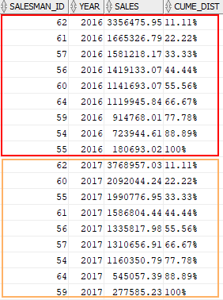

## Aggregate Functions

- Oracle aggregate functions calculate on a group of rows and return a single value for each group.
- We commonly use the aggregate functions together with the `GROUP BY` clause.
- We also use the aggregate functions in the `HAVING` clause to filter groups from the output based on the results of the aggregate functions.
- The `DISTINCT` clause instructs an aggregate function to consider only distinct values of the argument.
- The `ALL` clause causes an aggregate function to take all values into the calculation, including duplicates.
- For example, the `DISTINCT` average of 2, 2, 2 and 4 is 3, which is the result of (2 + 4) / 2.
- However, the `ALL` average of 2, 2, 2 and 4 is 2.5, which is the result of (2 + 2 + 2 + 4) / 4.
- Oracle uses the `ALL` clause by default if you don’t explicitly specify any clause.
- All aggregate functions ignore null values except `COUNT(*)`, `GROUPING()`, and `GROUPING_ID()`.
- The `COUNT()` and `REGR_COUNT()` functions never return null, but either a number or zero (0). Other aggregate functions return `NULL` if the input data set contains `NULL` or has no rows.

### AVG

```sql
AVG([DISTINCT | ALL ] expression)
-----
SELECT ROUND(AVG( standard_cost ), 2) avg_std_cost
FROM products;
```

### COUNT

```sql
COUNT( [ALL | DISTINCT | * ] expression)
-----
SELECT COUNT(*)
FROM items;
```

### MAX

````sql
MAX( expression );
-----
SELECT MAX( list_price )
FROM products;
```|
````

### MIN

```sql
MIN( expression );
-----
SELECT MIN( list_price )
FROM products;
```

### SUM

```sql
SUM( [ALL | DISTINCT] expression)
-----
SELECT SUM( quantity )
FROM order_items;
```

### LISTAGG

- `LISTAGG()` function is an aggregation function that transforms data from multiple rows into a single list of values separated by a specified delimiter.

```sql
LISTAGG (
    [ALL] column_name [,
    delimiter]
) WITHIN GROUP(
    ORDER BY
        sort_expressions
);
```

```sql
SELECT
    job_title,
    LISTAGG(
        first_name,
        ','
    ) WITHIN GROUP(
    ORDER BY
        first_name
    ) AS employees
FROM employees
GROUP BY job_title
ORDER BY job_title;
```

#### Return an error on overflow

- If the result row exceeds the maximum length of the supported data type, you can either return an error or truncate the result row and concatenate a truncation literal.

```sql
LISTAGG(
    [ALL] column_name
    [, delimiter] ON OVERFLOW ERROR
) WITHIN GROUP(
    ORDER BY
        sort_expression
);
```

```sql
SELECT
    category_id,
    LISTAGG(
        description,
        ';' ON OVERFLOW ERROR
    ) WITHIN GROUP(
    ORDER BY
        description
    ) AS products
FROM products
GROUP BY category_id
ORDER BY category_id;
-----

ORA-01489: result of string concatenation is too long

```

#### Truncate result on overflow

- Since Oracle 12c Release 2, you can use the `ON OVERFLOW TRUNCATE` clause to handle the overflow error gracefully.

```sql
LISTAGG(
        [ALL] column_name
        [, delimiter] ON OVERFLOW TRUNCATE
    ) WITHIN GROUP(
        ORDER BY
            sort_expression
    );
```

- By default, `LISTAGG()` function uses an ellipsis (…) and the number of overflow characters such as …(120).

```sql
SELECT
    category_id,
    LISTAGG(
        description,
        ';' ON OVERFLOW TRUNCATE
    ) WITHIN GROUP(
    ORDER BY
        description
    ) AS products
FROM products
GROUP BY category_id
ORDER BY category_id;
```

- If you don’t want to use the default ellipsis, you can specify a custom truncation literal by defining it after the `ON OVERFLOW TRUNCATE` clause as follows:

```sql
 SELECT
    category_id,
    LISTAGG(
        description,
        ';' ON OVERFLOW TRUNCATE '!!!'
    ) WITHIN GROUP(
    ORDER BY
        description
    ) AS products
FROM products
GROUP BY category_id
ORDER BY category_id;
```

- To remove the overflow character count, you use the `WITHOUT COUNT` clause. Note that the `LISTAGG()` function uses the `WITH COUNT` clause by default.

```sql
SELECT
    category_id,
    LISTAGG(
        description,
        ';' ON OVERFLOW TRUNCATE '!!!' WITHOUT COUNT
    ) WITHIN GROUP(
    ORDER BY
        description
    ) AS products
FROM products
GROUP BY category_id
ORDER BY category_id;
```

## Analytic Functions

| Name         | Description                                                                                                     |
| ------------ | --------------------------------------------------------------------------------------------------------------- |
| CUME_DIST    | Calculate the cumulative distribution of a value in a set of values                                             |
| DENSE_RANK   | Calculate the rank of a row in an ordered set of rows with no gaps in rank values.                              |
| FIRST_VALUE  | Get the value of the first row in a specified window frame.                                                     |
| LAG          | Provide access to a row at a given physical offset that comes before the current row without using a self-join. |
| LAST_VALUE   | Get the value of the last row in a specified window frame.                                                      |
| LEAD         | Provide access to a row at a given physical offset that follows the current row without using a self-join.      |
| NTH_VALUE    | Get the Nth value in a set of values.                                                                           |
| NTILE        | Divide an ordered set of rows into a number of buckets and assign an appropriate bucket number to each row.     |
| PERCENT_RANK | Calculate the percent rank of a value in a set of values.                                                       |
| RANK         | Calculate the rank of a value in a set of values                                                                |
| ROW_NUMBER   | Assign a unique sequential integer starting from 1 to each row in a partition or in the whole result            |

### CUME_DIST

- Sometimes, you want to pull the top or bottom x% values from a data set e.g., top 5% salesman by volume. To do this, you can use the Oracle `CUME_DIST()` function.

- The `CUME_DIST()` function is an analytic function that calculates the cumulative distribution of a value in a set of values. The result of `CUME_DIST()` is greater than 0 and less than or equal to 1. Tie values evaluate to the same cumulative distribution value.

- The following shows the syntax of the Oracle CUME_DIST() function:

```sql
CUME_DIST() OVER (
    [ query_partition_clause ]
    order_by_clause
)
```

Because `CUME_DIST()` function is order sensitive, the _order_by_clause_ is required. The _order_by_clause_ has the following syntax:

```sql
ORDER BY expression1
            [ASC | DESC ]
            [NULLS FIRST | LAST]
        [, expression2
            [ASC | DESC ]
            [NULLS FIRST | LAST],... ]
```

The `ORDER BY` clause specifies the order of rows in each partition.

The _query_partition_clause_ has the following form:

```sql
PARTITION BY expression1 [,expression2,..]
```

The `PARTITION BY` clause divides the result set into multiple partitions. It is optional. Omitting this clause means that the function will treat the whole result set as a single partition.

#### CUME_DIST() function over the result set

```sql
SELECT
    salesman_id,
    sales,
    ROUND(cume_dist() OVER (ORDER BY sales DESC) * 100,2) || '%' cume_dist
FROM  salesman_performance
WHERE  YEAR = 2017;
```


- As shown in the output, 33.33 % of salesman have sales amount greater than 1.99 million.

#### CUME_DIST() function over the partition

```sql
SELECT
    salesman_id,
    year,
    sales,
    ROUND(CUME_DIST() OVER (
        PARTITION BY year
        ORDER BY sales DESC
    ) * 100,2) || '%' cume_dist
FROM  salesman_performance
WHERE  year in (2016,2017);
```



In this example:

- The `PARTITION BY` clause divided the result set into two partitions by year, 2016 and 2017.
- The `ORDER BY` clause sorted rows in each partition by sales amount in descending order to which the `CUME_DIST()` function is applied.
- To get top 30% of the salesman by sales revenue in 2016 and 2017, you use the following query:

```sql
WITH cte_sales AS (
SELECT
    salesman_id,
    year,
    sales,
    ROUND(CUME_DIST() OVER (
        PARTITION BY year
        ORDER BY sales DESC
    ),2) cume_dist
FROM
    salesman_performance
WHERE
    year in (2016,2017)
)
SELECT *
FROM cte_sales
WHERE cume_dist <= 0.30;
```


### PERCENT_RANK

- The `PERCENT_RANK()` function is similar to the `CUME_DIST()` function. The `PERCENT_RANK()` function calculates the cumulative distribution of a value in a set of values.
- The result of `PERCENT_RANK()` function is between 0 and 1, inclusive. Tie values evaluate to the same cumulative distribution value.

```sql
PERCENT_RANK() OVER (
    [ query_partition_clause ]
    order_by_clause
)
```

- Because `PERCENT_RANK()` is order sensitive, the order*by_clause is required. The \_order_by_clause* has the following form:

```sql
ORDER BY expression1
            [ASC | DESC ]
            [NULLS FIRST | LAST]
        [, expression2
            [ASC | DESC ]
            [NULLS FIRST | LAST],... ]
```

- The `ORDER BY` clause specifies the order of rows in each partition.
- The _query_partition_clause_ has the following syntax:

```sql
PARTITION BY expression1 [,expression2,..]
```

- The `PARTITION BY` clause divides the result set into multiple partitions. It is an optional clause. Omitting this clause means that the function will treat the whole result set as a single partition.

- The following statement calculates the sales percentile for each salesman in 2017:

```sql
SELECT
    salesman_id,
    sales,
    ROUND(
       PERCENT_RANK() OVER (
          ORDER BY sales DESC
       ) * 100,2) || '%' percent_rank
FROM salesman_performance
WHERE YEAR = 2017;
```


- The following statement calculates the sales percentile for each salesman in 2016 and 2017.

```sql
SELECT
    salesman_id,
    year,
    sales,
    ROUND(PERCENT_RANK() OVER (
        PARTITION BY year
        ORDER BY sales DESC
    ) * 100,2) || '%' percent_rank
FROM salesman_performance
WHERE year in (2016,2017);
```


In this example:

- The `PARTITION BY` clause divided the result set into two partitions by year, 2016 and 2017.
- The `ORDER BY` clause sorted rows in each partition by sales amount from high to low.
- The `PERCENT_RANK()` function was then applied to the value of each row in each partition.

### RANK

- The RANK() function returns the same rank for the rows with the same values. It adds the number of tied rows to the tied rank to calculate the next rank. Therefore, the ranks may not be consecutive numbers.
- The RANK() function is useful for top-N and bottom-N queries.

```sql
RANK()
	OVER ([ query_partition_clause ] order_by_clause)
```

- The _order_by_clause_ is required. It species the order of rows in each partition to which the `RANK()` function applies.
- The query partition clause, if available, divides the rows into partitions to which the `RANK()` function applies. In case the query partition cause is omitted, the whole result set is treated as a single partition.

#### The following statement calculates the rank of each product by its list price:

```sql
SELECT
	product_name,
	list_price,
	RANK() OVER(ORDER BY list_price DESC)
FROM products;
```


#### To get the top 10 most expensive products, you use the following statement:

```sql
WITH cte_products AS (
	SELECT
		product_name,
		list_price,
		RANK() OVER(ORDER BY list_price DESC) price_rank
	FROM
		products
)
SELECT
	product_name,
	list_price,
	price_rank
FROM  cte_products
WHERE price_rank <= 10;
```


#### The following example returns the top-3 most expensive products for each category:

```sql
WITH cte_products AS (
	SELECT
		product_name,
		list_price,
		category_id,
		RANK() OVER(
			PARTITION BY category_id
			ORDER BY list_price DESC)
			price_rank
	FROM products
)
SELECT
	product_name,
	list_price,
	category_id,
	price_rank
FROM cte_products
WHERE price_rank <= 3;
```

In this example:

- First, the `PARTITION BY` clause divided the products into multiple partitions by category.
- Then, the `ORDER BY` clause sorted the rows in each partition by list price in descending order.
- Finally, the `RANK()` function calculated the rank for each row in each partition. It re-initialized the rank for each partition.


### DENSE_RANK

- The `DENSE_RANK()` is an analytic function that calculates the rank of a row in an ordered set of rows. The returned rank is an integer starting from 1.
- Unlike the `RANK()` function, the `DENSE_RANK()` function returns rank values as consecutive integers. It does not skip rank in case of ties. Rows with the same values for the rank criteria will receive the same rank values.
- You will find the `DENSE_RANK()` function very useful for top-N and bottom-N queries.

```sql
DENSE_RANK( ) OVER([ query_partition_clause ] order_by_clause)
```

the _order_by_clause_ is required because the `DENSE_RANK()` function is ordered sensitive.

```sql
ORDER BY expression1 [,expression2,...] [ASC | DESC ] [NULLS FIRST | LAST]
```

If you omit the _query_partition_by_ clause, the function will treat the whole result set as a single partition. Otherwise, the partition by clause will divide the result set into partitions to which the function applies.

```sql
PARTITION BY expression1 [,expression2, ...]
```

#### Rank values with the list price as a rank criterion

```sql
SELECT
    product_name,
    list_price,
    RANK() OVER(ORDER BY list_price)
FROM  products;
```


#### To get the top-10 cheapest product

```sql
WITH cte_products AS(
SELECT
    product_name,
    list_price,
    RANK() OVER(
    ORDER BY list_price
    ) my_rank
FROM products
)
SELECT * FROM cte_products
WHERE my_rank <= 10;
```


#### Top-5 cheapest products in each category

```sql
WITH cte_products AS(
SELECT
    product_name,
    category_id,
    list_price,
    RANK() OVER (
    PARTITION BY category_id
    ORDER BY list_price
    ) my_rank
FROM products
)
SELECT * FROM cte_products
WHERE my_rank <= 5;
```


In this example:

- First, the `PARTITION BY` clause distributed the rows from the products table into partitions by category id.
- Then, the `ORDER BY` clause sorted the rows in each partition by list price in ascending order.
- Finally, the `DENSE_RANK()` function applied to the rows in each partition. It re-initialized the rank values for each new partition.

### FIRST_VALUE

- The `FIRST_VALUE()` is an analytic function that allows you to get the first value in an ordered set of value

```sql
FIRST_VALUE (expression) [ {RESPECT | IGNORE} NULLS ])
OVER (
    [ query_partition_clause ]
    order_by_clause
    [frame_clause]
)
```

#### expression

- is an expression evaluated against the value of the first row in the window frame specified by the frame_clause.
- The expression must return a single value and must not contain subqueries or other analytic functions. The `FIRST_VALUE()` function returns `NULL` if the value of the first row in the window frame evaluates to `NULL` unless you specify the `IGNORE NULLS` option. By default, the function uses `RESPECT NULLS`.

#### query_partition_clause

- The _query_partition_clause_ clause divides rows into partitions by one or more criteria to which the `FIRST_VALUE()` function is applied. The _query_partition_clause_ clause is optional. If you skip it, the `FIRST_VALUE()` function will consider the whole result set as a single partition.
- The _query_partition_clause_ has the following form:

```sql
PARTITION BY expression1 [,expression2, ...]
```

#### order_by_clause

- The order_by_clause clause specifies the order of the rows in each partition to which the `FIRST_VALUE()` function is applied:

```sql
ORDER BY expression1 [,expression2,...] [ASC | DESC ] [NULLS FIRST | LAST]
```

#### frame_clause

- The frame_clause defines the frame of the current partition.

#### Returns the product id, product name, list price, and the name of the product with the lowest price

```sql
SELECT
    product_id,
    product_name,
    list_price,
    FIRST_VALUE(product_name)
     OVER (ORDER BY list_price) first_product
FROM
    products
WHERE
    category_id = 1;
```


#### To get the lowest price product in each category, you add the _query_partition_clause_ clause and remove the `WHERE` clause:

```sql
SELECT
    product_id,
    product_name,
    category_id,
    list_price,
    FIRST_VALUE(product_name)
        OVER (
            PARTITION BY category_id
            ORDER BY list_price
        ) first_product
FROM products;
```


### LAST_VALUE

- The `LAST_VALUE()` is an analytic function that allows you to obtain the last value in an ordered set of values.

```sql
LAST_VALUE (expression) [ {RESPECT | IGNORE} NULLS ])
OVER (
    [ query_partition_clause ]
    order_by_clause
    [frame_clause]
)
```

In this syntax:

#### expression

- is an expression evaluated against the value of the last row in the window frame specified by the _frame_clause_.
- It is required that the expression to return a single value. In addition, the expression must not contain subqueries or analytic functions. The `LAST_VALUE()` function returns `NULL` if the value of the last row in the window frame evaluates to `NULL` unless you specify the `IGNORE NULLS` option. The function uses `RESPECT NULLS` by default even you don’t explicitly specify it.

#### query_partition_clause

- The _query_partition_clause_ clause distributes rows into partitions by one or more criteria to which the `LAST_VALUE()` function is applied.
- The _query_partition_clause_ clause is optional. If you omit it, the function will treat the whole result set as a single partition.

The following shows the syntax of the _query_partition_clause_:

```sql
PARTITION BY expression1 [,expression2, ...]
```

#### order_by_clause

- The _order_by_clause_ clause specifies the order of the rows in each partition to which the `LAST_VALUE()` function is applied. - The _order_by_clause_ is required and has the following form:

```sql
ORDER BY expression1 [,expression2,...] [ASC | DESC ] [NULLS FIRST | LAST]
```

#### frame_clause

The frame_clause defines the frame of the current partition.

#### Returns the product id, product name, list price, and the name of the product that has the highest list price:

```sql
SELECT
    product_id,
    product_name,
    list_price,
    LAST_VALUE(product_id) OVER (
        ORDER BY list_price
        RANGE BETWEEN UNBOUNDED PRECEDING AND
            UNBOUNDED FOLLOWING) highest_price_product_id
FROM products;
```


Note that the frame clause:

```sql
RANGE BETWEEN UNBOUNDED PRECEDING AND
              UNBOUNDED FOLLOWING
```

defines that the window frame starts at the first row and ends at last row of the result set.

- To show the highest price product in each category, you add the `PARTITION BY` clause as shown in the following query:

```sql
SELECT
    product_id,
    product_name,
    category_id,
    list_price,
    LAST_VALUE(product_name) OVER (
        PARTITION BY category_id
        ORDER BY list_price
        RANGE BETWEEN UNBOUNDED PRECEDING AND
            UNBOUNDED FOLLOWING) highest_price_product_id
FROM products;
```

### LAG

- Oracle `LAG()` is an analytic function that allows you to access the row at a given offset prior to the current row without using a self-join.

```sql
LAG(expression [, offset ] [, default ])
OVER (
	[ query_partition_clause ]
	order_by_clause
)
```

In this syntax:

#### expression

- is a scalar expression evaluated against the value of the row at a given offset prior to the current row.

#### offset

- is the number of rows that you want to backward from the current row. The default is 1.

#### default

- If the offset goes beyond the scope of the partition, the function returns the default. If you omit default, then the function returns `NULL`.

#### query_partition_clause

- The _query_partition_clause_ clause divides rows into partitions to which the `LAG()` function is applied. By default, the function treats the whole result set as a single partition.

#### order_by_clause

- The _order_by_clause_ clause specifies the order of the rows in each partition to which the `LAG()` function is applied.
- Similar to the `LEAD()` function, the `LAG()` function is very useful for calculating the difference between the values of current and previous rows.

#### Return sales and the previous year’s sales of the salesman id 62

```sql
SELECT
	salesman_id,
	year,
	sales,
	LAG(sales) OVER (
		ORDER BY year
	) py_sales
FROM salesman_performance
WHERE salesman_id = 62;
```


#### Calculate year over year sales performance of the salesman id 62

```sql
WITH cte_sales (
	salesman_id,
	year,
	sales,
	py_sales)
AS (
	SELECT
		salesman_id,
		year,
		sales,
		LAG(sales) OVER (
			ORDER BY year
		) py_sales
	FROM
		salesman_performance
	WHERE
		salesman_id = 62
)
SELECT
	salesman_id,
	year,
	sales,
	py_sales,
	CASE
    	 WHEN py_sales IS NULL THEN 'N/A'
  	ELSE
    	 TO_CHAR((sales - py_sales) * 100 / py_sales,'999999.99') || '%'
  	END YoY
FROM cte_sales;
```


- The first row returned `NULL` for the py_sales column because there was no previous row of the first row.

#### Return YoY sales performance of every salesman

```sql
WITH cte_sales (
	salesman_id,
	year,
	sales,
	py_sales)
AS (
	SELECT
		salesman_id,
		year,
		sales,
		LAG(sales) OVER (
			PARTITION BY salesman_id
			ORDER BY year
		) py_sales
	FROM salesman_performance
)
SELECT
	salesman_id,
	year,
	sales,
	py_sales,
	CASE
    	 WHEN py_sales IS NULL THEN 'N/A'
  	ELSE
    	 TO_CHAR((sales - py_sales) * 100 / py_sales,'999999.99') || '%'
  	END YoY
FROM cte_sales;
```


### LEAD

- Oracle `LEAD()` is an analytic function that allows you to access the following row from the current row without using a self-join.

```sql
LEAD(expression [, offset ] [, default ])
OVER (
	[ query_partition_clause ]
	order_by_clause
)
```

In this syntax:

#### expression

- is a scalar expression evaluated against the value of the row specified by offset. It must return a single value.

#### offset

- is the number of rows forwarding from the current row from which to get the value. The default is 1.

#### default

- If the offset goes beyond the scope of the partition, the function returns the default. If you skip default, then the function will return `NULL`.

#### query_partition_clause

- The query_partition_clause clause divided the rows into partitions to which the `LEAD()` function is applied. By default, the function treats the whole result set as a single partition.

#### order_by_clause

- The order_by_clause clause specifies the order the rows in each partition to which the `LEAD()` function is applied.
- The `LEAD()` function is very useful for calculating the difference between the values of current and subsequent rows.

#### Returns the sales of the salesman by year based on the orders and order_items tables

```sql
CREATE VIEW salesman_performance (
	salesman_id,
	year,
	sales
) AS
SELECT
	salesman_id,
	EXTRACT(YEAR FROM order_date),
	SUM(quantity*unit_price)
FROM orders
INNER JOIN order_items USING (order_id)
WHERE salesman_id IS NOT NULL
GROUP BY
	salesman_id,
	EXTRACT(YEAR FROM order_date);
```

The following statement returns the data through the salesman_performance view :

```sql
SELECT
   salesman_id,
   year,
   sales
FROM salesman_performance
ORDER BY
   salesman_id,
   year,
   sales;
```


#### LEAD() function to return sales of the following year of the salesman id 55

```sql
SELECT
	salesman_id,
	year,
	sales,
	LEAD(sales) OVER (
		ORDER BY year
	) following_year_sales
FROM  salesman_performance
WHERE salesman_id = 55;
```


The last row returned `NULL` for the _following_year_sales_ column because the offset went beyond the scope of the result set.

#### LEAD() function to return sales of the following year for every salesman:

```sql
SELECT
	salesman_id,
	year,
	sales,
	LEAD(sales) OVER (
		PARTITION BY SALESMAN_ID
		ORDER BY year
	) following_year_sales
FROM salesman_performance;
```


### NTH_VALUE

- The Oracle `NTH_VALUE()` function is an analytic function that returns the Nth value in a set of values.

```sql
NTH_VALUE (expression, N)
[ FROM { FIRST | LAST } ]
[ { RESPECT | IGNORE } NULLS ]
OVER (
    [ query_partition_clause ]
    order_by_clause
    [frame_clause]
)
```

In this syntax:

#### expression

- is any valid expression evaluated against the Nth row of the window frame.

#### N

- Specifies the Nth row in the window frame defined by the frame_clause. N must be a positive integer such as 1, 2, and 3.
- The `NTH_VALUE()` function will return `NULL` if the Nth row does not exist.

#### FROM { FIRST | LAST }

- This determines whether the calculation starts at the first or last row of the window frame. The default is `FROM FIRST`.

#### [ { RESPECT | IGNORE } NULLS ]

- This determines whether `NULL` is included in or eliminated from the calculation. The default is `RESPECT NULLS`.

#### query_partition_clause

- The _query_partition_clause_ clause divides the rows into partitions to which the `NTH_VALUE()` function is applied. The _query_partition_clause_ clause is not mandatory. If you skip it, the `NTH_VALUE()` function will treat the whole result set as a single partition.

#### order_by_clause

- The order_by_clause clause specifies the order of rows in each partition to which the `NTH_VALUE()` function is applied.

#### frame_clause

- The frame_clause defines the frame of the current partition.

#### NTH_VALUE() function to return all the products and also the second most expensive one:

```sql
SELECT
    product_id,
    product_name,
    list_price,
    NTH_VALUE(product_name,2) OVER (
        ORDER BY list_price DESC
        RANGE BETWEEN
            UNBOUNDED PRECEDING AND
            UNBOUNDED FOLLOWING
    ) AS second_most_expensive_product
FROM products;
```


#### NTH_VALUE() function to get all the products as well as the second most expensive product by category:

```sql
SELECT
    product_id,
    product_name,
    category_id,
    list_price,
    NTH_VALUE(product_name,2) OVER (
        PARTITION BY category_id
        ORDER BY list_price DESC
        RANGE BETWEEN UNBOUNDED PRECEDING AND
            UNBOUNDED FOLLOWING
    ) AS second_most_expensive_product
FROM products;
```

### NTILE

- Oracle `NTILE()` function is an analytical function that divides an ordered result set into a number of and assigns an appropriate bucket number to each row.

```sql
NTILE(expression) OVER (
    [query_partition_clause]
    order_by_clause
)
```

In this syntax:

#### expression

- The expression is any valid expression evaluated to a positive integer.
- The buck number is from 1 to the result of expression e.g., N. The number of rows in buckets can differ by at most 1. The remainder of the number of rows divided by buckets is allocated to each bucket, starting from the first bucket.
- Suppose you have a result set that consists of 10 rows and you want to divide this result set into 4 buckets. First, 4 buckets will 2 rows are created. The remainder is 2 (10/4). These 2 buckets will be distributed to first and second buckets. As the result, the first and second buckets will have 2 + 1 = 3 rows. The last two buckets will have 2 rows.
- The following picture illustrates the logic:
  

- If the result of the expression is greater than the number of rows, then a number of buckets equal to the number of rows will be filled, and the remaining buckets will be empty.
- For example, if you have five rows and six buckets, each row will be assigned a bucket number from 1 to 6. The 7th bucket will be empty.
- Notice that the expression cannot contain any subquery or analytic function.

#### partition_by_clause

- The `PARTITION BY` clause divides the result sets into partitions to which the `NTILE` function is applied:

```sql
PARTITION BY expression1 [,expression2,..]
```

#### order_by_clause

- The _order_by_clause_ clause specifies the order of rows in each partition to which the `NTILE()` is applied:

```sql
ORDER BY expression1 [,expression2,...]
[ASC | DESC ]
[NULLS FIRST | LAST]
```

-- We will use the salesman_performance view for the demonstration:

```sql
CREATE OR REPLACE VIEW salesman_performance (
	salesman_id,
	year,
	sales
) AS
SELECT
	salesman_id,
	EXTRACT(YEAR FROM order_date),
	SUM(quantity*unit_price)
FROM orders
INNER JOIN order_items USING (order_id)
WHERE salesman_id IS NOT NULL
GROUP BY
	salesman_id,
	EXTRACT(YEAR FROM order_date);
```

The following statement divides into 4 buckets the values in the sales column of the salesman_performance view from the year of 2017.

```sql
SELECT
	salesman_id,
	sales,
	NTILE(4) OVER(
		ORDER BY sales DESC
	) quartile
FROM salesman_performance
WHERE year = 2017;
```


In this example, the sales column has 9 values so the first bucket receives 3 rows. Other 3 buckets receive 2 rows.

- The following statement divides into 4 buckets the values in the sales column of the salesman_performance view in the year of 2016 and 2017:

```sql
SELECT
	salesman_id,
	sales,
	year,
	NTILE(4) OVER(
		PARTITION BY year
		ORDER BY sales DESC
	) quartile
FROM  salesman_performance
WHERE year = 2016 OR year = 2017;
```


### ROW_NUMBER

- The `ROW_NUMBER()` is an analytic function that assigns a sequential unique integer to each row to which it is applied, either each row in the partition or each row in the result set.

```sql
ROW_NUMBER() OVER (
   [query_partition_clause]
   order_by_clause
)
```

In this syntax:

- The _order_by_clause_ is required. It specifies the order of rows in each partition or in the whole result set. The order_by_clause has the following form:

```sql
ORDER BY expression1 [,expression2,...] [ASC | DESC ] [NULLS FIRST | LAST]
```

- The _query_partition_clause_ is optional. It distributes the rows into partitions to which the function is applied. If you omit the _query_partition_clause_, the function will treat the whole result set as a single partition. The _query_partition_clause_ has the following form:

```sql
PARTITION BY expression1 [,expression2, ...]
```

#### The following statement returns the row number, product name and list price from the products table. The row number values are assigned based on the order of list prices.

```sql
SELECT
    ROW_NUMBER() OVER(
        ORDER BY list_price DESC
    ) row_num,
    product_name,
    list_price
FROM products;
```


- To effectively use the `ROW_NUMBER()` function, you should use a subquery or a common table expression to retrieve row numbers for a specified range to get the top-N, bottom-N, and inner-N results.

#### The ROW_NUMBER() function is useful for pagination in applications.

- Suppose you want to display products by pages with the list price from high to low, each page has 10 products. To display the third page, you use the `ROW_NUMBER()` function as follows:

```sql
WITH cte_products AS (
    SELECT
        row_number() OVER(
            ORDER BY list_price DESC
        ) row_num,
        product_name,
        list_price
    FROM products
)
SELECT * FROM cte_products
WHERE row_num > 30 and row_num <= 40;
```


- In this example, the CTE used the `ROW_NUMBER()` function to assign each row a sequential integer in descending order. The outer query retrieved the row whose row numbers are between 31 and 40.

- To get a single most expensive product by category, you can use the `ROW_NUMBER()` function as shown in the following query:

```sql
WITH cte_products AS (
SELECT
    row_number() OVER(
        PARTITION BY category_id
        ORDER BY list_price DESC
    ) row_num,
    category_id,
    product_name,
    list_price
FROM products
)
SELECT * FROM cte_products
WHERE row_num = 1;
```


In this example:

- First, the `PARTITION BY` clause divided the rows into partitions by category id.
- Then, the `ORDER BY` clause sorted the products in each category by list prices in descending order.
- Next, the `ROW_NUMBER()` function is applied to each row in a specific category id. It re-initialized the row number for each category.
- After that, the outer query selected the rows with row number 1 which is the most expensive product in each category.
- For the consistent result, the query must return a result set with the deterministic order. For example, if two products had the same highest prices, then the result would not be consistent. It could return the first or second product.
- To get more than one product with the same N-highest prices, you can use the `RANK()` or `DENSE_RANK()` function.

## Date Functions

| Function          | Example                                                                             | Result                                 | Description                                                                                        |     |
| ----------------- | ----------------------------------------------------------------------------------- | -------------------------------------- | -------------------------------------------------------------------------------------------------- | --- |
| ADD_MONTHS        | ADD_MONTHS( DATE '2016-02-29', 1 )                                                  | 31-MAR-16                              | Add a number of months (n) to a date and return the same day which is n of months away.            |     |
| CURRENT_DATE      | SELECT CURRENT_DATE FROM dual                                                       | 06-AUG-2017 19:43:44                   | Return the current date and time in the session time zone                                          |     |
| CURRENT_TIMESTAMP | SELECT CURRENT_TIMESTAMP FROM dual                                                  | 06-AUG-17 08.26.52.742000000 PM -07:00 | Return the current date and time with time zone in the session time zone                           |     |
| DBTIMEZONE        | SELECT DBTIMEZONE FROM dual;                                                        | -07:00                                 | Get the current database time zone                                                                 |     |
| EXTRACT           | EXTRACT(YEAR FROM SYSDATE)                                                          | 2017                                   | Extract a value of a date time field e.g., YEAR, MONTH, DAY, … from a date time value.             |     |
| FROM_TZ           | FROM_TZ(TIMESTAMP '2017-08-08 08:09:10', '-09:00')                                  | 08-AUG-17 08.09.10.000000000 AM -07:00 | Convert a timestamp and a time zone to a TIMESTAMP WITH TIME ZONE value                            |     |
| LAST_DAY          | LAST_DAY(DATE '2016-02-01')                                                         | 29-FEB-16                              | Gets the last day of the month of a specified date.                                                |     |
| LOCALTIMESTAMP    | SELECT LOCALTIMESTAMP FROM dual                                                     | 06-AUG-17 08.26.52.742000000 PM        | Return a TIMESTAMPvalue that represents the current date and time in the session time zone.        |     |
| MONTHS_BETWEEN    | MONTHS_BETWEEN( DATE '2017-07-01', DATE '2017-01-01' )                              | 6                                      | Return the number of months between two dates.                                                     |     |
| NEW_TIME          | NEW_TIME( TO_DATE( '08-07-2017 01:30:45', 'MM-DD-YYYY HH24:MI:SS' ), 'AST', 'PST' ) | 06-AUG-2017 21:30:45                   | Convert a date in one time zone to another                                                         |     |
| NEXT_DAY          | NEXT_DAY( DATE '2000-01-01', 'SUNDAY' )                                             | 02-JAN-00                              | Get the first weekday that is later than a specified date.                                         |     |
| ROUND             | ROUND(DATE '2017-07-16', 'MM')                                                      | 01-AUG-17                              | Return a date rounded to a specific unit of measure.                                               |     |
| SESSIONTIMEZONE   | SELECT SESSIONTIMEZONE FROM dual;                                                   | -07:00                                 | Get the session time zone                                                                          |     |
| SYSDATE           | SYSDATE                                                                             | 01-AUG-17                              | Return the current system date and time of the operating system where the Oracle Database resides. |     |
| SYSTIMESTAMP      | SELECT SYSTIMESTAMP FROM dual;                                                      | 01-AUG-17 01.33.57.929000000 PM -07:00 | Return the system date and time that includes fractional seconds and time zone.                    |     |
| TO_CHAR           | TO_CHAR( DATE'2017-01-01', 'DL' )                                                   | Sunday, January 01, 2017               | Convert a DATE or an INTERVALvalue to a character string in a specified format.                    |     |
| TO_DATE           | TO_DATE( '01 Jan 2017', 'DD MON YYYY' )                                             | 01-JAN-17                              | Convert a date which is in the character string to a DATE value.                                   |     |
| TRUNC             | TRUNC(DATE '2017-07-16', 'MM')                                                      | 01-JUL-17                              | Return a date truncated to a specific unit of measure.                                             |     |
| TZ_OFFSET         | TZ_OFFSET( 'Europe/London' )                                                        | +01:00                                 | Get time zone offset of a time zone name from UTC                                                  |     |

## String Functions

| Function       | Example                                          | Result            | Purpose                                                                                                                                            |
| -------------- | ------------------------------------------------ | ----------------- | -------------------------------------------------------------------------------------------------------------------------------------------------- |
| ASCII          | ASCII(‘A’)                                       | 65                | Returns an ASCII code value of a character.                                                                                                        |
| CHR            | CHR(’65’)                                        | ‘A’               | Converts a numeric value to its corresponding ASCII character.                                                                                     |
| CONCAT         | CONCAT(‘A’,’BC’)                                 | ‘ABC’             | Concatenate two strings and return the combined string.                                                                                            |
| CONVERT        | CONVERT( ‘Ä Ê Í’, ‘US7ASCII’, ‘WE8ISO8859P1’ )   | ‘A E I’           | Convert a character string from one character set to another.                                                                                      |
| DUMP           | DUMP(‘A’)                                        | Typ=96 Len=1: 65  | Return a string value (VARCHAR2) that includes the datatype code, length measured in bytes, and internal representation of a specified expression. |
| INITCAP        | INITCAP(‘hi there’)                              | ‘Hi There’        | Converts the first character in each word in a specified string to uppercase and the rest to lowercase.                                            |
| INSTR          | INSTR( ‘This is a playlist’, ‘is’)               | 3                 | Search for a substring and return the location of the substring in a string                                                                        |
| LENGTH         | LENGTH(‘ABC’)                                    | 3                 | Return the number of characters (or length) of a specified string                                                                                  |
| LOWER          | LOWER(‘Abc’)                                     | ‘abc’             | Return a string with all characters converted to lowercase.                                                                                        |
| LPAD           | LPAD(‘ABC’,5,’\*’)                               | ‘\*\*ABC’         | Return a string that is left-padded with the specified characters to a certain length.                                                             |
| LTRIM          | LTRIM(‘ ABC ‘)                                   | ‘ABC ‘            | Remove spaces or other specified characters in a set from the left end of a string.                                                                |
| REGEXP_COUNT   | REGEXP_COUNT(‘1 2 3 abc’,’\d’)                   | 3                 | Return the number of times a pattern occurs in a string.                                                                                           |
| REGEXP_INSTR   | REGEXP_INSTR( ‘Y2K problem’,’\d+’)               | 2                 | Return the position of a pattern in a string.                                                                                                      |
| REGEXP_LIKE    | REGEXP_LIKE( ‘Year of 2017′,’\d+’ )              | true              | Match a string based on a regular expression pattern.                                                                                              |
| REGEXP_REPLACE | REGEXP_REPLACE( ‘Year of 2017′,’\d+’, ‘Dragon’ ) | ‘Year of Dragon’  | Replace substring in a string by a new substring using a regular expression.                                                                       |
| REGEXP_SUBSTR  | REGEXP_SUBSTR( ‘Number 10’, ‘\d+’ )              | 10                | Extract substrings from a string using a pattern of a regular expression.                                                                          |
| REPLACE        | REPLACE(‘JACK AND JOND’,’J’,’BL’);               | ‘BLACK AND BLOND’ | Replace all occurrences of a substring by another substring in a string.                                                                           |
| RPAD           | RPAD(‘ABC’,5,’\*’)                               | ‘ABC\*\*’         | Return a string that is right-padded with the specified characters to a certain length.                                                            |
| RTRIM          | RTRIM(‘ ABC ‘)                                   | ‘ ABC’            | Remove all spaces or specified character in a set from the right end of a string.                                                                  |
| SOUNDEX        | SOUNDEX(‘sea’)                                   | ‘S000’            | Return a phonetic representation of a specified string.                                                                                            |
| SUBSTR         | SUBSTR(‘Oracle Substring’, 1, 6 )                | ‘Oracle’          | Extract a substring from a string.                                                                                                                 |
| TRANSLATE      | TRANSLATE(‘12345’, ‘143’, ‘bx’)                  | ‘b2x5’            | Replace all occurrences of characters by other characters in a string.                                                                             |
| TRIM           | TRIM(‘ ABC ‘)                                    | ‘ABC’             | Remove the space character or other specified characters either from the start or end of a string.                                                 |
| UPPER          | UPPER(‘Abc’)                                     | ‘ABC’             | Convert all characters in a specified string to uppercase.                                                                                         |

## Comparison Functions

### COALESCE

- `COALESCE()` function returns the first non-null expression in the list. It requires at least two expressions.
- If all arguments have the same data type, the `COALESCE()` function returns a value of that data type.
- If the arguments have different data types, the `COALESCE()` function implicitly converts all arguments to the data type of the first non-null argument.
- In case the conversion fails, then Oracle issues an error.
- The `COALESCE()` function uses short-circuit evaluation. It means that the function stops evaluating the remaining expressions once it finds the first one evaluates to a non-null value.
- In case of two expressions, the `COALESCE()` function and `NVL()` seems to be similar but their implementations are different.

```sql
SELECT COALESCE(1,NULL)
FROM dual;

SELECT NVL(1,NULL)
FROM dual;
```

- Both statements return the same result which is one. However, the `COALESCE()` function only evaluates the first expression to determine the result while the `NVL()` function evaluates both expressions.

```sql
SELECT COALESCE(1,1/0)
FROM dual;

SELECT NVL(1,1/0)
FROM dual;
```

- Because the `NVL()` function evaluated the second expression 1/0 that causes the error.

### DECODE

```sql
DECODE (search_value, search_value1, if search_value & search_value1 is same show this,
                      search_value2, if search_value & search_value2 is same show this,
                      search_value3, if search_value & search_value3 is same show this,
                      default)

SELECT product_id,
       DECODE (warehouse_id, 1, 'Southlake',
                             2, 'San Francisco',
                             3, 'New Jersey',
                             4, 'Seattle',
                                'Non domestic')
       "Location of inventory" FROM inventories
       WHERE product_id < 1775;
```

### NVL

- The `NVL()` function accepts two arguments. If e1 evaluates to null, then `NVL()` function returns e2. If e1 evaluates to non-null, the `NVL()` function returns e1.

```sql
SELECT NVL(NULL, 'N/A')
FROM dual;
```

### NVL2

- The Oracle `NVL2()` function accepts three arguments. If the first argument is not null, then it returns the second argument. In case the second argument is null, then it returns the third argument.


```sql
SELECT NVL2(NULL, 1, 2) -- 2
FROM dual;
```

```sql
SELECT NVL2(1, 'ABC', 'XYZ') -- ABC
FROM dual;
```

### NULLIF

- The Oracle `NULLIF()` function accepts two arguments. It returns a null value if the two arguments are equal. In case the arguments are not equal, the `NULLIF()` function returns the first argument.

```sql
SELECT NULLIF(100,100) -- null
FROM dual;
```

- The following example causes an error because the first argument is literal `NULL`:

```sql
SELECT NULLIF(NULL,100)
FROM dual;
```

- The following statement also causes an error because the data types of arguments are different.

```sql
SELECT NULLIF(10,'20')
FROM dual;
```
