- git add .
- git commit -m "first commit"
- git push -u origin main
- GIT_USER=tenimathew yarn deploy
- Generate tocken for password


## SQL Commands

### DDL (Data Definition Language)

Used to define the structure of the database.

```sql
CREATE DROP ALTER TRUNCATE COMMENT PURGE RENAME
```

### DML (Data Manipulation Language)

Used to manage the data in the database

```sql
INSERT UPDATE DELETE
```

### DCL (Data Control Language)

Used to control the access to database and various permissions. It is also considered as a DDL command.

```sql
GRANT REVOKE
```

### TCL (Transaction Control Language)

Used to manage the transactions made by the DML commands

```sql
COMMIT ROLLBACK SAVEPOINT
SAVEPOINT sp1;
ROLLBACK TO sp1;
```

#### COMMIT

All clauses after the `COMMIT` keyword are optional. If you specify only `COMMIT`, then the default is `COMMIT WORK WRITE IMMEDIATE WAIT`.

#### WORK

The `WORK` keyword is supported for compliance with standard SQL. The statements `COMMIT` and `COMMIT WORK` are equivalent.

### DQL (Data Query Language)

Used to retrieve data from the database

```sql
SELECT
```

### SQL Constraints

```sql
NOT NULL
UNIQUE
PRIMARY KEY
FOREIGN KEY
CHECK
```

### Data Dictionary (Constraints)

```sql
USER_CONSTRAINTS -- brief
USER_CONS_COLUMNS -- detailed
```

## Sample Database

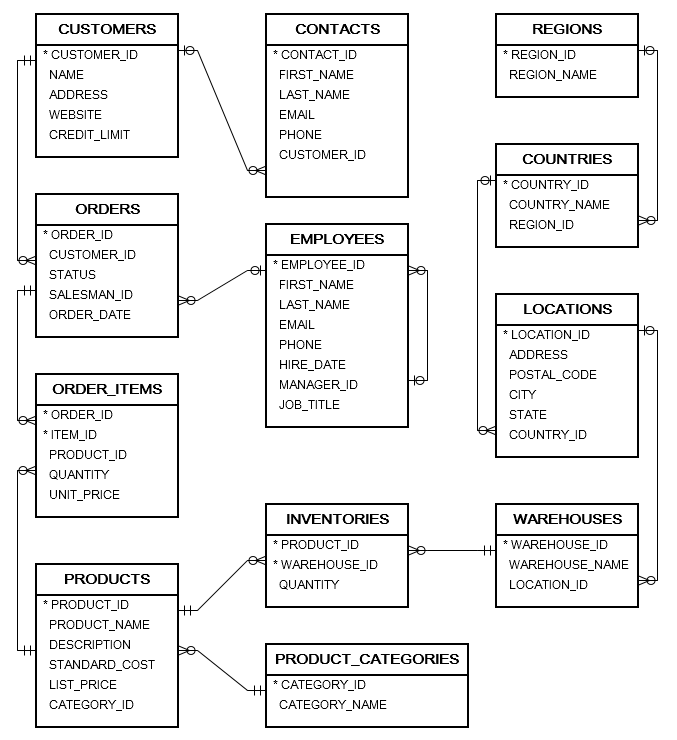

- `ot_create_user.sql` is for creating OT user and grant privileges
- `ot_schema.sql` is for creating database objects such as tables, constraints, etc.
- `ot_data.sql` is for loading data into the tables.
- ` ot_drop.sql` is for removing all objects in the sample database.

```sql
CREATE TABLE regions
  (
    region_id NUMBER GENERATED BY DEFAULT AS IDENTITY
    START WITH 5 PRIMARY KEY,
    region_name VARCHAR2( 50 ) NOT NULL
  );
-- countries table
CREATE TABLE countries
  (
    country_id   CHAR( 2 ) PRIMARY KEY  ,
    country_name VARCHAR2( 40 ) NOT NULL,
    region_id    NUMBER                 , -- fk
    CONSTRAINT fk_countries_regions FOREIGN KEY( region_id )
      REFERENCES regions( region_id )
      ON DELETE CASCADE
  );

-- location
CREATE TABLE locations
  (
    location_id NUMBER GENERATED BY DEFAULT AS IDENTITY START WITH 24
                PRIMARY KEY       ,
    address     VARCHAR2( 255 ) NOT NULL,
    postal_code VARCHAR2( 20 )          ,
    city        VARCHAR2( 50 )          ,
    state       VARCHAR2( 50 )          ,
    country_id  CHAR( 2 )               , -- fk
    CONSTRAINT fk_locations_countries
      FOREIGN KEY( country_id )
      REFERENCES countries( country_id )
      ON DELETE CASCADE
  );
-- warehouses
CREATE TABLE warehouses
  (
    warehouse_id NUMBER
                 GENERATED BY DEFAULT AS IDENTITY START WITH 10
                 PRIMARY KEY,
    warehouse_name VARCHAR( 255 ) ,
    location_id    NUMBER( 12, 0 ), -- fk
    CONSTRAINT fk_warehouses_locations
      FOREIGN KEY( location_id )
      REFERENCES locations( location_id )
      ON DELETE CASCADE
  );
-- employees
CREATE TABLE employees
  (
    employee_id NUMBER
                GENERATED BY DEFAULT AS IDENTITY START WITH 108
                PRIMARY KEY,
    first_name VARCHAR( 255 ) NOT NULL,
    last_name  VARCHAR( 255 ) NOT NULL,
    email      VARCHAR( 255 ) NOT NULL,
    phone      VARCHAR( 50 ) NOT NULL ,
    hire_date  DATE NOT NULL          ,
    manager_id NUMBER( 12, 0 )        , -- fk
    job_title  VARCHAR( 255 ) NOT NULL,
    CONSTRAINT fk_employees_manager
        FOREIGN KEY( manager_id )
        REFERENCES employees( employee_id )
        ON DELETE CASCADE
  );
-- product category
CREATE TABLE product_categories
  (
    category_id NUMBER
                GENERATED BY DEFAULT AS IDENTITY START WITH 6
                PRIMARY KEY,
    category_name VARCHAR2( 255 ) NOT NULL
  );

-- products table
CREATE TABLE products
  (
    product_id NUMBER
               GENERATED BY DEFAULT AS IDENTITY START WITH 289
               PRIMARY KEY,
    product_name  VARCHAR2( 255 ) NOT NULL,
    description   VARCHAR2( 2000 )        ,
    standard_cost NUMBER( 9, 2 )          ,
    list_price    NUMBER( 9, 2 )          ,
    category_id   NUMBER NOT NULL         ,
    CONSTRAINT fk_products_categories
      FOREIGN KEY( category_id )
      REFERENCES product_categories( category_id )
      ON DELETE CASCADE
  );
-- customers
CREATE TABLE customers
  (
    customer_id NUMBER
                GENERATED BY DEFAULT AS IDENTITY START WITH 320
                PRIMARY KEY,
    name         VARCHAR2( 255 ) NOT NULL,
    address      VARCHAR2( 255 )         ,
    website      VARCHAR2( 255 )         ,
    credit_limit NUMBER( 8, 2 )
  );
-- contacts
CREATE TABLE contacts
  (
    contact_id NUMBER
               GENERATED BY DEFAULT AS IDENTITY START WITH 320
               PRIMARY KEY,
    first_name  VARCHAR2( 255 ) NOT NULL,
    last_name   VARCHAR2( 255 ) NOT NULL,
    email       VARCHAR2( 255 ) NOT NULL,
    phone       VARCHAR2( 20 )          ,
    customer_id NUMBER                  ,
    CONSTRAINT fk_contacts_customers
      FOREIGN KEY( customer_id )
      REFERENCES customers( customer_id )
      ON DELETE CASCADE
  );
-- orders table
CREATE TABLE orders
  (
    order_id NUMBER
             GENERATED BY DEFAULT AS IDENTITY START WITH 106
             PRIMARY KEY,
    customer_id NUMBER( 6, 0 ) NOT NULL, -- fk
    status      VARCHAR( 20 ) NOT NULL ,
    salesman_id NUMBER( 6, 0 )         , -- fk
    order_date  DATE NOT NULL          ,
    CONSTRAINT fk_orders_customers
      FOREIGN KEY( customer_id )
      REFERENCES customers( customer_id )
      ON DELETE CASCADE,
    CONSTRAINT fk_orders_employees
      FOREIGN KEY( salesman_id )
      REFERENCES employees( employee_id )
      ON DELETE SET NULL
  );
-- order items
CREATE TABLE order_items
  (
    order_id   NUMBER( 12, 0 )                                , -- fk
    item_id    NUMBER( 12, 0 )                                ,
    product_id NUMBER( 12, 0 ) NOT NULL                       , -- fk
    quantity   NUMBER( 8, 2 ) NOT NULL                        ,
    unit_price NUMBER( 8, 2 ) NOT NULL                        ,
    CONSTRAINT pk_order_items
      PRIMARY KEY( order_id, item_id ),
    CONSTRAINT fk_order_items_products
      FOREIGN KEY( product_id )
      REFERENCES products( product_id )
      ON DELETE CASCADE,
    CONSTRAINT fk_order_items_orders
      FOREIGN KEY( order_id )
      REFERENCES orders( order_id )
      ON DELETE CASCADE
  );
-- inventories
CREATE TABLE inventories
  (
    product_id   NUMBER( 12, 0 )        , -- fk
    warehouse_id NUMBER( 12, 0 )        , -- fk
    quantity     NUMBER( 8, 0 ) NOT NULL,
    CONSTRAINT pk_inventories
      PRIMARY KEY( product_id, warehouse_id ),
    CONSTRAINT fk_inventories_products
      FOREIGN KEY( product_id )
      REFERENCES products( product_id )
      ON DELETE CASCADE,
    CONSTRAINT fk_inventories_warehouses
      FOREIGN KEY( warehouse_id )
      REFERENCES warehouses( warehouse_id )
      ON DELETE CASCADE
  );
```

[ot_create_user.sql](sql-files/ot_create_user.sql)

[ot_data.sql](sql-files/ot_data.sql)

[ot_drop.sql](sql-files/ot_drop.sql)

[ot_schema.sql](sql-files/ot_schema.sql)

## SDLC

- Software development life cycle (SDLC) is a series of phases that provide a common understanding of the software building process.
- The Software Development Life Cycle (SDLC) is a structured process that enables the production of high-quality, low-cost software, in the shortest possible production time.
- The goal of the SDLC is to produce superior software that meets and exceeds all customer expectations and demands.
- The SDLC defines and outlines a detailed plan with stages, or phases, that each encompass their own process and deliverables.
- Adherence to the SDLC enhances development speed and minimizes project risks and costs associated with alternative methods of production.

### Waterfall Model - 1970s to 90s

- The Waterfall Model is a linear sequential flow. In which progress is seen as flowing steadily downwards (like a waterfall) through the phases of software implementation.
- This means that any phase in the development process begins only if the previous phase is complete. The waterfall approach does not define the process to go back to the previous phase to handle changes in requirement.
- The waterfall approach is the earliest approach and most widely known that was used for software development.
- Phases
  - Requirement Analysis
  - Planning
  - Designing
  - Coding
  - Testing
  - Deployment
  - Maintenance

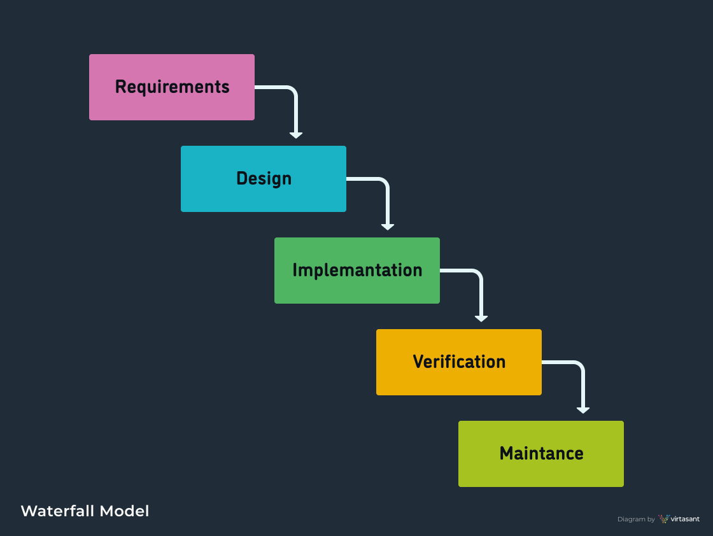

### Prototyping Model

- An outdated methodology that is no longer in active use, it served its purpose as one of the earliest alternatives to Waterfall, dating back to the mid 1970s.
- It refers to the activity of creating prototypes of software applications, for example, incomplete versions of the software program being developed.
- From there, prototypes are evolved into final software requirements

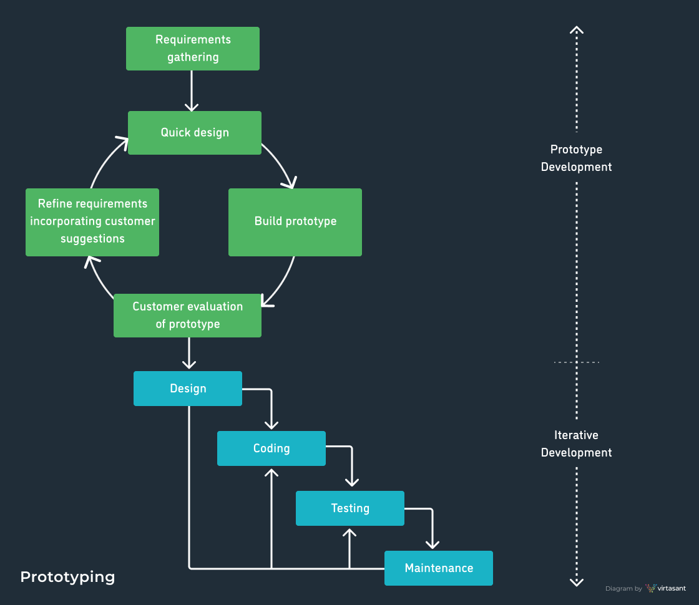

### Iterative Model

- With the Iterative Model, only the major requirements are known from the beginning.
- Based on these, the development team creates a quick and cheap first version of the software.
- Then, as additional requirements are identified, additional iterations of the software are designed and built.
- Each iteration goes through all the phases of the SDLC and these cycles are repeated until completion.
- It was common for the team to work on several SDLC phases at the same time.

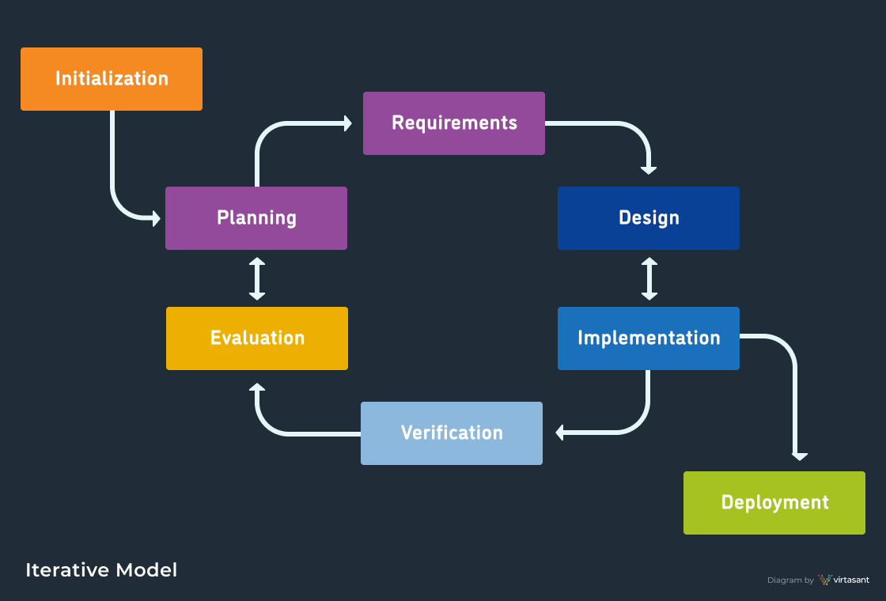

### Spiral Model (SDM)

- It is combining elements of both design and prototyping-in-stages, in an effort to combine advantages of top-down and bottom-up concepts.
- This model of development combines the features of the prototyping model and the waterfall model.
- The spiral model is favored for large, expensive, and complicated projects.
- This model uses many of the same phases as the waterfall model, in essentially the same order, separated by planning, risk assessment, and the building of prototypes and simulations.
- The usage
  - It is used in the large applications and systems which built-in small phases or segments.

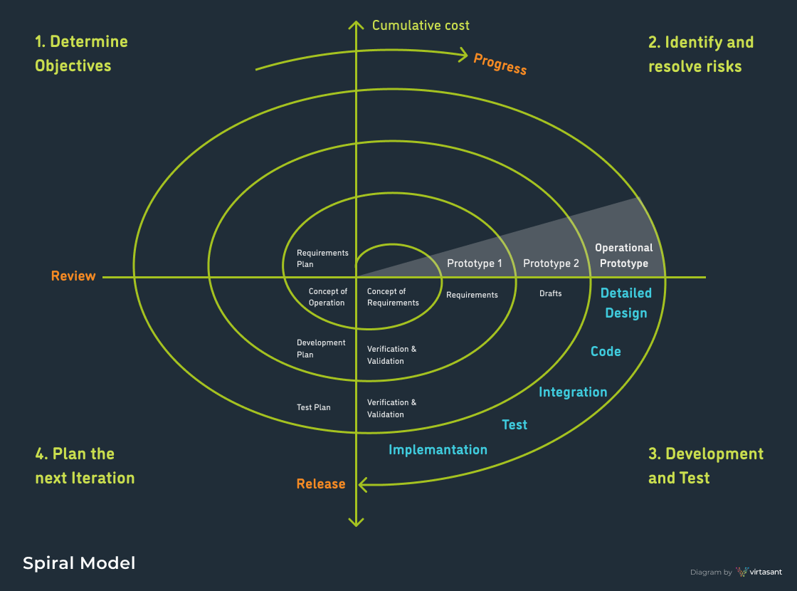

### V-Shaped Model

- It is an extension of the waterfall model, Instead of moving down in a linear way, the process steps are bent upwards after the implementation and coding phase, to form the typical V shape. The major difference between the V-shaped model and waterfall model is the early test planning in the V-shaped model.
- The usage
  - Software requirements clearly defined and known
  - Software development technologies and tools are well-known

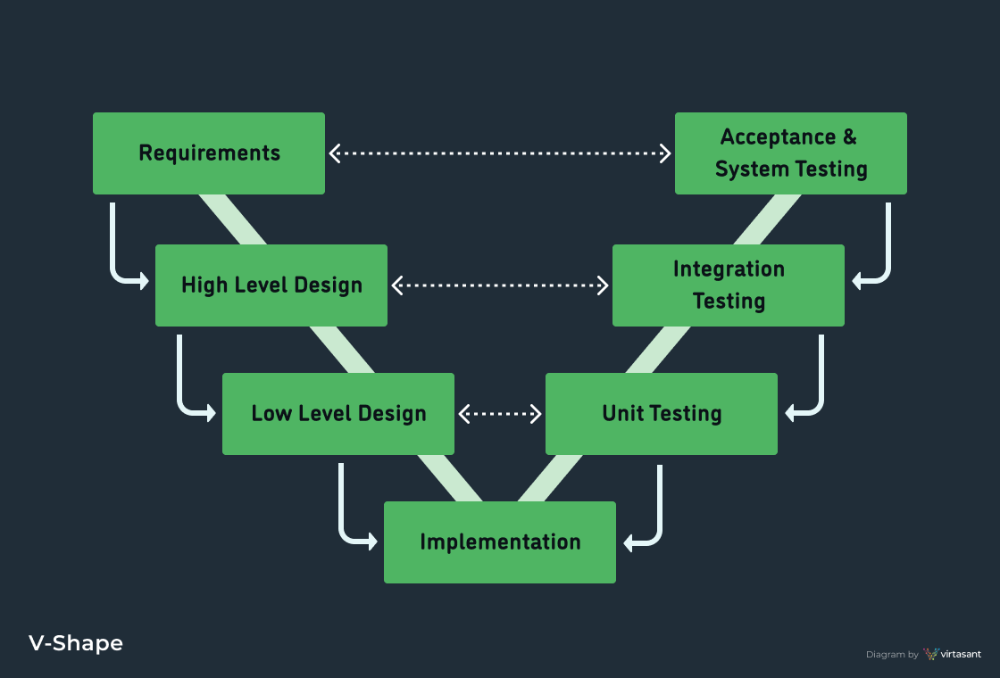

### Agile Model

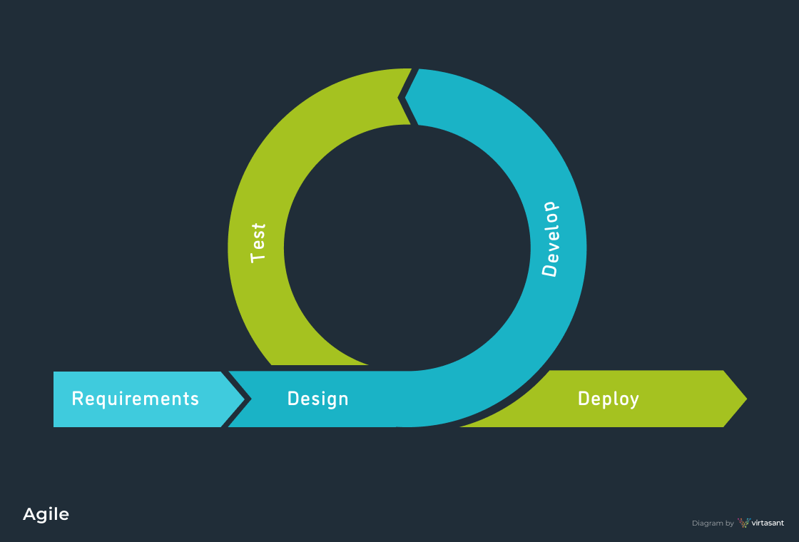

- It is based on iterative and incremental development, where requirements and solutions evolve through collaboration between cross-functional teams.
- The usage
  - It can be used with any type of the project, but it needs more engagement from the customer and to be interactive. Also, we can use it when the customer needs to have some functional requirement ready in less than three weeks and the requirements are not clear enough. This will enable more valuable and workable piece for software early which also increase the customer satisfaction.
- The Agile Manifesto’s 4 Core Values
  - Individuals and interactions over processes and tools
  - Working software over comprehensive documentation
  - Customer collaboration over contract negotiation
  - Responding to change over following a plan

#### Agile Roles

- **Product Owner** - The Product Owner, also known as the “voice of the customer”, defines the product vision based on all insights, feedback, and ideas gathered. He or she is the owner of the product requirements and works closely with the development team to communicate the vision by documenting it in short narratives called User Stories. User Stories typically include a name, description, reference to any external documents, and an explanation of how to test the implementation. Product Owners often maintain a backlog of User Stories if there are too many to be executed concurrently.
- **Scrum Master** - Similar to a project manager, this role is all about making sure the team is following Agile principles, values, and processes.
- **Team Member** - All members of the development team have different skills and collaborate together to build functional software. Teams can include QA engineers, business analysts, designers, database engineers, and more depending on the project scope.

#### Agile Frameworks

##### Scrum

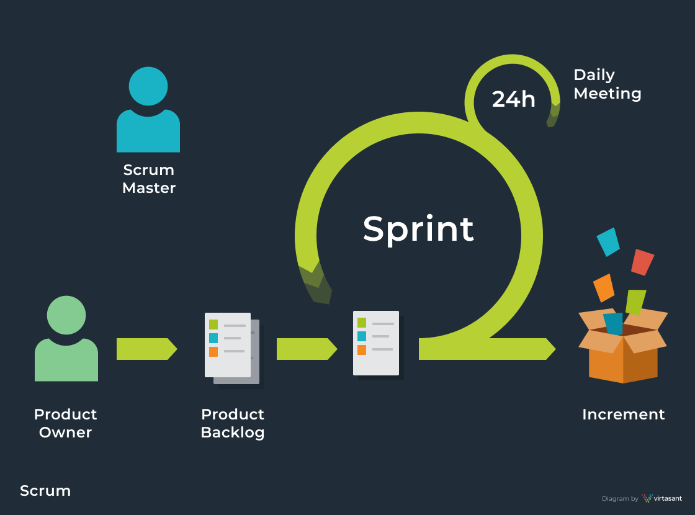

- Scrum is a very popular Agile framework characterized by continuous collaboration, frequent deliveries, and special development cycles called ‘Sprints’. Scrum revolves around the following checkpoints:
  - **Planning meetings**, in which the team identifies and discusses the Sprint priorities.
  - **Commitment meetings**, in which the team reviews the backlog of user stories to determine how much effort it involves and how much work can be done during the upcoming Sprint.
  - **Daily standup meetings**, which are notably short meetings that ensure everyone is aligned. In this regard, each team member communicates updates on story status, blockers, or concerns.
  - **Demo meetings**, which the team attends at the end of each Sprint to show the functionalities implemented during the current sprint to the Product Owner.
  - **Retrospective meetings**, which are also hosted at the end of each Sprint to discuss lessons learned, what went well, and what needs improvement.
- Scrum introduces the Scrum Master role to the Agile method. The Scrum Master’s job is to manage and improve processes, help the team stay authentic to Agile values, and focus on maximizing productivity. A good Scrum Master ensures that the process and progress are transparent to all stakeholders.

##### Kanban

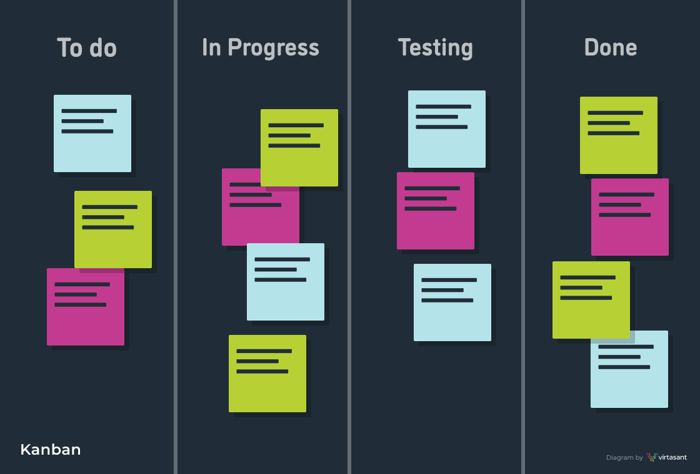

- Kanban is a scheduling system framework for the Agile-eque Lean methodology. It doesn’t have its roots in software development, but synergizes very well with Agile and has become a staple of Agile teams.
- Kanban got its start in lean manufacturing, where Toyota applied the same “just in time” principles that supermarkets use to manage inventory stock levels based on customer demand. Kanban, meaning signboard in Japanese, uses cards to track and support the production system by visually showing the steps within the process and how long each step is taking using cards.
- Kanban has a host of benefits when applied to Agile. You can limit WIP, focus on cycle time, and utilize just-in-time practices.
- Kanban is sometimes compared to Scrum, which are similar in some ways, but are distinct frameworks:
  - Scrum utilizes fixed length Sprints cycles while Kanban is about continuous flow
  - Scrum is role focused, while Kanban doesn’t utilize roles
  - Scrum measures velocity, while Kanban focuses on cycle time
  - In the Kanban framework, the team creates a visual representation of their tasks and statuses by using sticky notes on a physical whiteboard or by using a dedicated software application. Tasks are moved through predefined stages such as To-Do, In Progress, In Review, or Complete.
- A few examples of popular Kanban productivity apps:
  - Trello
  - Jira
  - Proofhub
  - Zoho Projects
  - ZenHubs

##### Extreme Programming

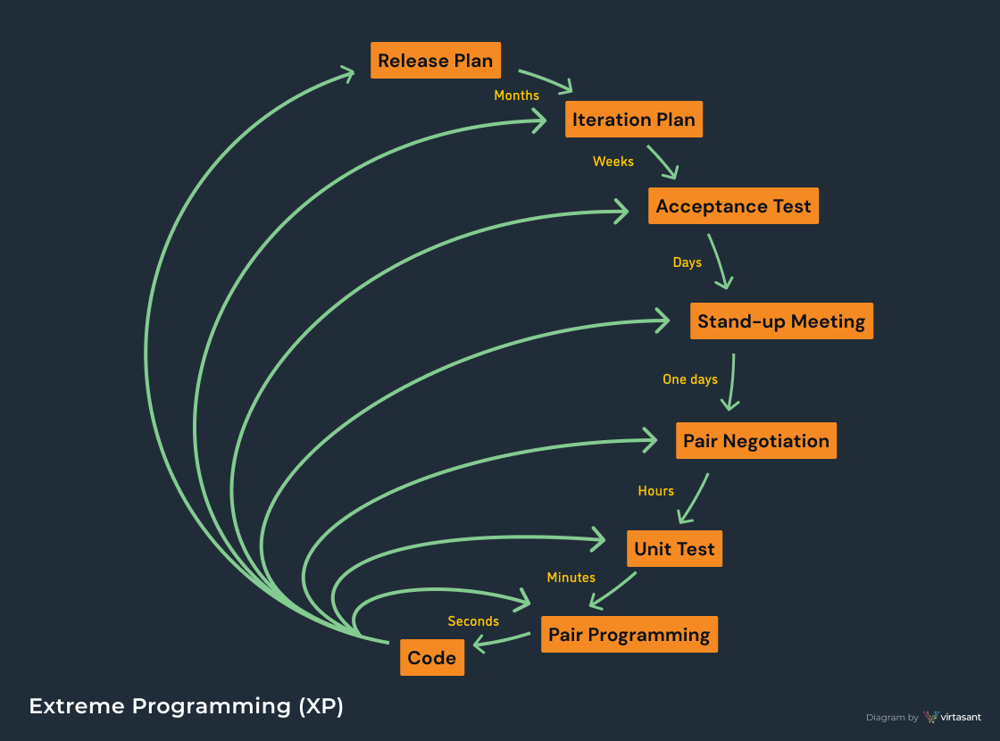

- Extreme Programming (XP) is an Agile framework focused on project flexibility and writing high quality, well-tested code. The official Extreme Programming website states that XP improves a software project in 5 key ways:

  - Communication
  - Simplicity
  - Feedback
  - Respect
  - Courage

- Extreme Programming is best known for the following:
  - **Pair programming** is a technique where two programmers share the same workstation and create software together. One acts as the driver and the other one as the navigator, then they switch roles. When paired, code review can take place instantly, and defects are more likely to be identified and corrected immediately. Pair programming encourages mentorship, knowledge sharing, and learning. And while it may take more time to produce new code when two developers work on the same task, the resulting code is higher quality with less defects.
  - **Unit and functional testing** are emphasized in XP. Tests are to be comprehensive and automated, reducing technical debt and ensuring code can confidently be validated and re-used.
  - **Continuous communication** between programmers and stakeholders to gather and act upon their input, feedback, and change requests. XP requires an “extended development team” that may include business managers, customers, and other key stakeholders.

##### Lean

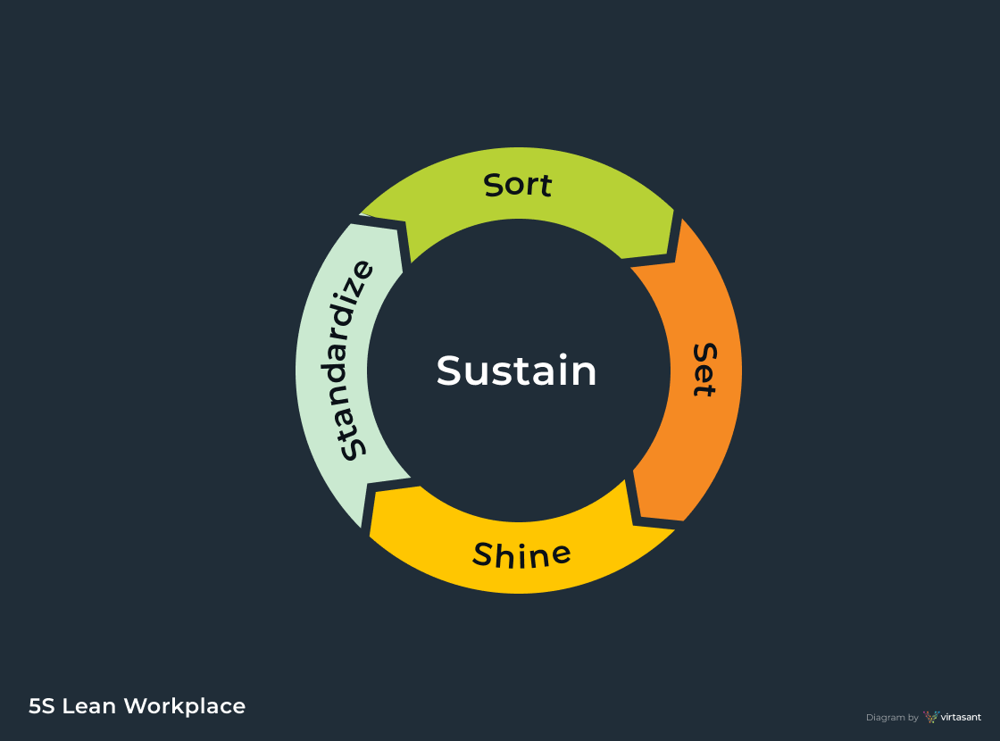

- Lean isn’t a software development methodology. Lean’s origins go back to a manufacturing production method invented in the 1930s, officially given a name in the 80s, and more-formally defined in the 90s. Lean is a system that focuses on making more with less. Many have more-recently discovered that Lean works extremely well with software development, especially Agile.
- While Agile focuses on delivering continuous value, the goal of Lean is to increase the speed and decrease the cost of product development. With Lean, the highest risks are wasted time and effort. Lean discourages multitasking and encourages team members to focus on what’s important in the present moment. By doing this, the waste associated with unnecessary documentation, meetings, or planning are eliminated.
- Lean focuses on the following “just in time” principles:
  - Eliminating waste in cost, scope, and scheduling
  - Amplifying learning
  - Taking decisions as late as possible
  - Fast delivery
  - Empowering the team
  - Building integrity
  - Optimizing the entire project

##### DevOps

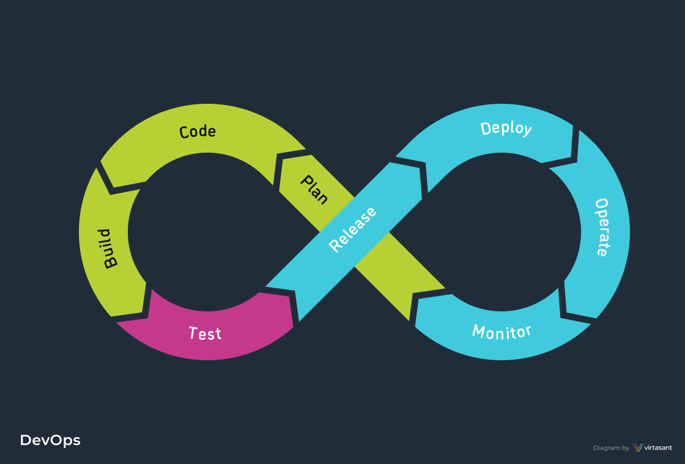

- DevOps is not technically an SDLC methodology but it does share the goal of maximizing software project success and includes Agile-inspired concepts.
- On Wikipedia, DevOps is defined as “a set of practices that combines software development and IT operations. It aims to shorten the systems development life cycle and provide continuous delivery with high software quality. DevOps is complementary with Agile software development; several DevOps aspects came from Agile methodology.”
- DevOps, just like Lean, can work alongside Agile to create an infrastructure that eliminates the barriers slowing development and delivery of the final software product. DevOps brings deployment and operation of the software fully into the Agile development process in the same way Agile brought testing and business analysis into software development. Ultimately, the team is empowered to be self-sufficient and take ownership of software development, shipping, and support. They use Continuous Delivery (CD) for frequent releases and to maintain a well-tested and high-quality codebase.

**History of DevOps**

- The DevOps movement started around 2008. The constant pressure to make rapid changes plus the emergence of a new wave of infrastructure automation allowed non-specialists to enter the space and highlighted the need for cross-functional collaboration.
- New expectations around delivering more-regular software changes were a big motivation for creating DevOps. Desktop applications were being replaced by web and mobile applications, and instead of delivering physical media (CDs or DVDs), companies began providing Software as a Service (SaaS) over the web. As the industry’s challenges evolved, DevOps offered a solution.

**Advantages of DevOps**

- Software development teams are self-sufficient; shipping and maintaining software without depending on the IT or technical operations teams.
- The deployment process is automated and optimized. A junior developer can learn to safely deploy, with less effort.
- Teams implement Continuous Integration / Continuous Delivery (CI/CD).
- Using the right tools, engineers save time on deployment so they can focus on coding.
- Feedback loops integrated throughout the entire process.

## Testing

### Unit Testing (White-Box Testing) -Verification

- It focuses on smallest unit of software design.
- In this we test an individual unit or group of inter related units.
- It is often done by programmer by using sample input and observing its corresponding outputs.
- In this we focus on internal mechanism i.e. how the output is achieved.

### System Testing (Black-Box Testing) (ST) -Validation

- In this software is tested such that it works fine for different operating system.
- In this we just focus on required input and output without focusing on internal working.

### Alpha Testing (In-house Testing)

- This testing performed by the test team and possibly other interested, friendly insiders.
- The point of an Alpha Test is often to assess readiness of the system to be exposed to external stakeholders (such as customers).
- Usually performed not by clients, but by internal testers.

### Beta Testing

- Testing conducted at one or more customer sites by the end-user of a software product or system .
- This is usually a "friendly" user and the testing is conducted before the system is made generally available.
- Usually performed by clients, sometimes with the help of internal testers.

### User Acceptance Testing (UAT)

- A formal product evaluation performed by a customer as a condition of purchase usually performed by clients.
- This is carried out to determine whether the software satisfies its acceptance criteria and should be accepted by the customer.
- User acceptance testing (UAT) is one of the final stages of a software project.
- Often, once UAT is complete, the project is done, and payment is due.

### Regression Testing

- Every time new module is added leads to changes in program.
- This type of testing make sure that whole component works properly even after adding components to the complete program.

### Smoke Testing

- This test is done to make sure that software under testing is ready or stable for further testing.
- It is called smoke test as testing initial pass is done to check if it did not catch the fire or smoked in the initial switch on.

### Stress Testing

- In this we gives unfavorable conditions to the system and check how they perform in those condition.

### Performance Testing

- It is designed to test the run-time performance of software within the context of an integrated system. It is used to test speed and effectiveness of program.

## The Basic Difference between SRS, BRS, CR, PR & FRS Documentation

### SRS -System Requirement Specification:

- It describes entire system flow, how data is going to flow into the system and overall functionality of the system.
- SRS says brief about each module's functionality and doesn't include in-depth functionality of each page and module.
- SRS documentation includes a set of use cases that explain all the interactions the users will have with the software. Use cases are also known as functional requirements.
- In addition to use cases, the SRS also contain non-functional requirements.
- NOTE: The Software Requirements Specification should contain descriptive labels for and references to every figure, table, and diagram included within the document.

### BRS -Business Requirement Specification:

- This document is called as high level document and includes the entire requirement demanded by the client.
- Ideally, this document simply includes all the requirements should be part of proposed system.
- BRS includes list of requirements which are demanded by the client and should be part of the proposed system.
- Business Requirements Specification general Contents
  - The purpose of the project
  - The Client, the Customer, and other stakeholders
  - Users of the product
  - The scope of the work
  - The scope of the product
  - Features and Functionalities
  - Usability and Humanity Requirements
  - Performance Requirements

### FRS -Functional Requirement Specification:

- FRS includes requirements, converted into functionality and says that how this requirement is going to work as a part of a proposed system. FRS includes requirement converted into the way it is going to work as a part of proposed system.

### Change Request (CR)

- A change request is a document containing a call for an adjustment of a system; it is of great importance in the change management process. A change request is declarative, i.e. it states what needs to be accomplished, but leaves out how the change should be carried out.

### Problem Report (PR)

- A PR is a Problem Report. It's not only used for problems but as a way to track any user-submitted issues including bugs, ideas and patches related to the base system

### What does SDR stand for?

- SDR stands for Service Desk Request (computer support; various organizations)

### What does RCA stand for?

- Root cause analysis
