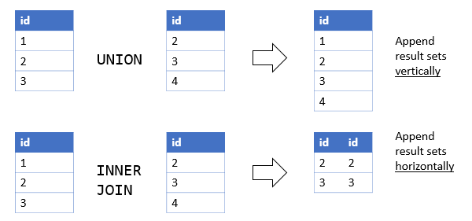
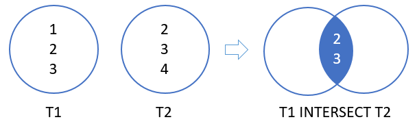
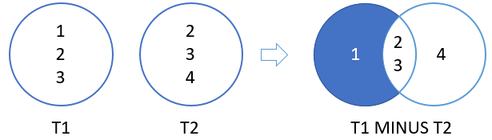

## UNION

The `UNION` operator is a set operator that combines result sets of two or more `SELECT` statements into a single result set.

By default, the `UNION` operator returns the unique rows from both result sets. If you want to retain the duplicate rows, you explicitly use `UNION ALL`

### Oracle UNION vs. JOIN

A `UNION` places a result set on top another, meaning that it appends result sets vertically. However, a join such as `INNER JOIN` or `LEFT JOIN` combines result sets horizontally.

## INTERSECT

The Oracle `INTERSECT` operator compares the result of two queries and returns the distinct rows that are output by both queries.

## MINUS

The Oracle `MINUS` operator compares two queries and returns distinct rows from the first query that are not output by the second query. In other words, the `MINUS` operator subtracts one result set from another.

