## GROUPING SETS

A grouping set is a grouping of one or more columns by which you group using the `GROUP BY` clause. A grouping set is denoted by a list of comma-separated columns in parentheses. A `GROUPING SETS` expression allows you to selectively define one or more grouping sets in a query.

This query returns a grouping set that includes the category column, (category) grouping set:

```sql
SELECT category, SUM(sales_amount)
FROM customer_category_sales
GROUP BY category;
```

The following query defines another grouping set that includes the customer column, or (customer) grouping set

```sql
SELECT customer, SUM(sales_amount)
FROM customer_category_sales
GROUP BY customer;
```

This query returns a grouping set that includes both columns customer and category, or (customer, category) grouping set

```sql
SELECT customer, category, sales_amount
FROM customer_category_sales
ORDER BY customer, category;
```

A grouping sets may include zero column. In this case, it is an empty grouping set, which is denoted by (). The following query doesn’t use the `GROUP BY` clause, therefore, it returns an empty grouping set ():

```sql
SELECT SUM(sales_amount)
FROM customer_category_sales;
```

So far, we have four queries that return 4 grouping sets: (category), (customer), (category, customer), and ().

If you want to return four grouping sets in one query, you need to use the `UNION ALL` operator.

However, the `UNION ALL` operator requires all involved queries return the same number of columns. Therefore, to make it works, you need to add NULL to the select list of each query as shown in the following query:

```sql
SELECT category, NULL, SUM(sales_amount)
FROM customer_category_sales
GROUP BY category

UNION ALL

SELECT customer, NULL, SUM(sales_amount)
FROM customer_category_sales
GROUP BY customer

UNION ALL

SELECT customer, category, sum(sales_amount)
FROM customer_category_sales
GROUP BY customer, category

UNION ALL

SELECT NULL, NULL, SUM(sales_amount)
FROM customer_category_sales;
```

This query has two main issues:

- It is so lengthy that make it difficult to read and maintain.
- Its performance is not optimal because Oracle has to execute 4 queries separately first and then combine all the immediate result sets into a single one.

Back to our query example that uses the `UNION ALL` operators above, you can use the `GROUPING SETS` instead:

```sql
SELECT customer, category, SUM(sales_amount)
FROM customer_category_sales
GROUP BY
    GROUPING SETS(
        (customer,category),
        (customer),
        (category),
        ()
    )
ORDER BY customer, category;
```

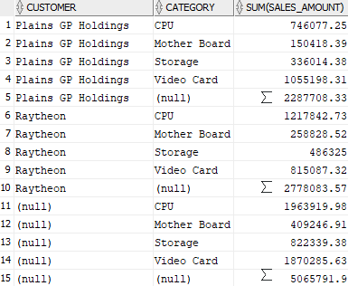

In this output, rows whose column have NULL are super-aggregate rows. For example, the row number 5, 10 and 15.

### GROUPING() function

The `GROUPING()` function differentiates the super-aggregate rows from regular grouped rows.

The expression must match with the expression in the `GROUP BY` clause.

The `GROUPING()` function returns a value of 1 when the value of expression in the row is NULL representing the set of all values. Otherwise, it returns 0.

```sql
SELECT customer, category,
    GROUPING(customer) customer_grouping,
    GROUPING(category) category_grouping,
    SUM(sales_amount)
FROM customer_category_sales
GROUP BY
    GROUPING SETS(
        (customer,category),
        (customer),
        (category),
        ()
    )
ORDER BY customer, category;
```

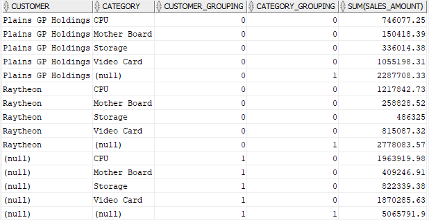

To make the output more readable, you can combine the `DECODE()` function with the `GROUPING()` function as shown in the following query:

```sql
SELECT
    DECODE(GROUPING(customer),1,'ALL customers', customer) customer,
    DECODE(GROUPING(category),1,'ALL categories', category) category,
    SUM(sales_amount)
FROM customer_category_sales
GROUP BY
    GROUPING SETS(
        (customer,category),
        (customer),
        (CATEGORY),
        ()
    )
ORDER BY customer, category;
```

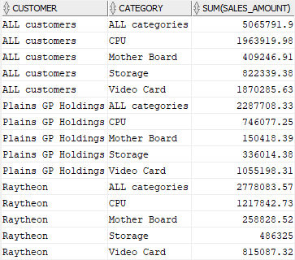

### GROUPING_ID() function

The `GROUPING_ID()` function takes the “group by” columns and returns a number denoting the GROUP BY level. In other words, it provides another compact way to identify the subtotal rows.

```sql
SELECT customer, category,
    GROUPING_ID(customer,category) grouping,
    SUM(sales_amount)
FROM customer_category_sales
GROUP BY
    GROUPING SETS(
        (customer,category),
        (customer),
        (category),
        ()
    )
ORDER BY customer, category;
```

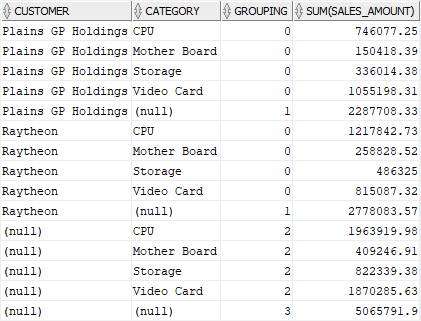

## CUBE

The `CUBE` is an extension of the `GROUP BY` clause that allows you to generate grouping sets for all possible combinations of dimensions.

```sql
SELECT c1, c2, c3, aggregate(c4)
FROM table_name
GROUP BY CUBE(c1,c2,c3);
```

In this syntax, the c1, c2, and c3 columns are called **dimensions**. The result of the aggregate(c4) aggregate function is known as a **fact**.

The `CUBE` generates grouping sets of all combinations of c1, c2 and c3 dimensions, which returns 8 grouping sets.

if you have n columns specified in the `CUBE`, you will get 2n grouping sets.

```sql
SELECT category, customer,
    SUM(sales_amount)
FROM customer_category_sales
GROUP BY CUBE(category,customer)
ORDER BY category NULLS LAST, customer NULLS LAST;
```

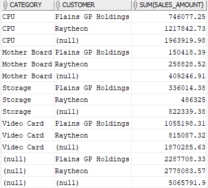

In this example, we have two dimensions: category and customer, therefore, the statement returns 4 subtotals:

- A subtotal by category.
- A subtotal by customer.
- A subtotal by both category and customer.
- A grand total.

Oracle allows you to reduce the number of generated grouping sets by using a partial cube.

```sql
SELECT category, customer,
    SUM(sales_amount)
FROM customer_category_sales
GROUP BY category,
    CUBE(customer)
ORDER BY category, customer NULLS LAST;
```

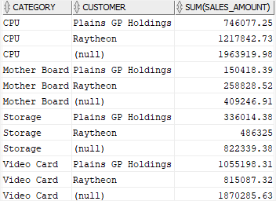

## ROLLUP

The `ROLLUP` is an extension of the GROUP BY clause. The `ROLLUP` calculates multiple levels of subtotals across a group of columns (or dimensions) along with the grand total.

The `ROLLUP` works as follows:

- First, calculate the standard aggregate values in the GROUP BY clause.
- Then, progressively create higher-level subtotals of the grouping columns, which are col2 and col1 columns, from right to left.
- Finally, calculate the grand total.

The `ROLLUP` clause generates the number of grouping sets which is the same as the number grouping columns specified in the ROLLUP plus a grand total. In other words, if you have n columns listed in the `ROLLUP`, you will get n+ 1 level of subtotals with `ROLLUP`.

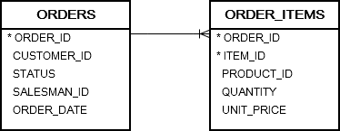

The following query returns the sales revenue by customers in the year of 2017. It calculates net values for the sales orders with the Shipped status and is in charge of a salesman.

```sql
SELECT customer_id,
   SUM(quantity * unit_price) amount
FROM orders
INNER JOIN order_items USING (order_id)
WHERE
   status      = 'Shipped' AND
   salesman_id IS NOT NULL AND
   EXTRACT(YEAR FROM order_date) = 2017
GROUP BY customer_id
ORDER BY amount DESC;
```

To get the sum of the values in the amount column, you may come up with the following subquery:

```sql
SELECT
   SUM(amount)
FROM
   (
      SELECT customer_id,
         SUM(quantity * unit_price) amount
      FROM orders
      INNER JOIN order_items USING (order_id)
      WHERE
         status      = 'Shipped' AND
         salesman_id IS NOT NULL AND
         EXTRACT(YEAR FROM order_date) = 2017
      GROUP BY customer_id
   );
```

Oracle provides a better and faster way to calculate the grand total by using the `ROLLUP` as shown in the following query:

```sql
SELECT customer_id,
   SUM(quantity * unit_price) amount
FROM orders
INNER JOIN order_items USING (order_id)
WHERE
   status      = 'Shipped' AND
   salesman_id IS NOT NULL AND
   EXTRACT(YEAR FROM order_date) = 2017
GROUP BY
   ROLLUP(customer_id);
```

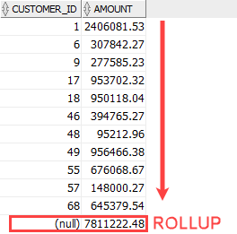

The row with a NULL value in the customer_id column denotes the grand total row.

To reduce the number of subtotals, you can perform a partial roll up.

```sql
SELECT salesman_id, customer_id,
   SUM(quantity * unit_price) amount
FROM orders
INNER JOIN order_items USING (order_id)
WHERE
   status      = 'Shipped' AND
   salesman_id IS NOT NULL AND
   EXTRACT(YEAR FROM order_date) = 2017
GROUP BY
   ROLLUP(salesman_id,customer_id);
```

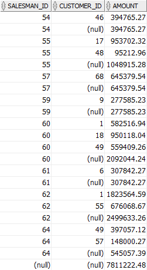

As you can see from the output, the query returned the following set of rows:

- The regular aggregation rows that would be returned by the GROUP BY clause without using the `ROLLUP` expression.
- The first-level of subtotals aggregating across salesman for each combination of salesman and customer.
- The second-level subtotals aggregating across salesman and customer for each salesman.
- A grand total row.

The following query performs a partial rollup:

```sql
SELECT salesman_id, customer_id,
   SUM(quantity * unit_price) amount
FROM orders
INNER JOIN order_items USING (order_id)
WHERE
   status      = 'Shipped' AND
   salesman_id IS NOT NULL AND
   EXTRACT(YEAR FROM order_date) = 2017
GROUP BY salesman_id,
   ROLLUP(customer_id);
```

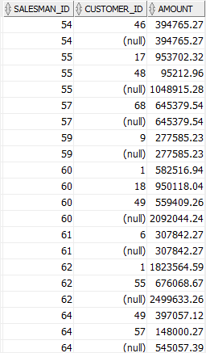

The query outputs regular aggregation rows that would be returned by the `GROUP BY` clause without using the `ROLLUP` and the subtotals aggregating across salesman for each combination of salesman and customer.

## PIVOT

Oracle 11g introduced the new `PIVOT` clause that allows you to write cross-tabulation queries which transpose rows into columns, aggregating data in the process of the transposing. As a result, the output of a pivot operation returns more columns and fewer rows than the starting data set.

### Syntax

```sql
SELECT select_list
FROM table_name
PIVOT [XML] (
    pivot_clause
    pivot_for_clause
    pivot_in_clause
);
```

In this syntax, following the PIVOT keyword are three clauses:

- `pivot_clause` specifies the column(s) that you want to aggregate. The `pivot_clause` performs an implicitly `GROUP BY` based on all columns which are not specified in the clause, along with values provided by the `pivot_in_clause`.
- `pivot_for_clause` specifies the column that you want to group or pivot.
- `pivot_in_clause` defines a filter for column(s) in the `pivot_for_clause`. The aggregation for each value in the `pivot_in_clause` will be rotated into a separate column.

```sql
CREATE VIEW order_stats AS
SELECT category_name, status, order_id
FROM order_items
    INNER JOIN orders
        USING (order_id)
    INNER JOIN products
        USING (product_id)
    INNER JOIN product_categories
        USING (category_id);
```

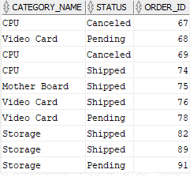

```sql
SELECT * FROM order_stats
PIVOT(
    COUNT(order_id)
    FOR category_name
    IN (
        'CPU',
        'Video Card',
        'Mother Board',
        'Storage'
    )
)
ORDER BY status;
```

In this example:

- The `COUNT(order_id)` is the `pivot_clause`.
- `FOR category_name` is the `pivot_for_clause`.
- And here is the `pivot_in_clause`

```sql
IN (
    'CPU',
    'Video Card',
    'Mother Board',
    'Storage'
)
```

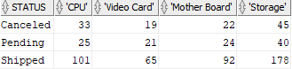

### Aliasing pivot columns

In the previous example, Oracle used product categories to generate pivot column names. On the other hands, you can alias one or more columns in the `pivot_clause` and one or more values in the `pivot_in_clause`.

Generally, Oracle uses the following convention to name the pivot columns based on aliases:

| Pivot Column Aliased? | Pivot In-Value Aliased? | Pivot Column Name     |
| --------------------- | ----------------------- | --------------------- | --- | ------------------ |
| No                    | No                      | pivot_in_clause value |
| Yes                   | Yes                     |
| pivot_in_clause alias |                         | ‘\_’                  |     | pivot_clause alias |
| No                    | Yes                     | pivot_in_clause alias |
| Yes                   | No                      |
| pivot_in_clause value |                         | ‘\_’                  |     | pivot_clause alias |

```sql
SELECT * FROM order_stats
PIVOT(
    COUNT(order_id) order_count
    FOR category_name
    IN (
        'CPU' CPU,
        'Video Card' VideoCard,
        'Mother Board' MotherBoard,
        'Storage' Storage
    )
)
ORDER BY status;
```

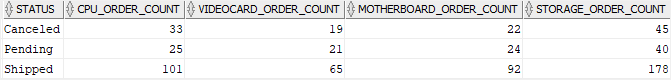

### Pivoting multiple columns

```sql
CREATE OR REPLACE VIEW order_stats AS
SELECT category_name, status, order_id,
    SUM(quantity * list_price) AS order_value
FROM order_items
INNER JOIN orders USING (order_id)
INNER JOIN products USING (product_id)
INNER JOIN product_categories USING (category_id)
GROUP BY order_id, status, category_name;
```

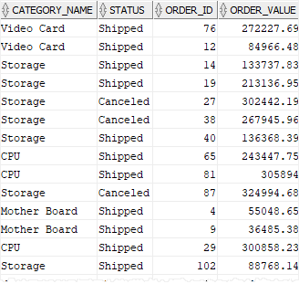

use `PIVOT` clause to return the number of orders and order values by product category and order status:

```sql
SELECT * FROM order_stats
PIVOT(
    COUNT(order_id) orders,
    SUM(order_value) sales
    FOR category_name
    IN (
        'CPU' CPU,
        'Video Card' VideoCard,
        'Mother Board' MotherBoard,
        'Storage' Storage
    )
)
ORDER BY status;
```

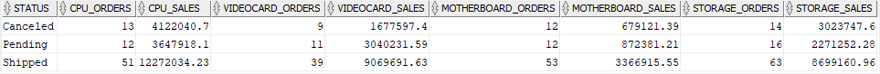

As you can see from the output, the number of pivot columns is doubled, combining category_name with orders and sales.

Finally, use status as the pivot columns and category_name as rows:

```sql
SELECT * FROM order_stats
PIVOT(
    COUNT(order_id) orders,
    SUM(order_value) sales
    FOR status
    IN (
        'Canceled' Canceled,
        'Pending' Pending,
        'Shipped' Shipped
    )
)
ORDER BY category_name;
```

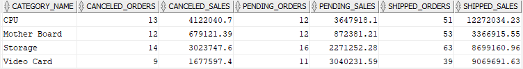

### PIVOT with subquery

You cannot use a subquery in the `pivot_in_clause`. The following statement is invalid and causes an error:

This restriction is relaxed with the XML option:

```sql
SELECT * FROM order_stats
PIVOT XML (
    COUNT(order_id) orders,
    SUM(order_value) sales
    FOR category_name
    IN (
       SELECT category_name
       FROM product_categories
    )
)
ORDER BY status;
```

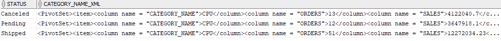

```xml
<PivotSet>
    <item>
        <column name="CATEGORY_NAME">CPU</column>
        <column name="ORDERS">13</column>
        <column name="SALES">4122040.7</column>
    </item>
    <item>
        <column name="CATEGORY_NAME">Mother Board</column>
        <column name="ORDERS">12</column>
        <column name="SALES">679121.39</column>
    </item>
    <item>
        <column name="CATEGORY_NAME">RAM</column>
        <column name="ORDERS">0</column>
        <column name="SALES" />
    </item>
    <item>
        <column name="CATEGORY_NAME">Storage</column>
        <column name="ORDERS">14</column>
        <column name="SALES">3023747.6</column>
    </item>
    <item>
        <column name="CATEGORY_NAME">Video Card</column>
        <column name="ORDERS">9</column>
        <column name="SALES">1677597.4</column>
    </item>
</PivotSet>
```

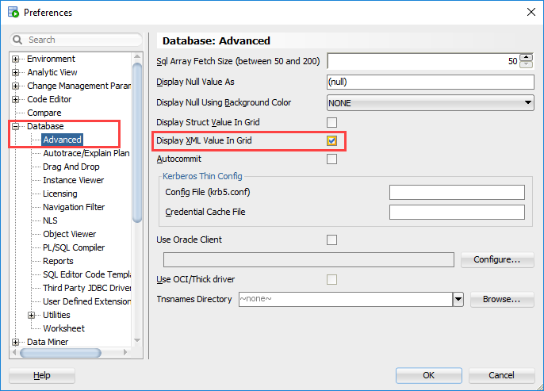

Note that the subquery must return a list of unique values. Otherwise, Oracle will raise a run-time error.

## UNPIVOT

The Oracle `UNPIVOT` clause allows you to transpose columns to rows. The `UNPIVOT` clause is opposite to the `PIVOT` clause except that it does not de-aggregate data during the transposing process.

### Syntax

```sql
SELECT
    select_list
FROM table_name
UNPIVOT [INCLUDE | EXCLUDE NULLS](
    unpivot_clause
    unpivot_for_clause
    unpivot_in_clause
);
```

In this syntax:

- The `unpivot_clause` allows you to specify a name for a column that represents the unpivoted measure values.
- The `unpivot_for_clause` allows you to specify the name for each column that will hold the measure’s values.
- The `unpivot_in_clause` contains the pivoted columns that will be unpivoted.

The `INCLUDE | EXCLUDE NULLS` clause allows you to include or exclude null-valued rows.

- The `INCLUDE NULLS` clause instructs Oracle to include null-valued rows.
- The `EXCLUDE NULLS` clause, on the other hand, eliminates null-valued rows from the returned result set.
- By default, the unpivot operation excludes null-valued rows.

```sql
CREATE TABLE sale_stats(
    id INT PRIMARY KEY,
    fiscal_year INT,
    product_a INT,
    product_b INT,
    product_c INT
);
```

```sql
INSERT INTO sale_stats(id, fiscal_year, product_a, product_b, product_c)
VALUES(1,2017, NULL, 200, 300);

INSERT INTO sale_stats(id, fiscal_year, product_a, product_b, product_c)
VALUES(2,2018, 150, NULL, 250);

INSERT INTO sale_stats(id, fiscal_year, product_a, product_b, product_c)
VALUES(3,2019, 150, 220, NULL);
```

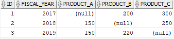

```sql
SELECT * FROM sale_stats
UNPIVOT(
    quantity  -- unpivot_clause
    FOR product_code --  unpivot_for_clause
    IN ( -- unpivot_in_clause
        product_a AS 'A',
        product_b AS 'B',
        product_c AS 'C'
    )
);
```

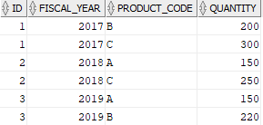

```sql
SELECT * FROM sale_stats
UNPIVOT INCLUDE NULLS(
    quantity
    FOR product_code
    IN (
        product_a AS 'A',
        product_b AS 'B',
        product_c AS 'C'
    )
);
```

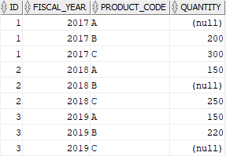

### Unpivot multiple columns

```sql
DROP TABLE sale_stats;

CREATE TABLE sale_stats(
    id INT PRIMARY KEY,
    fiscal_year INT,
    a_qty INT,
    a_value DEC(19,2),
    b_qty INT,
    b_value DEC(19,2)
);
```

```sql
INSERT INTO sale_stats(id, fiscal_year, a_qty, a_value, b_qty, b_value)
VALUES(1, 2018, 100, 1000, 2000, 4000);

INSERT INTO sale_stats(id, fiscal_year, a_qty, a_value, b_qty, b_value)
VALUES(2, 2019, 150, 1500, 2500, 5000);
```

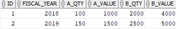

```sql
SELECT * FROM sale_stats
UNPIVOT (
    (quantity, amount)
    FOR product_code
    IN (
        (a_qty, a_value) AS 'A',
        (b_qty, b_value) AS 'B'
    )
);
```

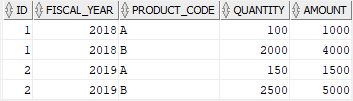

This picture illustrates the transposing process:
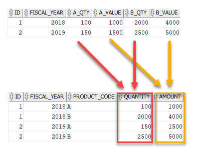
