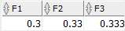

Each data type has a code managed internally by Oracle. To find the data type code of a value in a column, you use the `DUMP()` function.

## Character data types

- Character data types consist of `CHAR`, `NCHAR`, `VARCHAR2`, `NVARCHAR2`, and `VARCHAR`.
- The `NCHAR` and `NVARCHAR2` data types are for storing Unicode character strings.
- The fixed-length character data types are `CHAR`, `NCHAR` and the variable-length character data types are `VARCHAR2`, `NVARCHAR2`.
- `VARCHAR` is the synonym of `VARCHAR2`. However, you should not use `VARCHAR` because Oracle may change its semantics in the future.
- For character data types, you can specify their sizes either in bytes or characters.

## `NUMBER` data type

- The `NUMBER` data type has precision p and scale s. The precision ranges from 1 to 38 while the scale range from -84 to 127.
- If you don’t specify the precision, the column can store values including fixed-point and floating-point numbers. The default value for the scale is zero.
- Both precision and scale are in decimal digits and optional. If you skip the precision and scale, Oracle uses the maximum range and precision for the number.
- `NUMBER(p)` is equvalent to `NUMBER(p,0)`

```sql
NUMBER[(precision [, scale])]
```

Ex: NUMBER(6,2).

- Oracle allows the scale to be negative, for example the following number will round the numeric value to hundreds.

```sql
NUMBER(5,-2)
```

- Note that if you insert a number into a `NUMBER(p,s)` column and the number exceeds precision p, Oracle will issue an error. However, if the number exceeds the scale s, Oracle will round the value.
- `INT`, `SMALLINT`, `NUMERIC`, and `DECIMAL` are just aliases that you can use for define numeric columns . They are not the real data types. Internally, Oracle maps these aliases to the corresponding `NUMBER` data type.

## `FLOAT` datatype

- The Oracle `FLOAT` data type is the subtype of the `NUMBER` data type. Its main purpose is to facilitate compatibility with ANSI SQL `FLOAT` data types.
- You can only specify the precision for the `FLOAT` data type. You cannot specify the scale because Oracle Database interprets scale from the data. The maximum precision of `FLOAT` is 126.
- In FLOAT, the precision is in binary bits, while in NUMBER the precision is in decimal digits.
- According to this formula, the maximum of 126 digits of binary precision roughly equals 38 digits of decimal precision.
  |ANSI SQL FLOAT | Oracle FLOAT |
  |--- |--- |
  |FLOAT | FLOAT(126) |
  |REAL | FLOAT(63) |
  |DOUBLE PRECISION | FLOAT(126) |


f1, f2 and f3 is `FLOAT(1)`, `FLOAT(4)`, and `FLOAT(7)`. So the corresponding precision in decimal digits of the column f1, f2, and f3 is 1 (1 _ 0.30103), 2 (4 _ 0.30103), and 3 (7 \* 0.30103).

## Datetime and Interval data types

- Datetime data types are `DATE`, `TIMESTAMP`, `TIMESTAMP WITH TIME ZONE`, and `TIMESTAMP WITH LOCAL TIME ZONE`. The values of a datetime data type are datetimes.
- The interval data types are `INTERVAL YEAR TO MONTH` and `INTERVAL DAY TO SECOND`. The values of interval data type are intervals.

## `RAW` and `LONG RAW` data types

- The `RAW` and `LONG RAW` data types are for storing binary data or byte strings e.g., the content of documents, sound files, and video files.
- The `RAW` data type can store up to 2000 bytes while the `LONG RAW` data type can store up to 2GB.

## `BFILE` Datatype

- `BFILE` data type stores a locator to a large binary file which locates outside the database. The locator consists of the directory and file names.

## `BLOB` Datatype

- `BLOB` stands for binary large object. You use the `BLOB` data type to store binary objects with the maximum size of (4 gigabytes – 1) \* (database block size).

## `CLOB` Datatype

- `CLOB` stands for character large object. You use `CLOB` to store single-byte or multibyte characters with the maximum size is (4 gigabytes – 1) \* (database block size).
- Note that `CLOB` supports both fixed-with and variable-with character sets.

## `NCLOB` Datatype

- `NCLOB` is similar to `CLOB` except that it can store the Unicode characters.

## `UROWID` Datatype

- The `UROWID` is primarily for values returned by the `ROWID` pseudo-column. Its values are base 64 strings that represent the unique address of rows in a table.
