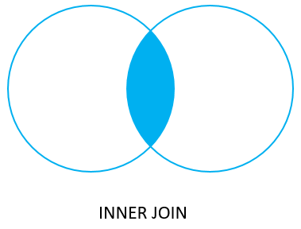
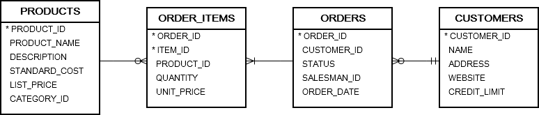
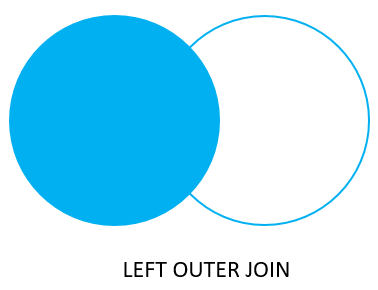
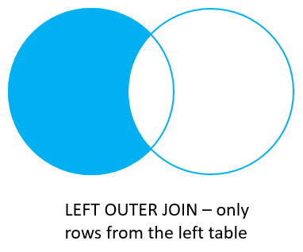
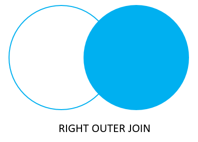
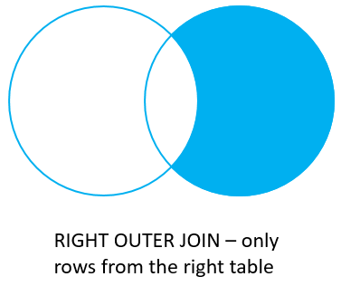
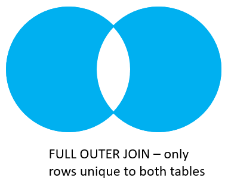

```sql
CREATE TABLE palette_a (
    id INT PRIMARY KEY,
    color VARCHAR2 (100) NOT NULL
);

CREATE TABLE palette_b (
    id INT PRIMARY KEY,
    color VARCHAR2 (100) NOT NULL
);

INSERT INTO palette_a (id, color)
VALUES (1, 'Red');

INSERT INTO palette_a (id, color)
VALUES (2, 'Green');

INSERT INTO palette_a (id, color)
VALUES (3, 'Blue');

INSERT INTO palette_a (id, color)
VALUES (4, 'Purple');

-- insert data for the palette_b
INSERT INTO palette_b (id, color)
VALUES (1, 'Green');

INSERT INTO palette_b (id, color)
VALUES (2, 'Red');

INSERT INTO palette_b (id, color)
VALUES (3, 'Cyan');

INSERT INTO palette_b (id, color)
VALUES (4, 'Brown');
```

## Inner Join

```sql
SELECT a.id id_a, a.color color_a, b.id id_b, b.color color_b
FROM palette_a a
    INNER JOIN palette_b b
    ON a.color = b.color;
```

Note that the columns listed in the USING clause must be available in both tables.

```sql
SELECT a.id id_a, a.color color_a, b.id id_b, b.color color_b
FROM palette_a a
    INNER JOIN palette_b b
    USING (color);
```



### Joining multiple tables



```sql
SELECT name AS customer_name, order_id, order_date, item_id, product_name, quantity, unit_price
FROM orders
    INNER JOIN order_items
	    USING(order_id)
    INNER JOIN customers
		USING(customer_id)
    INNER JOIN products
		USING(product_id)
ORDER BY
	order_date DESC, order_id DESC, item_id ASC;
```

## Left Join

```sql
SELECT a.id id_a, a.color color_a, b.id id_b, b.color color_b
FROM palette_a a
    LEFT JOIN palette_b b
    ON a.color = b.color;
```

```sql
SELECT a.id id_a, a.color color_a, b.id id_b, b.color color_b
FROM palette_a a
    LEFT JOIN palette_b b
    USING (color);
```

The left join returns all rows from the left table with the matching rows if available from the right table. If there is no matching row found from the right table, the left join will have null values for the columns of the right table.



Sometimes, you want to get only rows from the left table that do not exist in the right table. To achieve this, you use the left join and a WHERE clause to exclude the rows from the right table.

```sql
SELECT a.id id_a, a.color color_a, b.id id_b, b.color color_b
FROM palette_a a
    LEFT JOIN palette_b b
    ON a.color = b.color
WHERE b.id IS NULL;
```



### Joining multiple tables

```sql
SELECT order_id, name AS customer_name, status, first_name, last_name
FROM orders
    LEFT JOIN employees
    ON employee_id = salesman_id
    LEFT JOIN customers
    ON customers.customer_id = orders.customer_id
ORDER BY order_date DESC;
```

### Conditions in ON vs. WHERE clause

The following statement gets the order and salesman data of the order 58.

```sql
SELECT order_id, status, employee_id, last_name
FROM orders
    LEFT JOIN employees
    ON employee_id = salesman_id
WHERE order_id = 58;
```

Now if you move the condition from the WHERE clause to the `ON` clause of the `LEFT JOIN`:

```sql
SELECT order_id, status, employee_id, last_name
FROM orders
    LEFT JOIN employees
    ON employee_id = salesman_id
    AND order_id = 58;
```

In this case, the query returns all orders but only the order 58 had the salesman data associated with it.

Note that for the inner join, the condition placed in the `ON` has the same effect as it is placed in the `WHERE` clause.

## Right Join

The `OUTER` keyword is optional therefore the `RIGHT OUTER JOIN` and `RIGHT JOIN` are the same.

The right join makes a result set that contains all rows from the right table with the matching rows from the left table. If there is no match, the left side will have nulls.

```sql
SELECT a.id id_a, a.color color_a, b.id id_b, b.color color_b
FROM palette_a a
    RIGHT JOIN palette_b b
    ON a.color = b.color;
```

```sql
SELECT a.id id_a, a.color color_a, b.id id_b, b.color color_b
FROM palette_a a
    RIGHT JOIN palette_b b
    USING (color);
```



Likewise, you can get only rows from the right table but not the left table by adding a WHERE clause to the above statement as shown in the following query:

```sql
SELECT a.id id_a, a.color color_a, b.id id_b, b.color color_b
FROM palette_a a
    RIGHT JOIN palette_b b
    ON a.color = b.color
WHERE a.id IS NULL;
```



### Condition in ON vs. WHERE clause

The following statement gets the employee and order data of the salesman id 57.

```sql
SELECT employee_id, last_name, first_name, order_id, status
FROM orders
    RIGHT JOIN employees
    ON employee_id = salesman_id
WHERE employee_id = 57;
```

The following statement places the condition in the WHERE clause instead of the ON clause:

```sql
SELECT employee_id, last_name, first_name, order_id, status
FROM orders
    RIGHT JOIN employees
    ON employee_id = salesman_id
    AND employee_id = 57;
```

The query returned all employees but only the employee id 57 had the related order data.

A note that regarding the `INNER JOIN`, the condition is placed in the ON clause has the same effect as it is placed in the `WHERE` clause.

## Full Outer Join

Oracle full outer join or full join returns a result set that contains all rows from both left and right tables, with the matching rows from both sides where available. If there is no match, the missing side will have nulls.

```sql
SELECT a.id id_a, a.color color_a, b.id id_b, b.color color_b
FROM palette_a a
    FULL OUTER JOIN palette_b b
    ON a.color = b.color;
```


Note that the `OUTER` keyword is optional.

To get a set of rows that are unique from the left and right tales, you perform the same full join and then exclude the rows that you don’t want from both sides using a WHERE clause as follows:

```sql
SELECT a.id id_a, a.color color_a, b.id id_b, b.color color_b
FROM palette_a a
    FULL JOIN palette_b b
    ON a.color = b.color
WHERE a.id IS NULL OR b.id IS NULL;
```



```sql
CREATE TABLE projects(
    project_id INT GENERATED ALWAYS AS IDENTITY PRIMARY KEY,
    project_name VARCHAR2(100) NOT NULL
);

CREATE TABLE members(
    member_id INT GENERATED ALWAYS AS IDENTITY PRIMARY KEY,
    member_name VARCHAR2(100) NOT NULL,
    project_id INT,
    FOREIGN KEY (project_id) REFERENCES projects(project_id)
);
```

```sql
INSERT INTO projects(project_name)
VALUES('ERP');

INSERT INTO projects(project_name)
VALUES('Sales CRM');

INSERT INTO members(member_name, project_id)
VALUES('John Doe',1);

INSERT INTO members(member_name, project_id)
VALUES ('Jane Doe',1);

INSERT INTO members(member_name, project_id)
VALUES ('Jack Daniel',null);
```

```sql
SELECT  member_name,  project_name
FROM members m
    FULL OUTER JOIN projects p
    ON p.project_id = m.project_id
ORDER BY member_name;
```

Jack Daniel does not join any project, Jane Doe and John Doe join the ERP project and Sales CRM project has no member.

To find the project that does not have any member, you use the following query:

```sql
SELECT  project_name, member_name
FROM  members m
    FULL OUTER JOIN projects p
    ON p.project_id = m.project_id
WHERE member_name IS NULL
ORDER BY member_name;
```

Similarly, you can find members who do not participate in any project by using the following query:

```sql
SELECT  member_name,  project_name
FROM members m
    FULL OUTER JOIN projects p
    ON p.project_id = m.project_id
WHERE project_name IS NULL
ORDER BY member_name;
```

## Cross Join

Oracle CROSS JOIN to make a Cartesian product of the joined tables.
The cross join is useful when you want to generate plenty of rows for testing.

To generate the test data for inserting into the inventories table, you can use the CROSS JOIN clause as shown in the following statement:

```sql
SELECT product_id, warehouse_id,
    ROUND( dbms_random.value( 10, 100 )) quantity
FROM products
    CROSS JOIN warehouses;
```

The products table 288 rows and the warehouses table has 9 rows, therefore, the cross join of these tables returns 2592 rows (288 x 9).

## Self Join

A self join is a join that joins a table with itself. A self join is useful for comparing rows within a table or querying hierarchical data.

```sql
SELECT
   e1.hire_date,
  (e1.first_name || ' ' || e1.last_name) employee1,
  (e2.first_name || ' ' || e2.last_name) employee2
FROM employees e1
    INNER JOIN employees e2
    ON e1.employee_id > e2.employee_id
    AND e1.hire_date = e2.hire_date
ORDER BY
   e1.hire_date DESC,
   employee1,
   employee2;
```
