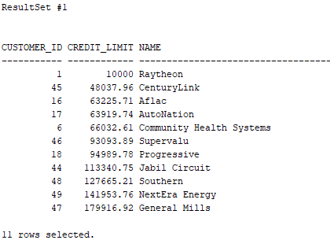
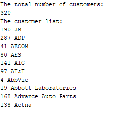

## Actual vs. Formal Parameter

Formal-Parameter defined in the procedure or function.
Actual-Parameter provided by the calling statement to a procedure or function.

## Functions

```sql
CREATE [OR REPLACE] FUNCTION function_name (parameter1 datatype, parameter2 datatype,..) --size [VARCHAR2(10)] is not defined;
RETURN datatype IS --size is not defined
    --declare variables;
BEGIN
    --executable statements;
RETURN (return_value);
END;
```

## Stored Procedures

```sql
CREATE [OR REPLACE] PROCEDURE procedure_name (parameter1 [IN|OUT|IN OUT] datatype, parameter2..) IS
BEGIN
    --executable statements;
END [procedure_name];
```

## Calling Notations

- **Positional**-The datatype and the position if the actual parameter must match with the formal parameter.
- **Named**-The actual parameter is matched with the formal parameter using => symbol
- **Mixed**-Combination of Positional and Named notations

```sql
CREATE OR REPLACE PROCEDURE greetings(name IN VARCHAR2 ,age IN NUMBER ,place IN VARCHAR2)
IS
BEGIN
    DBMS_OUTPUT.PUT_LINE('Hello:' || name);
    DBMS_OUTPUT.PUT_LINE('Age:' || age);
    DBMS_OUTPUT.PUT_LINE('Place:' || place);
END greetings;
/*
Calling Program
*/
EXECUTE greetings('Mohan', 26 ,'Mumbai'); --Positional
----
EXECUTE greetings(place=>'Mumbai',name=>'Mohan',age=>26); --Named
----
EXECUTE greetings('Mohan',place=>'Mumbai',age=>26); --Mixed -Positioned notations are not allowed after Named notations
```

## Parameter Modes

- **IN**: [default mode] An IN parameter lets you pass a value to the subprogram. It is a read-only parameter. Inside the subprogram, an IN parameter acts like a constant. Its value cannot be changed. IN can have default value; but others cannot. In can pass expressions like (10+5) or constant. But other must be a variable. Parameters are passed by reference.
- **OUT**: An OUT parameter returns a value to the calling program. Its value can be changed. Parameters are passed by value.
- **INOUT**: An INOUT parameter passes an initial value to a subprogram and returns an updated value to the caller. Its value can be changed. Parameters are passed by value.

## NOCOPY

- By default OUT and IN OUT parameters are passed by value and IN parameters are passed by reference.
- When an OUT or IN OUT parameter is modified inside the procedure the procedure actually only modifies a copy of the parameter value.
- Only when the procedure has finished without exception is the result value copied back to the formal parameter.
- Now, if you pass a large collection as an OUT or an IN OUT parameter then it will be passed by value, in other words the entire collection will be copied to the formal parameter when entering the procedure and back again when exiting the procedure.
- If the collection is large this can lead to unnecessary CPU and memory consumption.
- The `NOCOPY` hint alleviates this problem because you can use it to instruct the runtime engine to try to pass OUT or IN OUT parameters by reference instead of by value. For example:

```sql
PROCEDURE GET_CUSTOMER_ORDERS(
    P_CUSTOMER_ID IN NUMBER,
    P_ORDERS OUT NOCOPY ORDERS_COLL
    );

THEORDERS ORDERS_COLL;

GET_CUSTOMER_ORDERS(124, THEORDERS);
```

- In the absence of the NOCOPY hint the entire orders collection would have been copied into the orders variable upon exit from the procedure.
- Instead the collection is now passed by reference.
- Keep in mind, however, that there is a downside to using NOCOPY.
- When you pass parameters to a procedure by reference then any modifications you perform on the parameters inside the procedure is done on the same memory location as the actual parameter, so the modifications are visible.
- In other words, there is no way to undo or rollback these modifications, even when an exception is raised midway.
- So if an exception is raised inside the procedure the value of the parameter is undefined and cannot be trusted.

## Procedure Vs. Function

| Procedure                                                          | Function                                                                                               |
| ------------------------------------------------------------------ | ------------------------------------------------------------------------------------------------------ |
| Used mainly to a execute certain process                           | Used mainly to perform some calculation                                                                |
| Cannot call in `SELECT` statement                                  | A Function that contains no DML statements can be called in `SELECT` statement                         |
| Use OUT parameter to return the value                              | Use `RETURN` to return the value                                                                       |
| It is not mandatory to return the value                            | It is mandatory to return the value                                                                    |
| `RETURN` will simply exit the control from subprogram.             | `RETURN` will exit the control from subprogram and also returns the value                              |
| Return datatype will not be specified at the time of creation      | Return datatype is mandatory at the time of creation                                                   |
| Inputs are used to _do_ something, rather than _derive_ something. | A function takes a set of inputs, and returns something based on those inputs. It "answers a question" |

## PL/SQL Packages

- Package is a collection of related variables, constants, exceptions, cursors, and subprograms.
- Objects placed in the specification are calledpublic objects.
- Any objects (subprogram or variable) which are not coded in the package specification but coded in the package body is called a private object.
- Only the objects inside the package can call a **private object**.
- **Global Variables**: Global variables can be defined by creating body less package. Whenever a package is loaded, whole package (including variables) will be loaded into the memory for easy access. It won’t be destroyed until the package is complete. These public variables in the package specification can be accessed directly fromother programs. It is useful to declare constants.

```sql
CREATE OR REPLACE PACKAGE pkg_var IS
    v_ttemp number(2):=10;
END;
----
BEGIN
    DBMS_OUTPUT.PUT_LINE(pkg_var.v_ttemp);
END;
```

- **Overloading**: Packages allow overloading (procedures or functions having same name with different type or different number of parameters) of procedures and functions. Standalone procedures and functions cannot be overloaded.
- **Forward Declaration**: If there are any private procedure or functions in the package, as a convention (not mandatory), it can be declared in the beginning of the package body and define it in the later part of the package body.
- Avoid re-compilation of specification. Because, once the specification is compiled, the body and other objects depend on this package become invalid. So they also need to be compiled again to use it.
- The procedures and functions inside the package does not create an object. Object is created for entire package only.
- For local procedure call (inside package), no need to pass parameters because all the variables declared as public (public inside the package or outside) can be accessed anywhere in the package.

### Package Specification

```sql
CREATE [OR REPLACE] PACKAGE package_name IS
    --Declaration of package elements;
    PROCEDURE procedure_name(param1 datatype,param2 datatype,..);
    FUNCTION function_name(param1 datatype,param2 datatype,..) RETURN datatype;
END [package_name];
```

### Package Body

```sql
CREATE [OR REPLACE] PACKAGE BODY package_name IS
    --Declaration of variables
    --implementation of package elements
    PROCEDURE procedure_name(param1 datatype,param2 datatype,..) IS
        --declare variables;
    BEGIN
        --executable statements;
    END procedure_name;

    FUNCTION function_name(param1 datatype,param2 datatype,..)
    RETURN datatype IS
        --declare variables;
    BEGIN
        --executable statements;
        RETURN (return_value);
    END function_name;

END [package_name];
```

### Calling package elements

```sql
BEGIN
    package_name.procedure_name(param1,param2..);
    DBMS_OUTPUT.PUT_LINE(package_name.function_name);
END;
```

## One-time only procedure

```sql
CREATE OR REPLACE PACKAGE BODY package_name IS
    --Functions, Procedures etc..
BEGIN
    --written at the end of package
    --whatever code is here executes one time only
    --runs immediately when the package is loaded into the memory
    --useful for initializing variables like gold rate, USD rate etc.. which changes every day.
END package_name; --The END of one time only procedure should be the END of package body. There won't be any separate END for that procedure.
```

## AUTHID

- The `AUTHID CURRENT_USER` is used when you want a piece of code to execute with the privileges of the current user, and not with the privilege of the user who defined the PL/SQL code.
- `AUTHID DEFINER` is exactly opposite to `AUTHID CURRENT_USER`. Using this clause is as same as granting public access to the PL/SQL code.
- If no AUTHID clause is specified Oracle will default to `AUTHID DEFINER`.
- It is suggestible to set `AUTHID` clause. If not, an intruder may get access to privileges of the definer which an intruder should not get.

```sql
CREATE OR REPLACE PROCEDURE create_dept(v_deptno NUMBER)
AUTHID CURRENT_USER
IS
BEGIN
    INSERT INTO departments VALUES (v_deptno);
END;
```

## PL/SQL Triggers

- Triggers are stored programs, which are automatically executed or fired implicitly when a triggering events occur. We cannot execute it explicitly.
- Triggers can be enabled or disabled. But stored sub programs cannot.
- Triggers cannot exceed the size limit of 32Kb.
- If a trigger requires many lines of code, consider moving it to a stored procedure that is invoked from the trigger.
- For every trigger a background process is created. It will compromise the performance of the database.
- Triggers cannot span across multiple tables. But views can span across tables.
- A trigger cannot end a transaction directly or indirectly (DDL). Because a trigger is part of a larger transaction. But an autonomous transaction can contain COMMIT and ROLLBACK statements inside a trigger.
- **Row-Level trigger**: Fire for each affected row. The old and new values can be seen using this trigger.
- **Statement-Level trigger**: Fire for each statement regardless of how many rows are affected. Default trigger is statement level trigger.

### Triggering Events:

DML Statement -Update, Delete, Insert...
DDL Statement -Create, Alter...
System Event -Shutdown, Start-Up of database
User Event -Logon, Logoff

### Uses of creating Trigger

- Enforce business rules
- Gain strong control over the security
- Collect statistical information
- Automatically generate values
- Prevent invalid transactions

```sql
CREATE [OR REPLACE] TRIGGER trigger_name
{BEFORE|AFTER|INSTEAD OF} triggering_event
[OF column_name]
ON table_name
[FOR EACH ROW] --Except for INSTEAD OF triggers, if you omit this clause, then the trigger is a statement trigger.
[FOLLOWS another_trigger_name]
[ENABLE/DISABLE]
[WHEN condition]
DECLARE
--declaration statements
BEGIN
--executable statements
END;
```

### Order of Execution

BEFORE STATEMENT -> BEFORE ROW -> DML -> AFTER ROW -> AFTER STATEMENT

### Pseudo-records in Trigger

| Operation | :OLD                | :NEW               |
| --------- | ------------------- | ------------------ |
| INSERT    | NULL                | Inserted value     |
| UPDATE    | value before update | value after update |
| DELETE    | value before update | NULL               |

```sql
Ex:
IF :NEW.sal < :OLD.sal THEN
DBMS_OUTPUT.PUT_LINE('Salary Increased');
END IF;
```

### DDL Trigger

```sql
CREATE OR REPLACE TRIGGER tr_schema
AFTER DDL ON SCHEMA --Trigger for all DLLs for the schema where the trigger is created
BEGIN
INSERT INTO schema_audit VALUES(
SYSDATE,
SYS_CONTEXT('USERENV','CURRENT_USER'), --user who executed the DDL;
--sys_context(namespace,paramenter,length)
ORA_DICT_OBJ_TYPE, --system event attribute -type of object where DDL operation occurred
ORA_DICT_OBJ_NAME, --system event attribute -name of the object
ORA_SYSEVENT --system event attribute -which DDL operation
);
END;
----
CREATE OR REPLACE TRIGGER tr_schema
AFTER TRUNCATE ON SCHEMA --for specific DDL; 'DML' does not exist(have to specify individual DML names)
BEGIN
INSERT INTO…
END;
----
CREATE OR REPLACE TRIGGER tr_schema
AFTER DDL ON DATABASE --for whole Database
BEGIN
INSERT INTO…
END;
```

### System, User Event Triggers

```sql
CREATE OR REPLACE TRIGGER tr_logon
AFTER LOGON ON SCHEMA
BEGIN
INSERT INTO hr_event_audit VALUES(
ORA_SYSEVENT, --system event attribute -what system event fired
SYSDATE
);
END;
----
CREATE OR REPLACE TRIGGER tr_logoff
BEFORE LOGOFF ON SCHEMA
BEGIN
INSERT INTO ...
END;
----
CREATE OR REPLACE TRIGGER tr_logoff
BEFORE LOGOFF ON DATABASE --sysdba
BEGIN
INSERT INTO db_event_audit VALUES(
USER); --USER will fetch the username of the logged in db user
COMMIT;
END;
----
CREATE OR REPLACE TRIGGER tr_startup
AFTER STARTUP ON DATABASE --sysdba privilege needed
BEGIN
INSERT INTO …
END;
----
CREATE OR REPLACE TRIGGER tr_startup
AFTER SHUTDOWN ON DATABASE --normal or + shutdown only. Won't work on ABORT or database crashes
BEGIN
INSERT INTO …
END;
```

### Instead of Trigger

- Using Instead of Trigger, you can control the default behavior of Insert, Update, Delete and Merge operations on Views.
- You cannot specify an `INSTEAD OF` trigger on a table.
- `INSTEAD OF` trigger statements are implicitly activated for each row.
- `INSTEAD OF` triggers are valid for DML events on views. They are not valid for DDL or database events.

```sql
CREATE OR REPLACE TRIGGER tr_io_insert
INSTEAD OF INSERT
ON v$employee
FOR EACH ROW
BEGIN
    INSERT INTO employee VALUES(:new.name);
    INSERT INTO dept VALUES(:new.dname);
END;
```

```sql
CREATE [OR REPLACE] TRIGGER trigger_name
INSTEAD OF operation
ON view_name
FOR EACH ROW
BEGIN
    --executable statements
END;
```

### Conditional predicates

These functions helps to know what operation is going on while the trigger is called. It returns Boolean value.

```sql
CREATE OR REPLACE TRIGGER tr_employee
BEFORE INSERT OR DELETE OR UPDATE ON tbl_employee
FOR EACH ROW
ENABLE

DECLARE
    v_user VARCHAR2(20);
BEGIN
    SELECT user INTO v_user FROM dual;
    IF INSERTING THEN
        DBMS_OUTPUT.PUT_LINE('Inserted by:' || v_user);
    ELSIF DELETING THEN
        DBMS_OUTPUT.PUT_LINE('Deleted by:' || v_user);
    ELSIF UPDATING THEN
        DBMS_OUTPUT.PUT_LINE('Updated by:' || v_user);
    END IF;
END;
```

### Compound Trigger

The Compound trigger is a trigger that allows you to specify actions for each of four timing points in the single trigger body.

```sql
CREATE OR REPLACE TRIGGER trigger_name
FOR
    INSERT OR UPDATE
    ON table_name
    COMPOUND TRIGGER
    BEFORE STATEMENT IS
    BEGIN
        --Execution statements
    END BEFORE STATEMENT;

    BEFORE EACH ROW IS
    BEGIN
        --Execution statements
    END BEFORE EACH ROW;

    AFTER EACH ROW IS
    BEGIN
        --Execution statements
    END AFTER EACH ROW;

    AFTER STATEMENT IS
    BEGIN
        --Execution statements
    END AFTER STATEMENT;
END;
```

BEFORE STATEMENT –level
BEFORE EACH ROW –level
AFTER EACH ROW -level
AFTER STATEMENT –level

### Mutating table error

- This error occurs when we create a row level trigger and attempts to access the same table inside the trigger body.
- Row level cannot read or write to the table from which it is triggering. However, a statement trigger can access.

```sql
/*Only 1 president is allowed in the table*/
CREATE OR REPLACE PACKAGE presi_pack IS
    flag NUMBER(1); --Global variable
END presi_pack;
----
CREATE OR REPLACE TRIGGER presi_check_row
BEFORE INSERT OR UPDATE OF job ON emp
FOR EACH ROW
WHEN(:NEW.job='PRESIDENT')
BEGIN
    presi_pack.flag := 1;
end presi_check_row;
----
CREATE OR REPLACE TRIGGER presi_check_stat
AFTER INSERT OR UPDATE OF job ON emp
DECLARE
    presi_count NUMBER(1);
BEGIN
    IF presi_pack.flag = 1 THEN
        presi_pack.flag := 0;
        SELECT COUNT(1) INTO presi_count FROM emp WHERE job = 'PRESIDENT';
        IF presi_count > 1 THEN
            DBMS_OUTPUT.PUT_LINE('More than 1 PRESIDENT');
        END IF;
    END IF;
END presi_check_stat;
```

## Implicit Statement

- Prior Oracle Database 12c, you can return a result set from a stored procedure using the OUT REF CURSOR parameters.
- To make the migration of other databases to the Oracle Database easier, Oracle Database 12c Release 1 added a new feature called implicit statement result that allows you to return one or more result sets from a stored procedure by using the dbms_sql package.
- The following statement creates a stored procedure that returns customers who have credit limits are greater than a specific credit:

```sql
CREATE OR REPLACE PROCEDURE get_customer_by_credit(
    min_credit NUMBER
)
AS
    c_customers SYS_REFCURSOR;
BEGIN
    -- open the cursor
    OPEN c_customers FOR
        SELECT customer_id, credit_limit, name
        FROM customers
        WHERE credit_limit > min_credit
        ORDER BY credit_limit;
    -- return the result set
    dbms_sql.return_result(c_customers);
END;
```

In this stored procedure:

- First, declare a cursor with type SYS_REFCURSOR in the declaration section.
- Second, open the cursor associated with a query.
- Third, use the dbms_sql.return_result() function which accepts a cursor as an argument and returns the result set.
- To test the stored procedure, you can execute it as follows:

```sql
EXEC get_customer_by_credit(5000);
```



- The following statement creates a stored procedure that returns the customer result set by pages specified by page no and page size. On top of that, it returns the total rows of the customers table.

```sql
CREATE OR REPLACE PROCEDURE get_customers(
    page_no NUMBER,
    page_size NUMBER
)
AS
    c_customers SYS_REFCURSOR;
    c_total_row SYS_REFCURSOR;
BEGIN
    -- return the total of customers
    OPEN c_total_row FOR
        SELECT COUNT(*)
        FROM customers;

    dbms_sql.return_result(c_total_row);

    -- return the customers
    OPEN c_customers FOR
        SELECT customer_id, name
        FROM customers
        ORDER BY name
        OFFSET page_size * (page_no - 1) ROWS
        FETCH NEXT page_size ROWS ONLY;

    dbms_sql.return_result(c_customers);
END;
```


- It returned two result sets. The first result set is the total rows of the customers table. The second one is the first 10 customers in the page 1.

- Typically, you process result sets returned by a procedure using client programming languages such as Python, C#, and Java.
- However, if you want to process result sets using PL/SQL, you can use the get_next_resultset() procedure in the DBMS_SQL package.
- The following anonymous block calls the get_customers() procedure and uses the get_next_resultset() procedure to process the result sets.
- Since the get_customers() returns multiple result sets, we handle the result sets based on their number of columns.

```sql
SET SERVEROUTPUT ON

DECLARE
l_sql_cursor    PLS_INTEGER;
c_cursor        SYS_REFCURSOR;
l_return        PLS_INTEGER;

l_column_count  PLS_INTEGER;
l_desc_tab      dbms_sql.desc_tab;

l_total_rows    NUMBER;
l_customer_id   customers.customer_id%TYPE;
l_name          customers.NAME%TYPE;
BEGIN
-- Execute the function.
l_sql_cursor := dbms_sql.open_cursor(treat_as_client_for_results => TRUE);

dbms_sql.parse(C             => l_sql_cursor,
                STATEMENT     => 'BEGIN get_customers(1,10); END;',
                language_flag => dbms_sql.NATIVE);

l_return := dbms_sql.EXECUTE(l_sql_cursor);

-- Loop over the result sets.
LOOP
    -- Get the next resultset.
    BEGIN
    dbms_sql.get_next_result(l_sql_cursor, c_cursor);
    EXCEPTION
    WHEN no_data_found THEN
        EXIT;
    END;

    -- Get the number of columns in each result set.
    l_return := dbms_sql.to_cursor_number(c_cursor);
    dbms_sql.describe_columns (l_return, l_column_count, l_desc_tab);
    c_cursor := dbms_sql.to_refcursor(l_return);

    -- Handle the result set based on the number of columns.
    CASE l_column_count
    WHEN 1 THEN
        dbms_output.put_line('The total number of customers:');
        FETCH c_cursor
        INTO  l_total_rows;

        dbms_output.put_line(l_total_rows);
        CLOSE c_cursor;
    WHEN 2 THEN
        dbms_output.put_line('The customer list:');
        LOOP
        FETCH c_cursor
        INTO  l_customer_id, l_name;

        EXIT WHEN c_cursor%notfound;

        dbms_output.put_line(l_customer_id || ' ' || l_name);
        END LOOP;
        CLOSE c_cursor;
    ELSE
        dbms_output.put_line('An error occurred!');
    END CASE;
END LOOP;
END;
/
```


