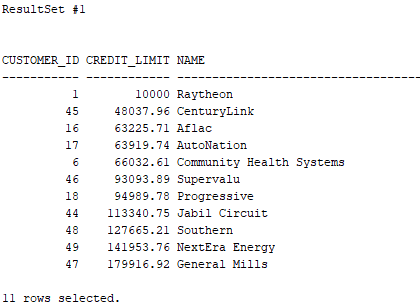
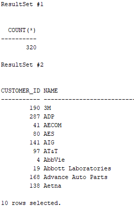
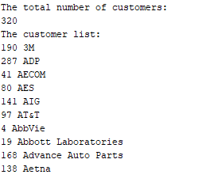

- Cursor is a pointer to a memory area called context area.
- Context area is a memory region inside the Process Global Area(PGA).

## Implicit cursors

- Implicit CURSORs are automatically created by Oracle when DML statement such as `SELECT INTO`, `INSERT`, `UPDATE`, and `DELETE` is executed. Cursor name is ‘SQL’.
- Oracle internally manages the whole execution cycle of implicit cursors and reveals only the cursor’s information and statuses such as `SQL%ROWCOUNT`, `SQL%ISOPEN`, `SQL%FOUND`, and `SQL%NOTFOUND`. `%ROWCOUNT`
- The implicit cursor is not elegant when the query returns zero or multiple rows which cause `NO_DATA_FOUND` or `TOO_MANY_ROWS` exception respectively.

```sql
DECLARE
    total_rows(2);
    emp_rec emp %ROWTYPE;
BEGIN
    SELECT * INTO emp_rec FROM emp WHERE empno=7369;
    IF SQL %FOUND THEN
        DBMS_OUTPUT.PUT_LINE(emp_rec.ename ||emp_rec.sal);
    END IF;
END;
```

## Explicit cursors

- Explicit CURSORs are user defined cursors. It is created for any DML operation which returns more than 1 row.
- For an explicit cursor, you have control over its execution cycle from `OPEN`, `FETCH`, and `CLOSE`

```sql
DECLARE
    CURSOR emp_cur IS
        SELECT empno,ename FROM emp;
    emp_rec emp_cur %ROWTYPE;
BEGIN
    OPEN emp_cur;
    LOOP
        FETCH emp_cur INTO emp_rec;
        EXIT WHEN emp_cur %NOTFOUND;
        DBMS_OUTPUT.PUT_LINE(emp_rec.empno ||emp_rec.ename);
    END LOOP;
    CLOSE emp_cur;
END;
```

### Parameterized CURSORs

```sql
DECLARE
    emp_rec emp %ROWTYPE;
    CURSOR emp_cur(max_wage NUMBER :=100, emp_name VARCHAR2) IS --Default value is assigned to parameter max_wage
        SELECT * FROM emp WHERE sal>max_wage and ename=emp_name;
BEGIN
    OPEN emp_cur(2000,'Raj');
    LOOP
        FETCH emp_cur INTO emp_rec;
            EXIT WHEN emp_cur %NOTFOUND;
            DBMS_OUTPUT.PUT_LINE(emp_rec.ename ||emp_rec.sal);
        END LOOP;
    CLOSE emp_cur;
END;
```

## Recursive Cursor

- A recursive subprogram is one that calls itself. Each recursive call creates a new instance of any items declared in the subprogram, including parameters, variables, cursors, and exceptions. A recursive cursor (a pointer to a shared SQL area) is used to keep a pointer to each call of a recursive function.

## REF CURSOR

- A `REF CURSOR` is basically a data type.
- A `REF CURSOR` can be associated with more than one `SELECT` statement at run-time. Before associating a new `SELECT` statement, we need to close the previous `CURSOR`.
- The primary advantage of using `REF CURSOR` is their capability to pass result sets between sub programs (like stored procedures, functions, packages etc.).

### Dealing with REF CURSOR in the sub-programs of a PL/SQL block

- The sub-routine gets executed for every iteration, which displays the employee information for the respective department.

```sql
DECLARE
    TYPE r_cursor IS REF CURSOR;
    c_emp r_cursor;
    TYPE rec_emp IS RECORD(
        name VARCHAR2(20),
        sal NUMBER(6));
    er rec_emp;

    PROCEDURE printemployeedetails IS
    BEGIN
        LOOP
            FETCH c_emp INTO ER;
            EXIT WHEN c_emp %NOTFOUND;
            DBMS_OUTPUT.PUT_LINE(er.name || ' –' || er.sal);
        END LOOP;
    END;

    BEGIN
        FOR i IN (SELECT deptno,dname FROM dept) --can use SELECT statement directly without defining a cursor
        LOOP
            OPEN c_emp FOR SELECT ename,sal FROM emp WHERE deptno = i.deptno;
                DBMS_OUTPUT.PUT_LINE(i.dname);
                DBMS_OUTPUT.PUT_LINE('————–');
                printemployeedetails;
            CLOSE c_emp;
        END LOOP;
END;
```

### Passing REF CURSOR as parameters to sub-programs

```sql
DECLARE
    TYPE r_cursor IS REF CURSOR;
    c_emp r_cursor;
    TYPE rec_emp IS RECORD(
        NAME VARCHAR2(20),
        sal NUMBER(6));

    PROCEDURE printemployeedetails(p_emp r_cursor) IS
        er rec_emp;
    BEGIN
        LOOP
            FETCH p_emp INTO er; --no need to OPEN
            EXIT WHEN p_emp %NOTFOUND;
            DBMS_OUTPUT.PUT_LINE(er.name || ' –' || er.sal);
        END LOOP;
    END;

    BEGIN
        FOR i IN (SELECT deptno,dname FROM dept)
        LOOP
            OPEN c_emp FOR SELECT ename,sal FROM EMP WHERE deptno = i.deptno;
                DBMS_OUTPUT.PUT_LINE(i.dname);
                DBMS_OUTPUT.PUT_LINE('————–');
                printemployeedetails(c_emp);
            CLOSE c_emp;
        END LOOP;
END;
```

### Strong REF CURSOR

- Any `REF CURSOR` which has fixed return type is called Strong `REF CURSOR`
- Strong `REF CURSOR` supports different type of `SELECT` statements but all of the same structure ,but not necessary that the table should be same.

```sql
DECLARE
    TYPE ref_cursor_name IS REF CURSOR
        RETURN (return_type);--Return must be of RECORD datatype
----
DECLARE
    TYPE my_RefCur IS REF CURSOR
        RETURN employees %ROWTYPE;
    cur_var my_RefCur;
    rec_var employees %ROWTYPE;
BEGIN
    OPEN cur_var FOR SELECT * FROM employees WHERE employee_id =100;
        FETCH cur_var INTO rec_var;
    CLOSE cur_var;
    DBMS_OUTPUT.PUT_LINE(rec_var.first_name || rec_var.salary);
END;
```

### Strong Ref Cursor with User Defined Record Datatype

- Use of this is, we can customize the number of field we want to fetch and still we can have a record datatype for Strong Ref Cursor

```sql
DECLARE
    TYPE my_rec IS RECORD(
        emp_sal employees.salary %TYPE;);
    TYPE my_RefCur IS REF CURSOR
        RETURN my_rec;--User defined RECORD datatype for return
    cur_var my_RefCur;
    at_var employees.salary %TYPE;
BEGIN
    OPEN cur_var FOR SELECT salary FROM employees WHERE employee_id =100;
        FETCH cur_var INTO at_var;
    CLOSE cur_var;
    DBMS_OUTPUT.PUT_LINE('Salary:' || at_var);
END;
```

### Weak REF CURSOR

- Weak REF CURSORs are those cursors which do not have any return type
- These cursors are the most frequently used `REF CURSOR` as they are open to all `SELECT` statements
- This `REF CURSOR` allows us to fetch any type of `SELECT` statement irrespective of data structure .

```sql
DECLARE
    TYPE ref_cursor_name IS REF CURSOR;
----
DECLARE
    TYPE my_RefCur IS REF CURSOR;
    cur_var my_RefCur;
    f_name employees.first_name %TYPE;
    emp_sal employees.salary %TYPE;
BEGIN
    OPEN cur_var FOR SELECT first_name, salary FROM employees WHERE employee_id =100;
        FETCH cur_var INTO f_name,emp_sal;
    CLOSE cur_var;
    DBMS_OUTPUT.PUT_LINE(f_name || emp_sal);
END;
```

### SYS_REF CURSOR

- It is a predefined weak `REF CURSOR` (`TYPE SYS_REFCURSOR IS REF CURSOR`);. So without declaring the ref pointer type, you can assign variable.

```sql
DECLARE
    cur_var SYS_REFCURSOR;
    f_name employees.first_name %TYPE;
    emp_sal employees.salary %TYPE;
BEGIN
    OPEN cur_var FOR SELECT first_name, salary FROM employees WHERE employee_id =100;
        FETCH cur_var INTO f_name,emp_sal;
    CLOSE cur_var;
    DBMS_OUTPUT.PUT_LINE(f_name || emp_sal);
END;
```

## Implicit Statement

- Prior Oracle Database 12c, you can return a result set from a stored procedure using the OUT REF CURSOR parameters.
- To make the migration of other databases to the Oracle Database easier, Oracle Database 12c Release 1 added a new feature called implicit statement result that allows you to return one or more result sets from a stored procedure by using the dbms_sql package.
- The following statement creates a stored procedure that returns customers who have credit limits are greater than a specific credit:

```sql
CREATE OR REPLACE PROCEDURE get_customer_by_credit(
    min_credit NUMBER
)
AS
    c_customers SYS_REFCURSOR;
BEGIN
    -- open the cursor
    OPEN c_customers FOR
        SELECT customer_id, credit_limit, name
        FROM customers
        WHERE credit_limit > min_credit
        ORDER BY credit_limit;
    -- return the result set
    dbms_sql.return_result(c_customers);
END;
```

In this stored procedure:

- First, declare a cursor with type SYS_REFCURSOR in the declaration section.
- Second, open the cursor associated with a query.
- Third, use the dbms_sql.return_result() function which accepts a cursor as an argument and returns the result set.
- To test the stored procedure, you can execute it as follows:

```sql
EXEC get_customer_by_credit(5000);
```



- The following statement creates a stored procedure that returns the customer result set by pages specified by page no and page size. On top of that, it returns the total rows of the customers table.

```sql
CREATE OR REPLACE PROCEDURE get_customers(
    page_no NUMBER,
    page_size NUMBER
)
AS
    c_customers SYS_REFCURSOR;
    c_total_row SYS_REFCURSOR;
BEGIN
    -- return the total of customers
    OPEN c_total_row FOR
        SELECT COUNT(*)
        FROM customers;

    dbms_sql.return_result(c_total_row);

    -- return the customers
    OPEN c_customers FOR
        SELECT customer_id, name
        FROM customers
        ORDER BY name
        OFFSET page_size * (page_no - 1) ROWS
        FETCH NEXT page_size ROWS ONLY;

    dbms_sql.return_result(c_customers);
END;
```



- It returned two result sets. The first result set is the total rows of the customers table. The second one is the first 10 customers in the page 1.

- Typically, you process result sets returned by a procedure using client programming languages such as Python, C#, and Java.
- However, if you want to process result sets using PL/SQL, you can use the get_next_resultset() procedure in the DBMS_SQL package.
- The following anonymous block calls the get_customers() procedure and uses the get_next_resultset() procedure to process the result sets.
- Since the get_customers() returns multiple result sets, we handle the result sets based on their number of columns.

```sql
SET SERVEROUTPUT ON

DECLARE
l_sql_cursor    PLS_INTEGER;
c_cursor        SYS_REFCURSOR;
l_return        PLS_INTEGER;

l_column_count  PLS_INTEGER;
l_desc_tab      dbms_sql.desc_tab;

l_total_rows    NUMBER;
l_customer_id   customers.customer_id%TYPE;
l_name          customers.NAME%TYPE;
BEGIN
-- Execute the function.
l_sql_cursor := dbms_sql.open_cursor(treat_as_client_for_results => TRUE);

dbms_sql.parse(C             => l_sql_cursor,
                STATEMENT     => 'BEGIN get_customers(1,10); END;',
                language_flag => dbms_sql.NATIVE);

l_return := dbms_sql.EXECUTE(l_sql_cursor);

-- Loop over the result sets.
LOOP
    -- Get the next resultset.
    BEGIN
    dbms_sql.get_next_result(l_sql_cursor, c_cursor);
    EXCEPTION
    WHEN no_data_found THEN
        EXIT;
    END;

    -- Get the number of columns in each result set.
    l_return := dbms_sql.to_cursor_number(c_cursor);
    dbms_sql.describe_columns (l_return, l_column_count, l_desc_tab);
    c_cursor := dbms_sql.to_refcursor(l_return);

    -- Handle the result set based on the number of columns.
    CASE l_column_count
    WHEN 1 THEN
        dbms_output.put_line('The total number of customers:');
        FETCH c_cursor
        INTO  l_total_rows;

        dbms_output.put_line(l_total_rows);
        CLOSE c_cursor;
    WHEN 2 THEN
        dbms_output.put_line('The customer list:');
        LOOP
        FETCH c_cursor
        INTO  l_customer_id, l_name;

        EXIT WHEN c_cursor%notfound;

        dbms_output.put_line(l_customer_id || ' ' || l_name);
        END LOOP;
        CLOSE c_cursor;
    ELSE
        dbms_output.put_line('An error occurred!');
    END CASE;
END LOOP;
END;
/
```



## CURSOR vs. REF CURSOR

| REF CURSOR                                                             | CURSOR                                                                                                    |
| ---------------------------------------------------------------------- | --------------------------------------------------------------------------------------------------------- |
| Dynamic                                                                | Static                                                                                                    |
| Can be associated with multiple SELECT statements in a PL/SQL block    | Can only access single SELECT statement at a time                                                         |
| Can be changed at run time                                             | Cannot be changed at run time. Can be done with parameterized cursor.                                     |
| Can be returned to the client application                              | Cannot be returned to the client application                                                              |
| Cannot be global. Cannot define them OUTSIDE of a procedure / function | Can be global. Global cursors can be opened and executed outside of the package in which they are defined |
| Can be passed from one sub-program to other sub-program                | Cannot be passed                                                                                          |

## FOR UPDATE OF, FOR UPDATE and WHERE CURRENT OF

- `FOR UPDATE` will give exclusive row-level lock on all rows retrieved by `SELECT` statement.
- The `FOR UPDATE` clause is generally used in cases where an online system needs to display a set of row data on a screen and they need to ensure that the data does not change before the end-user has an opportunity to update the data. In the real-world, many large online systems do not use the `FOR UPDATE` clause.
- If you try to access the rows with the `NOWAIT` clause, you will get an error message, `ORA-00054 Resource busy and acquire with NOWAIT` specified. `NOWAIT` option is just to investigate that yes i am not at all willing to wait to acquire the lock rather than hang myself, If i cannot get the lock immediately, an error is returned to signal that the lock is not possible at this time. You may try again later.
- If there are more than one table are joined for update, then the use of `FOR UPDATE OF`... will only lock the rows in the tables that contain the columns you specify in the OF clause. You can never lock a single column, the minimum lock is at row level. It locks all rows in the table that contains the column, which are selected by the query.
- `WHERE CURRENT OF` clause can be used for both `DELETE` and `UPDATE` statements inside a cursor's range to make changes to the last fetched row(s)

```sql
CURSOR cursor_name IS
    SELECT * FROM ..
    FOR UPDATE [OF column_list] [WAIT 15] [NOWAIT];
--NOWAIT -cursor does not wait for resources. If it is locked, it will show error
--WAIT 15 -wait up to 15 seconds for another session to release their lock. If not, show error
```

```sql
DECLARE
    CURSOR cur IS
        SELECT * FROM departments WHERE department_id = 210 FOR UPDATE;
    emp_rec departments %ROWTYPE;
BEGIN
    OPEN cur;
        LOOP
            FETCH cur INTO emp_rec;
            EXIT WHEN cur %NOTFOUND;
            INSERT INTO emp_log VALUES emp_rec;
            DELETE FROM departments WHERE CURRENT OF cur;
        END LOOP;
        COMMIT;
    CLOSE cur;
END;
```

## INVALID_CURSOR error

- If the cursor is not opened it will show INVALID_CURSOR

## PL/SQL Bulk Collect

- Bulk collect is used to reduce the context switching between SQL engine and PL/SQL engine and to improve query performance.
- Bulk collect will reduce the context switching by collecting all the SQL statement calls from PL/SQL program and sending them to SQL engine in just one go and vice versa.
- Bulk collect clause can be used with `SELECT INTO`, `FETCH INTO`, `RETURNING INTO` statements.

```sql
DECLARE
    TYPE rc_emp IS RECORD(
        v_empno employees.employee_id%TYPE,
        v_ename employees.first_name%TYPE,
        v_sal employees.salary%TYPE);
    TYPE cl_emp IS TABLE OF rc_emp;
    v_emp cl_emp;
BEGIN
    SELECT employee_id, first_name, salary
        BULK COLLECT INTO v_emp FROM employees;
    FOR i IN 1..v_emp.COUNT LOOP
        DBMS_OUTPUT.PUT_LINE(v_emp(i).v_empno || v_emp(i).v_ename || v_emp(i).v_sal);
    END LOOP;

    FORALL i IN 1..v_emp.COUNT
        INSERT INTO temp_emp (employee_id,first_name,salary)
            VALUES(v_emp(i).v_empno, v_emp(i).v_ename, v_emp(i).v_sal);
END;
```

```sql
DECLARE
    TYPE nt_fName IS TABLE OF VARCHAR2(20);
    fname nt_fName;
BEGIN
    SELECT first_name BULK COLLECT INTO fname FROM employees; --variable should be a collection
    FOR i IN 1..fname.COUNT LOOP
        DBMS_OUTPUT.PUT_LINE(i||fname(i));
    END LOOP;
END;
```

```sql
DECLARE
    CURSOR exp_cur IS
    SELECT first_name FROM employees;
    TYPE nt_fNAME IS TABLE OF VARCHAR2(20);
    fname nt_fNAME;
BEGIN
    OPEN exp_cur;
        FETCH exp_cur BULK COLLECT INTO fname;--Bulk collect does not need loop
    FOR i IN fname.FIRST..fname.LAST LOOP
        DBMS_OUTPUT.PUT_LINE(i||fname(i));
    END LOOP;
    CLOSE exp_cur;
END;
```

### Bulk Collect with LIMIT clause

- Whenever we retrieve a large number of records using bulk collect, the program starts consuming lot of memory in order to be fast and efficient. That degrades the performance of the database.
- `LIMIT` clause will restrict the number of rows fetched.
- `LIMIT` clause can be only used with `FETCH INTO` statement.

```sql
DECLARE
    CURSOR exp_cur IS
        SELECT first_name FROM employees;
    TYPE nt_fNAME IS TABLE OF VARCHAR2(20);
    fname nt_fNAME;
BEGIN
    OPEN exp_cur;
    LOOP
        FETCH exp_cur BULK COLLECT INTO fname LIMIT 10;
        FOR i IN 1..fname.COUNT LOOP
            DBMS_OUTPUT.PUT_LINE(i||fname(i));
        END LOOP;
        EXIT WHEN fname.COUNT = 0;
    END LOOP;
    CLOSE exp_cur;
END;
```

## FORALL (Bulk Binding)

- `FORALL` statement reduces context switches which occur during the execution of a DML statement by sending it in batches instead of one at a time.
- With `BULK COLLECT` we were fetching data from table and storing it into the collection. But in `FORALL` statement, we will fetch the data from the collection and store it into the table.
- A `FORALL` statement can have only one DML statement at a time.

```sql
FORALL i IN bound_clause --Bound clause decides the number of iteration.
[SAVE EXCEPTIONS] --It helps the DML statements to keep running even when there is an exception. --Using this is recommended
--DML statement;
```

### Lower and Upper bound

- The collection should have consecutive index numbers.
- If an element in the range is missing or was deleted, PL/SQL raises an exception.

```sql
DECLARE
    TYPE myArray IS TABLE OF NUMBER(2);
    col_var myArray := myArray(9,45,1,24,5,4,7,54,6,23);
BEGIN
    FORALL i IN 1..col_var.COUNT
        INSERT INTO tbl_mulpxn VALUES (col_var(i));
    DBMS_OUTPUT.PUT_LINE(SQL %ROWCOUNT);
END;
```

### Indices-of bound

- The indexes need not be consecutive.
- If a subscript in the range does not exist in the collection, that subscript is skipped.
- If collection is an associative array, it must be indexed by `PLS_INTEGER`.

```sql
DECLARE
    TYPE myArray IS TABLE OF NUMBER(2);
    col_var myArray := myArray(9,45,1,24,5,4,7,54,6,23);
BEGIN
    col_var.DELETE(3 , 6);
    FORALL i IN INDICES OF col_var
        INSERT INTO tbl_mulpxn VALUES (col_var(i));
    DBMS_OUTPUT.PUT_LINE(SQL %ROWCOUNT);
END;
----
DECLARE
    TYPE myArray IS TABLE OF NUMBER(2);
    col_var myArray := myArray(9,45,1,24,5,4,7,54,6,23);
BEGIN
    col_var.DELETE(3 , 6);
    FORALL i IN INDICES OF col_var BETWEEN 1 AND 10
        INSERT INTO tbl_mulpxn VALUES (col_var(i));
    DBMS_OUTPUT.PUT_LINE(SQL %ROWCOUNT);
END;
```

### Values-of bound

- It requires two collection; source collection and indexing collection
- The subscripts for the `FORALL` indexing collection are taken from the values of the elements in source collection
- The indexing collection must be a nested table, or an associative array
- The elements of the indexing collection must be of either `PLS_INTEGER` or `BINARY_INTEGER`
- If it is associate array, then it must be indexed by `PLS_INTEGER` or `BINARY_INTEGER`
- Indexing collection is a group of indexes that the `FORALL` statement can loop through

```sql
DECLARE
    TYPE myArray IS TABLE OF NUMBER(2);--Source collection
    src_col myArray := myArray(9,45,1,24,5,4,7,54,6,23);
    TYPE yourArray IS TABLE OF PLS_INTEGER;--Indexing collection
    idx_col yourArray:=yourArray();
BEGIN
    idx_col.EXTEND(2);
    idx_col(1):=4; --24 inserted here; src_col(4)
    idx_col(2):=8; --54 inserted here; src_col(8)
    FORALL i IN VALUES OF idx_col --idx_col(1) = 4; i =4
        INSERT INTO tbl_mulpxn VALUES (src_col(i)); --src_col(4) = 24
    DBMS_OUTPUT.PUT_LINE(SQL %ROWCOUNT);
END;
```

### SQL%BULK_ROWCOUNT

- The `SQL%BULK_ROWCOUNT` cursor attribute gives granular information about the rows affected by each iteration of the FORALL statement.
- Every row in the driving collection has a corresponding row in the `SQL%BULK_ROWCOUNT` cursor attribute.
- In the below code, we can see that rows affected for the username "BANANA" is zero.

```sql
CREATE TABLE bulk_rowcount_test AS
    SELECT *
    FROM all_users;
----
DECLARE
    TYPE t_array_tab IS TABLE OF VARCHAR2(30);
    l_array t_array_tab := t_array_tab('SCOTT', 'SYS','SYSTEM', 'DBSNMP', 'BANANA');
BEGIN
    --Perform bulk delete operation.
    FORALL i IN l_array.FIRST .. l_array.LAST
        DELETE FROM bulk_rowcount_test
            WHERE username = l_array(i);
    --Report affected rows.
    FOR i IN l_array.FIRST .. l_array.LAST LOOP
        DBMS_OUTPUT.PUT_LINE('Element: ' || RPAD(l_array(i), 15, ' ') ||
        ' Rows affected: ' || SQL %BULK_ROWCOUNT(i));
    END LOOP;
END;
/
Element: SCOTT Rows affected: 1
Element: SYS Rows affected: 1
Element: SYSTEM Rows affected: 1
Element: DBSNMP Rows affected: 1
Element: BANANA Rows affected: 0
```

### SAVE EXCEPTIONS and SQL%BULK_EXCEPTION

- The following code creates a collection with 100 rows, but sets the value of rows 50 and 51 to NULL.
- Since the "exception_test" table does not allow nulls, these rows will result in an exception.
- The `SAVE EXCEPTIONS` clause allows the bulk operation to continue past any exceptions, but if any exceptions were raised , it will jump to the exception handler once all the operations are complete.
- In this case, the exception handler just loops through the `SQL%BULK_EXCEPTION` cursor attribute to see what errors occurred.

```sql
CREATE TABLE exception_test (
    id NUMBER(10) NOT NULL);
----
DECLARE
    TYPE t_tab IS TABLE OF exception_test%ROWTYPE;
    l_tab t_tab := t_tab();
    l_error_count NUMBER(10);
    ex_dml_errors EXCEPTION;
    PRAGMA EXCEPTION_INIT(ex_dml_errors, -24381);
BEGIN
    --Fill the collection.
    FOR i IN 1..100 LOOP
        l_tab.EXTEND;
        l_tab(i).id := i;
    END LOOP;

    --Cause a failure.
    l_tab(50).id := NULL;
    l_tab(51).id := NULL;
    EXECUTE IMMEDIATE 'TRUNCATE TABLE exception_test';

    --Perform a bulk operation.
    BEGIN
        FORALL i IN l_tab.FIRST..l_tab.LAST SAVE EXCEPTIONS
            INSERT INTO exception_test
                VALUES l_tab(i);
    EXCEPTION
        WHEN ex_dml_errors THEN
            l_error_count := SQL%BULK_EXCEPTIONS.COUNT;
            DBMS_OUTPUT.PUT_LINE('Number of failures: ' || l_error_count);
            FOR i IN 1 .. l_error_count LOOP
                DBMS_OUTPUT.PUT_LINE('Error: ' || i ||
                ' Array Index: ' || SQL%BULK_EXCEPTIONS(i).ERROR_INDEX ||
                ' Error Code: ' || SQL%BULK_EXCEPTIONS(i).ERROR_CODE ||
                ' Message1: ' || SQLERRM(SQL%BULK_EXCEPTIONS(i).ERROR_CODE) ||
                ' Message2: ' || SQLERRM(-SQL%BULK_EXCEPTIONS(i).ERROR_CODE)) ;
            END LOOP;
    END;
END;
/
Number of failures: 2
Error: 1 Array Index: 50 Error Code: 1400 Message1: -1400: non-ORACLE exception Message2: ORA-01400: cannot insert NULL into ()
Error: 2 Array Index: 51 Error Code: 1400 Message1: -1400: non-ORACLE exception Message2: ORA-01400: cannot insert NULL into ()
```
